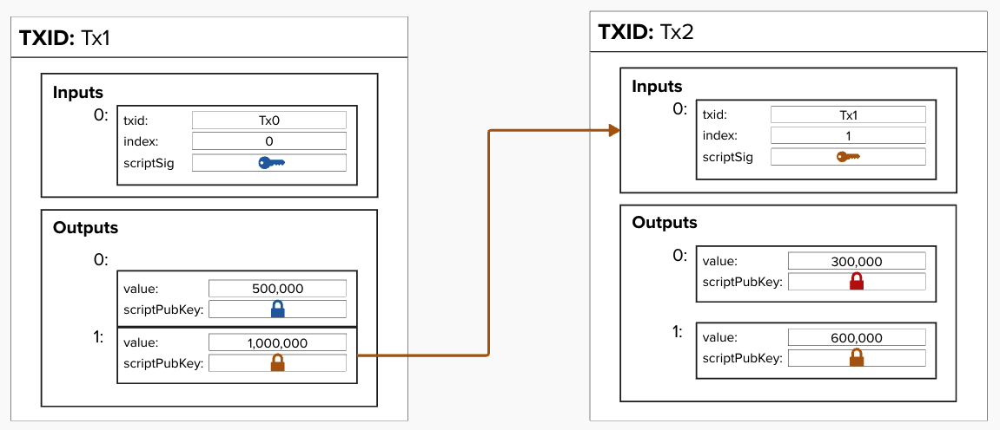

# Bitcoin Transactions
Believe it or not, the Lightning Network is actually a subset of all Bitcoin transactions!

To keep the network trustless, decentralized, and secure, we have to employ some clever techniques to make everything work smoothly. In other words, we use a variety of advanced Bitcoin transactions, leveraging features like timelocks, spending paths, and multi-signature setups.

We'll break it down step by step, introducing each concept gradually to build a solid understanding. Once we've covered the basics, we'll see how all these elements come together to create "payment channels" and, eventually, a full Lightning Network node.


## Bitcoin Transaction: Inputs and Outputs

A bitcoin transaction primarily consists of **inputs** and **outputs**.

- An **input** is a pointer to a previous transaction's output and a bitcoin script that unlocks or proves you have the information necessary to spend that bitcoin.

- An **output** is an amount of bitcoin and a script that locks or determines how that amount of bitcoin can be spent in the future.

In the diagram below...
- A **key** icon represents a *signature*, and it is placed in the ```scriptSig``` field.
- A **lock** icon symbolizes a *script* that defines the conditions required to spend Bitcoin, and it is located in the ```scriptPubKey``` field.

<p align="center" style="width: 50%; max-width: 300px;">
  
</p>

#### Tx2's input is referencing an output with 1,000,000 sats, but Tx2's outputs only add up to 900,000 sats. What happened to the other 100,000 sats?

<br/>
<details>
  <summary>Answer</summary>

The 100,000 sats went to the miner in the form of fees! To be a valid transaction the sum of the inputs must be greater than or equal to the sum of the outputs. The difference between the inputs and outputs is sent to the miner to incentivize them to include this transaction in a block.

</details>

<br/>

#### In Tx2 above, you'll notice that the gold key is sending 600,000 back to itself. Why is it doing that?

<br/>
<details>
  <summary>Answer</summary>

When you spend a Bitcoin output, you are required to spend the entire amount associated with it. If you don't intend to send the full amount to someone else, the remaining balance (known as "change") must be sent back to a Bitcoin address that you control (i.e., one for which you hold the private keys). Most software handles this process automatically, so it's often hidden from the user. However, if you accidentally forget to send the change back to yourself, the leftover amount will be given to the miner as an additional transaction fee. Oops!

</details>

<br/>