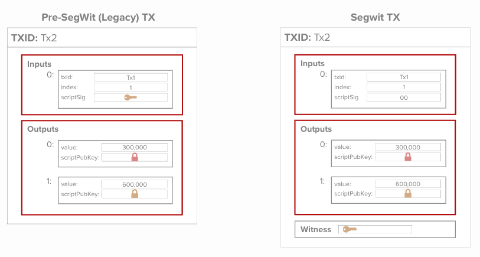
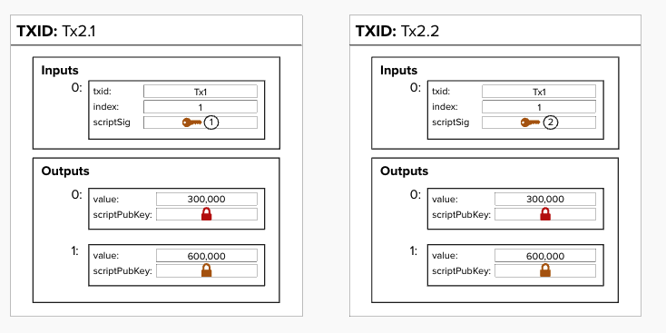

# Segretated Witness (SegWit)

Segregated Witness, also known as "SegWit", was a soft-fork upgrade to Bitcoin that was activated in 2017. This was at the end of the "Blocksize War", a period that lasted from 2015 - 2017 in which many argued whether or not Bitcoin should increase its block size so that it could fit more transactions in each block, effectively leading to a higher transaction throughput and lower fees. A detailed overview of the tradeoffs is beyond the scope of this workshop, however, curious readers can see Jonathan Bier's book, "The Blocksize War", for an in depth analysis.

So, why are we mentioning SegWit in this workshop? Well, SegWit was actually a crucial upgrade to Bitcoin and was required for the Lightning Network to work properly.

As mentioned above, "SegWit" is short for "segretated witness". In Bitcoin parlance, a "witness" is another word for a signature, which is required to prove ownership and move bitcoin. The SegWit upgrade moved the signature data from its previous location, the **scriptSig**, to a separate location, called the **witness stack**. After the upgrade, many SegWit transactions now leave the **scriptSig** blank or enter ```00```, indicating that there is no signature present for that input.

<p align="center" style="width: 50%; max-width: 300px;">
  
</p>

## Transaction IDs

Each transaction has a unique identifier for the transaction, called the **"Transaction ID"** (**TXID**). The TXID is calculated by hashing the data within each transaction, including the inputs and outputs. The TXID is very important within Bitcoin, as it tells us which previous transaction we are spending our bitcoin from. This is precicely why it is listed in the **input** field of our transaction. 

By creating a separarate "witness" field in the transaction, SegWit changed which data is included when we are calculating the TXID for each transaction. Effectively, this means that the signature is **NOT** included when calculating the TXID for SegWit transactions. In the simplified transaction below, the information within the red boxes represents which data is included when calculating the TXID for both Pre-SegWit (also known as "Legacy") and SegWit transactions.

<p align="center" style="width: 50%; max-width: 300px;">
  
</p>

## Why Was SegWit Required For Lightning?

Great question—glad you asked!

As a quick teaser for what's to come, the Lightning Network relies on nodes sharing pre-signed transactions that could technically be broadcasted to the Bitcoin blockchain but are deliberately held back for later. As long as each node can validate the legitimacy of these transactions, sharing the data itself is sufficient.

Before SegWit, there was a problem: it was possible to create two versions of the same transaction that both had valid signatures, ***but different***, signatures. This meant the transaction ID (TXID) would be different for each version. Since the TXID is used as an identifier in the inputs of other transactions, this opened the door for a scenario where one could give someone a valid transaction (with a specific TXID) and then broadcast a different, also valid, transaction to the Bitcoin network. This inconsistency made it unreliable to reference transactions by TXID.

This issue, called **transaction malleability**, would cause problems in Lightning’s structure. SegWit fixed this by removing the signature data from the TXID calculation, making it impossible to change the TXID without invalidating the transaction.

<p align="center" style="width: 50%; max-width: 300px;">
  
</p>

## ??? Write a function to create a transaction ID for a SegWit and Non-Segwit transaction