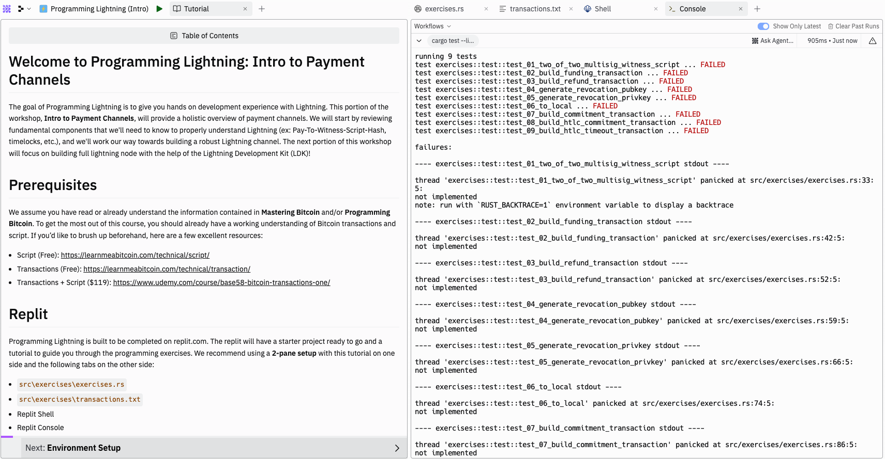

# Welcome to Programming Lightning: Intro to Payment Channels

The goal of Programming Lightning is to give you hands on development experience with Lightning. This portion of the workshop, **Intro to Payment Channels**, will provide a holistic overview of payment channels. We will start by reviewing fundamental components that we'll need to know to properly understand Lightning (ex: Pay-To-Witness-Script-Hash, timelocks, etc.), and we'll work our way towards building a robust Lightning channel. The next portion of this workshop will focus on building full lightning node with the help of the Lightning Development Kit (LDK)!

# Prerequisites

We assume you have read or already understand the information contained in **Mastering Bitcoin** and/or **Programming Bitcoin**. To get the most out of this course, you should already have a working understanding of Bitcoin transactions and script. If you’d like to brush up beforehand, here are a few excellent resources:
- Script (Free): https://learnmeabitcoin.com/technical/script/
- Transactions (Free): https://learnmeabitcoin.com/technical/transaction/
- Transactions + Script ($119): https://www.udemy.com/course/base58-bitcoin-transactions-one/

# Replit

Programming Lightning is built to be completed on replit.com. The replit will have a starter project ready to go and a tutorial to guide you through the programming exercises.  We recommend using a **2-pane setup** with this tutorial on one side and the following tabs on the other side:
- `src\exercises\exercises.rs`
- `src\exercises\transactions.txt`
- Replit Shell
- Replit Console

**This is what that would look like**:
<p align="center" style="width: 50%; max-width: 300px;">
  
</p>


# Rust

This workshop relies heavily on the Rust programming language and ecosystem. For this section of Programming Lightning, **Intro to Payment Channels**, we will be using **rust-bitcoin** and do not assume *any* prior knowledge of Rust. However, for the next section of Programming Lightning, we will use rust extensively to build a full Lightning node, so a background in Rust will be very helpful.

# Using the Workshop

Along the way you will come across emojis that signify something important.  Here's a quick overview of what you will see and what they mean:
<br/><br/>
👉 This emoji means the following console command or code block should be copy-and-pasted or typed out:
```
// some command or code will be here, with a copy button on the right
```
⚡️ You'll see a lightning bolt when it's time to start a programming exercise
<br/><br/>

# A Special Thanks
- During this workshop, you'll see many transaction diagrams that are meant to help you understand what is going on "under the hood" while also providing enough of an abstraction so that it's easier to see the bigger picture. Please note, these transaction diagram are based on the diagrams created by **Elle Mouton** in her article, [Opening and announcing a pre-taproot LN channel](https://ellemouton.com/posts/open_channel_pre_taproot/). Elle's diagrams are, by far, the most clear and concise transaction visuals I've seen. I encourage you to visit her blog!
- In the same transaction diagrams mentioned above, you'll also notice that icons are used to represent *locking to a public key* and *provding a signature*. These icons are inspired by [Base58's LARP](https://www.base58.info/classes/larp). These diagrams are meant to provide a visual aid so that it's easier to keep track of which key is used in various locking scripts. If you're interested in learning more about the Bitcoin protocol, I encourage you to check out Base58's website!