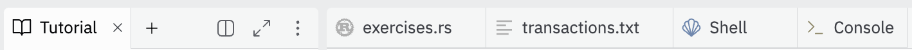

# Welcome to Programming Lightning

The goal of this workshop is to give you hands on development experience with Lightning. We will start by building up the intuition behind payment channels and then implement a few of our own. After that, we'll build a full lightning node with the help of the Lightning Development Kit (LDK).
<br/>
# Prerequisites

We assume you have read or already understand the information contained in **Mastering Bitcoin** and **Programming Bitcoin**.  It's recommended but not absolutely required to have a decent understanding of the content of Mastering Lightning as well.
<br/>
# Replit

Programming Lightning is built to be completed on replit.com. The replit will have a starter project ready to go and a tutorial to guide you through the programming exercises.  We recommend using a **2-pane setup** with this tutorial on one side and the following tabs on the other side:
- `src\ch1_intro_htlcs\exercises.rs`
- `src\ch1_intro_htlcs\transactions.txt`
- Replit Shell
- Replit Console

**This is what that would look like**:
<p align="center" style="width: 50%; max-width: 300px;">
  
</p>


# Rust

This workshop relies heavily on the Rust programming language and ecosystem.  We will be using **rust-bitcoin** and the **Lightning Development Kit** as we explore the lightning network.  

We do not assume *any* prior knowledge of Rust and aim to have it not get in the way of the overall experience.  

# Using the Workshop

Along the way you might come across emojis that signify something important.  Here's a quick overview of what you might see and what they mean:
<br/><br/>
👉 This emoji means the following console command or code block should be copy-and-pasted or typed out:
```
// some command or code will be here, with a copy button on the right
```
⚡️ You'll see a lightning bolt when it's time to start a programming exercise
<br/><br/>

# A Special Thanks
- During this workshop, you'll see many transaction diagrams that are meant to help you understand what is going on "under the hood" while also providing enough of an abstraction so that it's easier to see the bigger picture. Please note, these transaction diagram are based on the diagrams created by **Elle Mouton** in her article, [Opening and announcing a pre-taproot LN channel](https://ellemouton.com/posts/open_channel_pre_taproot/). Elle's diagrams are, by far, the most clear and concise transaction visuals I've seen. I encourage you to visit her blog!
- In the same transaction diagrams mentioned above, you'll also notice that icons are used to represent *locking to a public key* and *provding a signature*. These icons are inspired by [Base58's LARP](https://www.base58.info/classes/larp). If you're interested in learning more about the Bitcoin protocol, I encourage you to check out Base58's website!
- TODO: Thank prior Programming Lightning PM for kickstarting the project and providing the building blocks to expand upon.