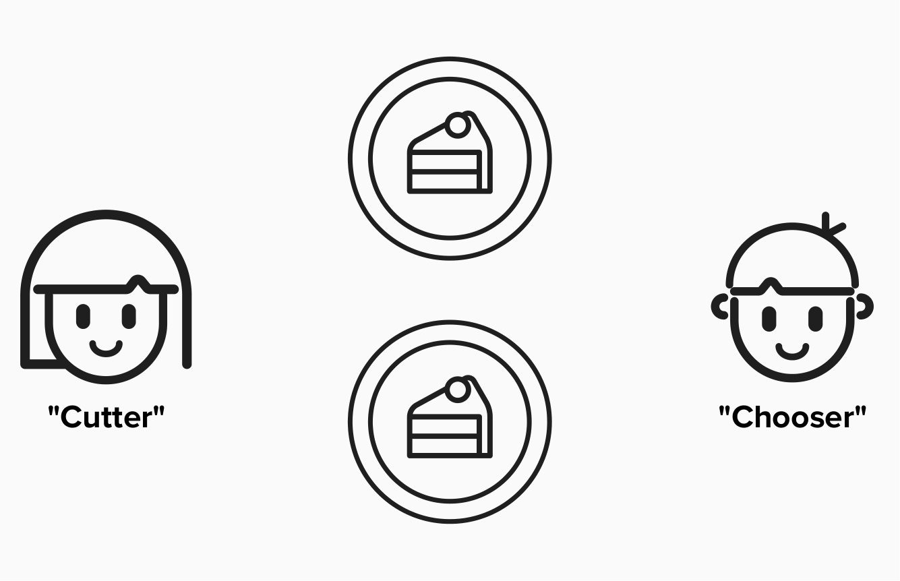

# Fairness Protocol

Before digging into Bitcoin and the Lightning protocol, it's important to review **fairness protocols**, as they are the underpinning of decentralized systems such as Bitcoin and Lightning.

## Achieving Fairness
Over the last few thousand years, societies have developed a variety of ways to achieve fair outcomes. Some of these are more innate, while others are explicit innovations. Some examples are below:

1) **Law**: Establish rules for interactions that are enforced by institutions such as governments.
3) **Trusted Third Parties**: Enforce fairness by including a trusted third party in every interaction. 
4) **Trusted Protocols**: Establish rules and interactions that are enforced by incentives instead of third parties (institutions, governments, etc.).

## An Example
For a simple example of a fairness protocol, let's introduce Alice, Bob, and their mom.

Alice and Bob are hungry for cake (who isn't), but they never play fair when cake is involved. They both try to take as much as they can!

  

To ensure there is a fair division of cake, we could try implementing one of the following:

1) **Law**: If you're caught eating more than half of the cake, you are grounded for 100 hours. Ouch!
2) **Trusted Third Parties**: Mom is in charge of splitting the cake and handing the relevant portions to Alice and Bob.
3) **Trusted Protocols**: ....

#### How can we design a fairness protocol such that Alice and Bob do not have to trust eachother but still get fair outcomes?

  
Answer

Mom can enforce a game, called **"cut and choose"**. In this game, one child plays the role of **"cutter"** and the other child plays the role of **"chooser"**.

The **"cutter"** will begin the game by splitting the cake into two pieces. The **"chooser"** will then select which piece of cake they want. If the **"cutter"** decides to cheat by creating a bigger pile of cookies, the **"chooser"** can punish them by taking the bigger pile. As long as both participants play by the rules, a fair outcome is incentivized by the protocol.

**Fun Fact**: A similar procedure is actually applied by the United Nations Convention on the Law of the Sea. Specifically, when a developed state is applying for a permit ot mine minerals from the ocean, they must present **two** options to the United Nations (UN). The UN will pick **one** location for the developed country and reserve the other location for **developing states**.

  

## The Lightning Network
Throughout this workshop, keep the concept of a fairness protocol in mind. Much of the Bitcoin wizardry that we are about to encounter is, at it's heart, a way of enforcing fair outcomes on the Lightning Network without requiring a trusted party.