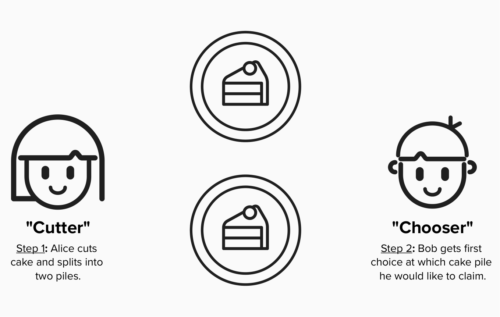

# Fairness Protocol

Before digging into Bitcoin transactions and the Lightning protocol, it's important to review **fairness protocols**, as they are the underpinning of decentralized systems such as Bitcoin and Lightning.

## What Is A Fairness Protocol?
A **fairness protocol** is a series of predefined steps designed to ensure *fair outcomes* among participants. These protocols use mechanisms such as incentives and penalties to enforce fairness, removing the need for a central authority.

You might be wondering: "How do we measure fairness?" That’s a great question, and one without a simple answer. Fairness isn’t something that can be fully defined in objective terms, like a GPS calculating the fastest route from point A to point B.

A more practical way to approach fairness is to ensure that participants can expect predictable and equitable outcomes based on predefined rules. If these expected outcomes are made explicit and participants agree to them when entering the system, then fairness can be reliably enforced within that framework.

When designing a fairness protocol, we must consider game theory and the incentives of participants. A poor understanding of their motivations could lead to rules that are easily manipulated, undermining our ultimate objective.

## An Example
For a simple example of a fairness protocol, let's introduce Alice, Bob, and their mom.

Alice and Bob are hungry for cake (who isn't), but they never play fair when cake is involved. They both try to take as much as they can!

  

To ensure there is a fair division of cake, we could implement one of the following:

1) **Law**: If you're caught eating more than half of the cake, you are grounded for 100 hours. Ouch!
2) **Trusted Third Parties**: Mom is in charge of splitting the cake and handing the relevant portions to Alice and Bob.
3) **Fairness Protocol**: ....

#### How can we design a fairness protocol such that Alice and Bob do not have to trust eachother but still get fair outcomes?

  
Answer

Assuming Alice and Bob both want to maximize the amount of cake they get, Mom can enforce a game, called **"cut and choose"**. In this game, one child plays the role of **"cutter"** and the other child plays the role of **"chooser"**.

The **"cutter"** will begin the game by splitting the cake into two pieces. The **"chooser"** will then select which piece of cake they want. If the **"cutter"** cheats by making one piece larger, the **"chooser"** can punish them by taking it.

  

## The Lightning Network
Throughout this workshop, keep fairness protocols in mind. Much of the Bitcoin wizardry we’ll encounter is, at its heart, a way to enforce fair outcomes between multiple entities without a trusted party. Just as "cut and choose" ensures fairness for Alice and Bob, the Lightning Network uses similar principles to achieve trustless cooperation.