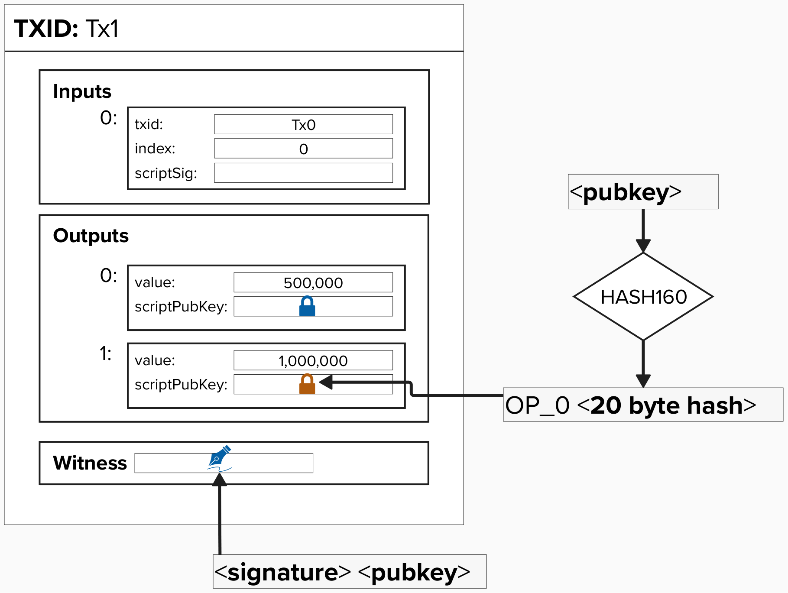
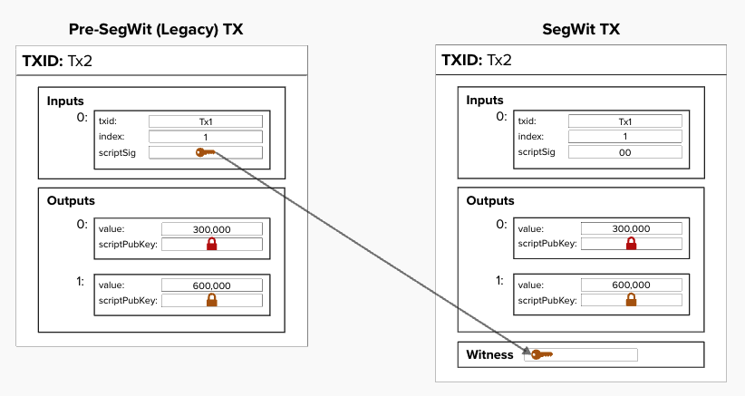

# Bitcoin Transactions
Believe it or not, the Lightning Network is actually a subset of all Bitcoin transactions!

To keep the network trustless, decentralized, and secure, we have to employ some clever techniques to make everything work smoothly. In other words, we use a variety of advanced Bitcoin transactions, leveraging features like timelocks, spending paths, and multi-signature setups.

We'll break it down step by step, introducing each concept gradually to build a solid understanding. Once we've covered the basics, we'll see how all these elements come together to create "payment channels" and, eventually, a full Lightning Network node.


## Bitcoin Transaction: Inputs and Outputs

A bitcoin transaction primarily consists of **inputs** and **outputs**.

- An **input** is a pointer to a previous transaction's output and a bitcoin script that unlocks or proves you have the information necessary to spend that bitcoin.

- An **output** is an amount of bitcoin and a script that locks or determines how that amount of bitcoin can be spent in the future.

In the diagram below...
- A **signature** icon, unsurprisingly, represents a *signature* for a specific pubkey, and it is placed in the ```witness``` field. For pre-segwit transactions, it was placed in the `scriptSig` field.
- A **lock** icon symbolizes a *public key* that bitcoin is locked to, and it is located in the ```scriptPubKey``` field. As we venture into the land of Lightning, we'll encounter many public keys, so, hopefully, this will help keep things organized.

<p align="center" style="width: 50%; max-width: 300px;">
  
</p>

The above output is a simple **Pay-To-Witness-Public-Key-Hash** (**P2WPKH**) output. We are taking the HASH160 of our public key and putting the 20-byte result in the `scriptPubKey` field with an `OP_0` in front of it. The `OP_0` signals to the Bitcoin protocol that this is a **P2WPKH** or **P2WSH** output.

To spend from this output, all we have to provide is a valid signature and unhashed pubkey.

```
[ <signature>, <public_key> ]
```

## Segretated Witness (SegWit)

Segregated Witness, also known as "SegWit", was a soft-fork upgrade to Bitcoin that was activated in 2017. Why are we mentioning SegWit in this workshop? Well, SegWit was actually a crucial upgrade to Bitcoin and was required for the Lightning Network to work properly.

<p align="center" style="width: 50%; max-width: 300px;">
  
</p>

#### Why was SegWit an important upgrade for Lightning?
<details> <summary>Answer</summary>
The SegWit (Segregated Witness) upgrade moved the signature data from its previous location, the `scriptSig` (within the transaction inputs), to a separate structure called the `witness stack`.

This change was critical because it eliminated the possibility of **transaction malleability**. Transaction malleability refers to the ability to alter the signature's byte representation (e.g., through valid but slightly different encoding) **after the transaction is broadcast** but **before it is mined**. Such changes would result in a different transaction ID (txid), even though the transaction itself remained valid and unchanged.

This vulnerability made it unsafe to build off-chain payment protocols like the Lightning Network, which rely on transaction IDs to remain constant.

By moving the signature data to the witness stack, which is not included in the transaction ID hash, SegWit ensured that the transaction ID could no longer be altered through malleability.

</details>