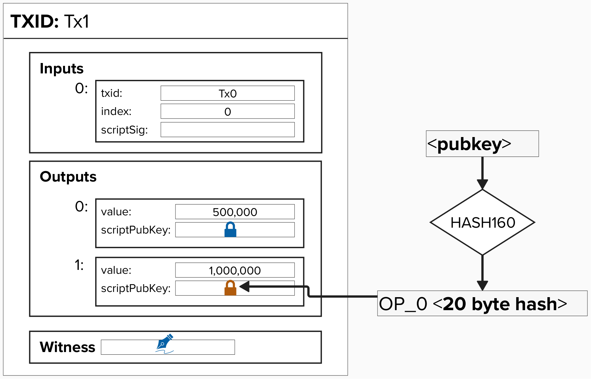
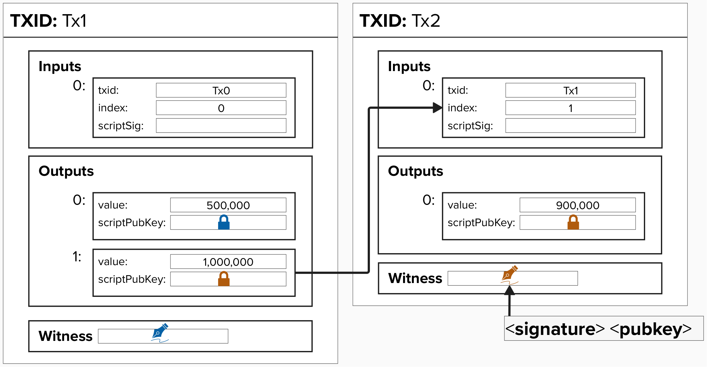
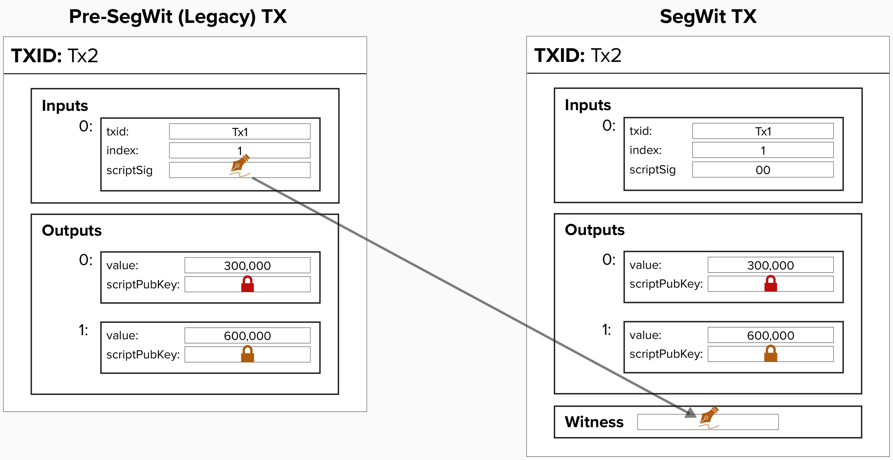

# Bitcoin Transactions
Under the hood, the Lightning Network relies on Bitcoin transactions, so it's important to start here!

To keep the network trustless, decentralized, and secure, we use a variety of advanced features such as timelocks, spending paths, and multi-signature setups.

We'll break each down step by step, introducing each concept gradually so that we can gradually build a solid understanding. Once we've covered the basics, we'll see how all these elements come together to create "payment channels".


## Bitcoin Transaction: Inputs and Outputs

A bitcoin transaction primarily consists of **inputs** and **outputs**.

- An **input** is a pointer to a previous transaction’s output, paired with a bitcoin script that proves ownership by satisfying the output’s conditions.

- An **output** is an amount of bitcoin and a script that "locks" it, determining how it can be spent in the future.

To visualize this, consider the diagram below...
- A **signature** icon, unsurprisingly, represents a *signature* for a specific color-coded public key, placed in the `witness` field. For pre-segwit transactions, it was placed in the `scriptSig` field.
- A **lock** icon symbolizes a *public key* that bitcoin is locked to, located in the ```scriptPubKey``` field. As we venture into the land of Lightning, we'll encounter many public keys, so hopefully these color-coded icons will help keep things organized.

<p align="center" style="width: 50%; max-width: 300px;">
  
</p>

The above output is a simple **Pay-To-Witness-Public-Key-Hash** (**P2WPKH**) output. We are taking the HASH160 of a public key and putting the 20-byte result in the `scriptPubKey` field with an `OP_0` in front of it. The `OP_0` signals to the Bitcoin protocol that this is a **P2WPKH** or **P2WSH** output.

To spend from a P2WPKH output, you provide a valid signature and the unhashed public key:

<p align="center" style="width: 50%; max-width: 300px;">
  
</p>

## Segregated Witness (SegWit)

Segregated Witness, also known as "SegWit", was a soft-fork upgrade to Bitcoin that was activated in 2017. Why are we mentioning SegWit in this workshop? Well, SegWit was actually an important upgrade to bitcoin, enabling stronger security guarantees for Lightning.

<p align="center" style="width: 50%; max-width: 300px;">
  
</p>

#### Why was SegWit an important upgrade for Lightning?

<details> <summary>Answer</summary>
  
SegWit moved signature data from the `scriptSig` (within transaction inputs) to a separate structure called the **witness stack**.

This change was critical because it eliminated one form of [**transaction malleability**](https://en.bitcoin.it/wiki/Transaction_malleability). There are various forms of transaction malleability, but one of them involves altering the signature in such a way that the signature's byte representation is slightly different, but still valid. For example, an ECDSA signature can be represented as the pair `(r,s)`, where `r` and `s` are both very large integers. We don't need to get into the nuances of what these values are, but the important thing to note is that you can flip the sign of `s` (and mod `n` to stay within the finite field), and you would still have a valid signature. In other words, `(r, -s mod n)` is also a valid signature.

Transaction malleability presented a large problem because, if you exploited this vulnerability in pre-segwit transactions, then the transaction ID would change. This made it unsafe to build off-chain payment protocols like the Lightning Network, which rely on transaction IDs to remain constant. For instance, you can imagine multiple parties agree to build an off-chain transaction based on TXID 123. Everyone agrees and exchanges signatures. However, **after the transaction is broadcast** but **before it is mined**, a bad actor changes the sign of the `s` value on their signature, resulting in a new TXID and potentially interfering with any other transactions that depend on the previously agreed upon transaction, TX123.

By moving the signature data to the witness stack, which is not included in the transaction ID hash, SegWit ensured that the transaction ID could no longer be altered through malleability attacks.

If you don't have a strong understanding of how off-chain protocols work, this may sound confusing. Don't worry - this will become very clear shortly!

</details>