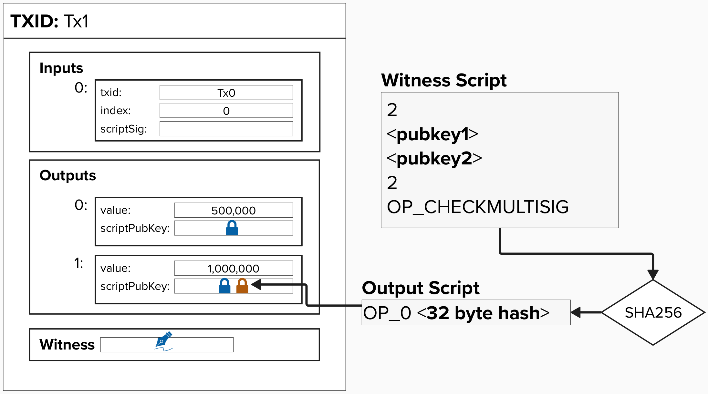
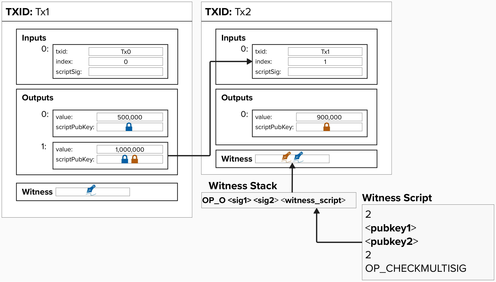
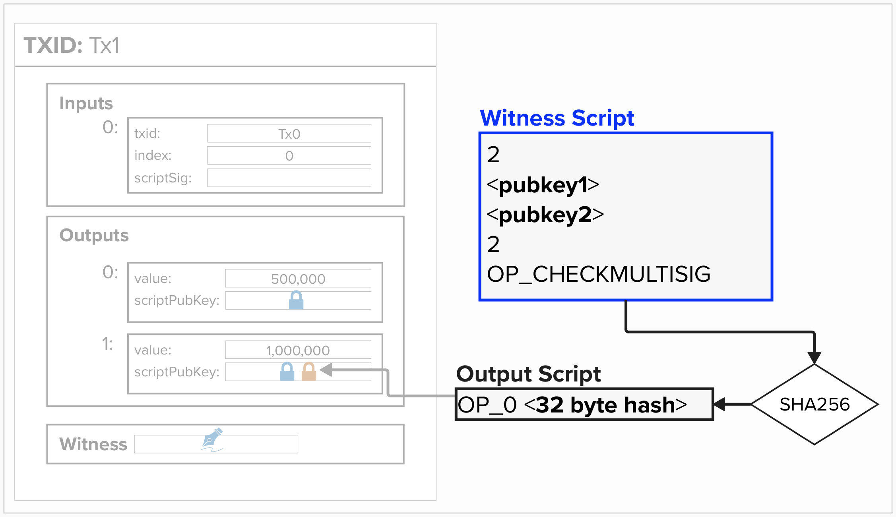
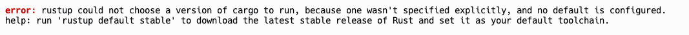

# Pay-to-Witness-Script-Hash (P2WSH)

As we dive into the Lightning Network, we're going to heavily rely on **Pay-to-Witness-Script-Hash** (**P2WSH**) outputs, so it's helpful to review them first.

In a **P2WSH** output, bitcoin is "locked" to the SHA256 hash of a script. The script specifies the conditions that must be met to spend the bitcoin, and it can encode some pretty complex spending conditions.

To unlock the bitcoin, the spender must provide:
- The original (unhashed) **Witness Script** that, when hashed, matches the hash of our original script.
- Any other data that the Witness script specifies, such as a valid **signature**, **preimage**, etc.)

## Locking To Multisig
To build our intuition of a **P2WSH** script, let's walk through an example where we'd like to lock our funds such that multiple signatures are required to spend those funds.

Multiple signature (multi-sig) outputs are fairly common in Bitcoin and involve locking Bitcoin such that a predefined number of valid signatures from a group of public keys are required to spend the funds. This is often referred to as an **"T-of-N" scheme**, where **T** represents the number of required signatures ("threshold") and **N** is the total number of possible public keys that can be provided.

In the below example, we lock our bitcoin such that two signatures must be presented to spend the funds.

<p align="center" style="width: 50%; max-width: 300px;">
  
</p>

To spend from this output, we'd have to provide valid signatures for each public key and the original witness script within our **witness stack**.

<p align="center" style="width: 50%; max-width: 300px;">
  
</p>

#### Question: Why is there an `OP_0` in front of the first signature?
<details>
  <summary>Answer</summary>

There is a bug in the `OP_CHECKMULTISIG` opcode that will remove an extra item from the stack during script evaluation. To ensure that our script still executes correctly, we'll need to add an `OP_0`, which is effectively a dummy value that can be safely removed from the stack without impacting the rest of our evaluation logic.

</details>

## Witness vs Output Script
Before moving on, it's worth bringing extra attention to the difference between the **witness script** and the **output script**, as these terms will come up frequently during the workshop and exercises.

- The **witness script** is the script that defines the locking condition for a **P2WSH** output. For pre-segwit **Pay-To-Script-Hash** (**P2SH**) outputs, this is called the "Redeem Script". In this example below, the "witness script" the script defining the multisig condition.
- The **output script** is the script that is placed in the `scriptPubKey` field. For a Pay-To-Witness-Script-Hash output, it's the 32-byte SHA256 hash of the witness script, preceded by `OP_0`.

<p align="center" style="width: 50%; max-width: 300px;">
  
</p>

### ⚡️ Build 2-of-2 Multisig Witness Script

Let's build a function that takes in two Bitcoin public keys and returns a **two of two multisig** script. In this case, this script will be our **Witness Script**.

You can find this exercise at the top of `src/exercises/exercises.rs`.

```rust
pub fn two_of_two_multisig_witness_script(
    pubkey1: &PublicKey,
    pubkey2: &PublicKey,
) -> ScriptBuf {
    
    // build 2-of-2 multisig script
  
    // to push int to stack, you can use
      // push_int(2)
      // push_opcode(use opcodes::OP_PUSHNUM_2)
  
    // opcodes::OP_CHECKMULTISIG
}
```
  
<details>
  <summary>Click here to learn about writing functions in Rust</summary>

  In Rust, functions start with the `fn` keyword, followed by the function name, parameters, and return type. For example, in `two_of_two_multisig_witness_script`, `pubkey1` and `pubkey2` are parameters, each of type `&PublicKey` (a reference to a `PublicKey`). The `-> ScriptBuf` keyword specifies that the function returns a `ScriptBuf`.

```rust
pub fn two_of_two_multisig_witness_script(
    pubkey1: &PublicKey,
    pubkey2: &PublicKey,
) -> ScriptBuf {
}
```

Inside a function, you can define local variables using `let`. In Rust, the last expression in a function is returned by default if it doesn’t end with a semicolon (`;`). For example, in the below function, we are defining a variable that is 1 more than the provided number. We then return that variable from the function.

```rust
pub fn add_1(num: u32) -> u32 {
    let num_plus_one = num + 1;
    num_plus_one // This value is returned automatically
}
```

</details>

For this exercise, and many to come, we're going to be using **rust-bitcoin**. rust-bitcoin is a comprehensive library for building Bitcoin applications in Rust, providing tools for building transactions, keys, scripts, and other core Bitcoin primitives. You can read about it [here](https://docs.rs/bitcoin/latest/bitcoin/).

rust-bitcoin provides a `Builder` object we can use to construct a `ScriptBuf`, which represents a Bitcoin script. It offers a handful of helper functions for adding opcodes, ints, bytes, and keys to a script:
<br/>

* `Builder::new()` - construct a new builder object
* `.push_opcode(op)` - add an opcode to the script
* `.push_int(num)` - add a number to the script
* `.push_key(public_key)` - add a `PublicKey` to the script
* `.push_pubkey_hash(public_key)` - add a `PubkeyHash` of a `PublicKey` to the script
* `.push_signature(signature)` - add a signature to the script
* `.push_script(script)` - add another script to this script
* `.into_script()` - return the resulting `ScriptBuf` from the `Builder`  


For example, we could build a Pay-to-Public-Key-Hash script like this:

```rust
pub fn p2pkh(
    pubkey: &PublicKey,
) -> ScriptBuf {
    Builder::new()
      .push_opcode(opcodes::OP_DUP)
      .push_opcode(opcodes::OP_HASH160)
      .push_pubkey_hash(pubkey)
      .push_opcode(opcodes::OP_EQUALVERIFY)
      .push_opcode(opcodes::OP_CHECKSIG)
      .into_script()
}
```

You can see we use `Builder::new()` to construct a new empty Builder object.  From there we can chain calls to `push_opcode` and `push_pubkey_hash` to build up the script we want.  Finally, we call the `into_script()` method to convert the `Builder` into the `ScriptBuf` that our function needs to return.

It's worth noting that this Builder object has been slightly simplified to make this exercise easier for those who do not come from a Rust background. For example, the helper method `push_pubkey_hash` does not exist in rust-bitcoin. That has been added in this workshop to simplify the process of adding a public key hash to a script.

### When you think you have the solution, click the big green `play` button at the top left of the screen to make sure the unit test is passing.

<p align="center" style="width: 50%; max-width: 300px;">
  
</p>

### If it passes, you should see something like this...
```
test exercises::test::test_01_two_of_two_multisig_witness_script ... ok
```

### If you see this error, simply resart your Bitcoin node by typing `./start.sh` into your Shell...
<p align="center" style="width: 50%; max-width: 300px;">
  
</p>