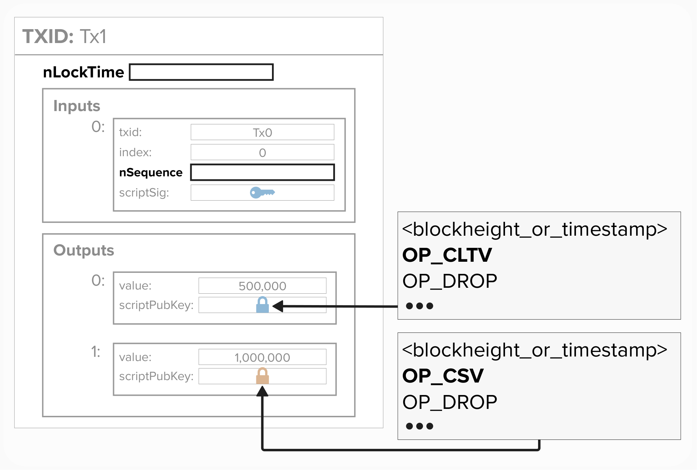

# Timelocks

Timelocks are a neat feature in Bitcoin that will become **very** useful as we begin to build our payment channels.

Timelocks allow us to lock bitcoin such that they can only be spent after a certain amount of time passes. For example, we can lock bitcoin so that they can only be spent after 144 blocks from when they are mined. Or, we can accidentally lock them  forever - fun!

## Relative & Absolute Timelocks
There are multiple ways to specify time-based conditions on our transactions. Generally speaking, timelocks can either be **relative** or **absolute**.
- A **relative** timelock will lock bitcoin until either a certain **number of blocks** or **seconds** have passed since, for example, the output was first mined in a block. For example, if I add a relative timlock of 144 blocks to an output, then that output is only spendable 144 blocks (~1 day) *after* it is first mined within a block.
- An **absolute** timelock will lock bitcoin until either a given **block height** or **unix timestamp** is reached. For example, if I timelock an output to block height 2,000,000, then the output cannot be spent until after block 2,000,000.

## Timelocks in Bitcoin Transactions
Timelock conditions can be placed in the following three locations within a transaction:
- **```nLocktime```**: This is a **transaction level** timelock that locks the entire transaction to an **absolute** timelock. If a timelock condition is placed in this field, then the transaction itself cannot be mined until **after** a specific block height or time has passed.

- **```nSequence```**: This is an **input level** timelock that locks an input to a **relative** timelock. If a timelock condition is placed on an input, then the input cannot be **mined** until that amount of blocks or time has passed since the **output it's referencing was mined**. It's also important to note that the ```nSquence``` field is used to enable `nLocktime` and **Replace-By-Fee**.

- **```scriptPubKey```**: Bitcoin's script language allows you to lock transaction outputs using two types of timelocks:
  - **Absolute Timelocks (OP_CHECKLOCKTIMEVERIFY)**:
    - Prevents spending until a specific block height or timestamp is reached.
    - Example: "Cannot spend until block 800,000" or "Cannot spend until January 1, 2025"
    
  - **Relative Timelocks (OP_CHECKSEQUENCEVERIFY)**:
    - Prevents spending until a certain time has elapsed since the output was mined
    - Can be specified in:
      - **Blocks**: "Must wait 144 blocks after mining" (~1 day)
      - **Time**: Number of seconds, specified in 512-second intervals.

<p align="center" style="width: 50%; max-width: 300px;">
  
</p>
<details>
<summary>Click here to learn more about nSequence</summary>
  
The **```nSequence```** field is quite important when configuring locktimes, so let's take a closer look at it.
- To enable **```nLocktime```** to be used on a transaction, we need to configure the **```nSequence```** for at least one input to be `0xFFFFFFFE` or less.
- To enable **Replace By Fee**, we need to configure the **```nSequence```** for at least one input to be `0xFFFFFFFD` or less.
- To enable **Relative Locktime**, we need to configure the **```nSequence```** to be:
  - **`0x00000000`** to **`0x0000FFFF`** for **Blocks**.
  - **`0x00400000`** to **`0x0040FFFF`** for **Time**.
    - Note, for time, the value is multiplied by 512 and is interpreted as seconds.
  
<p align="center" style="width: 50%; max-width: 300px;">
  
</p>

</details>

<details>
<summary>Click here to learn more about nLocktime</summary>

**```nLocktime```** conditions are processed as follows:
- If ```nLocktime``` is set to ```<=499999999```, then the ```nLocktime``` field is read as a **block height**.
- If ```nLocktime``` is set to ```>=500000000```, then the ```nLocktime``` field is read as a **timestamp**.

</details>


## ⚡️ Generate a Timelocked Output

For this exercise, imagine you want to create a **P2PKH** output script that is not spendable until a certain number of blocks passed after the output is mined.

Go ahead and try to complete the `timelocked_p2pkh` function such that is satisfies the above conditions. As you can see from the function delcaration below, it will take a ```PublicKey``` and ```blocks_or_seconds``` as an input and produce an output script.


The above picture will be helpul in addition to the below **P2PKH** output script.

```
OP_DUP OP_HASH160 <pubkey_hash> OP_EQUALVERIFY OP_CHECKSIG`
```

```rust
pub fn timelocked_p2pkh(pubkey: &PublicKey, blocks_or_seconds: i64) -> ScriptBuf {
}
```
<details>
  <summary>Hint: Click here to see the full output script</summary>
  
```
<blocks_or_seconds> OP_CSV OP_DROP OP_DUP OP_HASH160 <pubkey_hash> OP_EQUALVERIFY OP_CHECKSIG
```

</details>