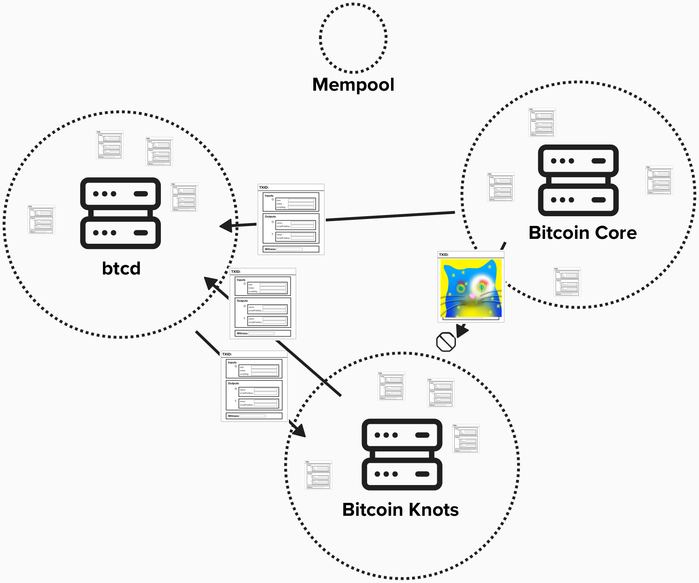
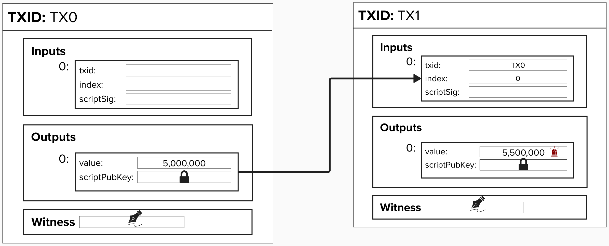
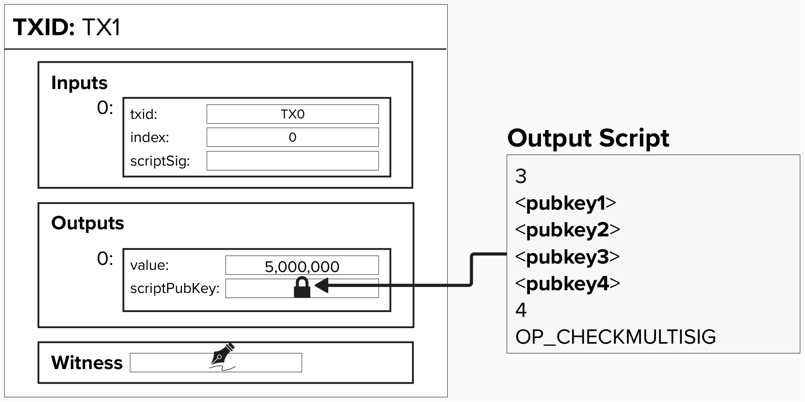
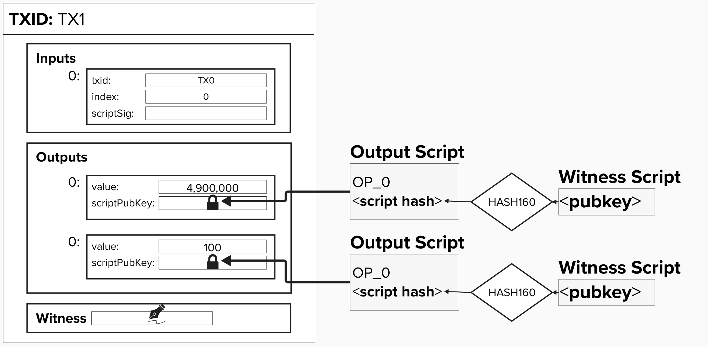

# Mempool Policy

An additional concept to review, which is sometimes overlooked in Lightning education, is mempool policy. 

<p align="center" style="width: 50%; max-width: 300px;">
  
</p>

# What is a mempool?
First and foremost, notice how this section's title is "What is ***a*** mempool?" and *not* "What is ***the*** mempool". This is a small, but significant, difference!

A **memory pool** (mempool) is a node's local storage of unconfirmed Bitcoin transactions. These transactions are either created by us or relayed to us by other nodes, and they are stored in our node's random access memory (RAM). Once these transactions have been included in a block, they are removed from the mempool.

Furthermore, the rules that your node's mempool follows will depend on a few factors, such as which Bitcoin client you're running and how you configure the mempool settings. Remember, the Bitcoin protocol is a set of rules that all *implementations* must follow, but there are multiple implementations. **Bitcoin Core**, a C++ codebase that was originally created by Satoshi, is the most popular implementation. However, other options exist, such as **Bitcoin Knots**, which is a derivative of Bitcoin Core, and **btcd**, which is a Bitcoin implementation written in Go. Since implementations are free to add additional rules that don't break consensus, each implementation may enforce different mempool policies. For example, Bitcoin Knots provides users with extra customization to filter out transactions that contain inscriptions.

Since we're running a Bitcoin Core node in the background of this workbook, we have our own mempool! Go ahead and type the following command in your **Shell**:

```
bcli getrawmempool
```

Once you run this, you'll see which unconfirmed transactions, if any, your node is aware of.

<details>
  <summary>Click to see what an empty mempool looks like</summary>

If your node is not aware of any transactions, you will see an empty list.

```
[

]
```

</details>

<details>
  <summary>Click to see what a non-empty mempool looks like</summary>

On the other hand, if you see a list of Transaction IDs, then your node has some unconfirmed transaction in its mempool!

```
[
"11c29ff...2264ff8",
"3c599e8...4d06d6e",
]
```

</details>


#### Question: Why do nodes have mempools in the first place? Why don't we just send transactions to miners directly?

<details>
  <summary>Answer</summary>

While it might be more convenient to directly send transactions to miners, this would pose serious privacy concerns. For instance, in this secenario, miners would be able to monitor the IP addresses associated with the node's sending transactions to miners. Not only is this a privacy leak, but it opens the door to Denial of Service attacks.

By leveraging the mempool to monitor transactions peer-to-peer, it's much harder for a minder to know where a transactions originated from. Additionally, it's much easier for a new miner to join the network, as they will be relayed new transactions to mine by default.

Another important reason mempools exist is to create an orderly staging area for transactions ready to be mined. To do this, mempools will employ various policies to ensure that the transactions they store are both valid (do not double-spend) and mineable (ex: not timelocked).

</details>

#### Question: Why is a mempool stored in memory and not disk?

<details>
  <summary>Answer</summary>

First and foremost, it should be noted that your node may persist its mempool to disk when it shuts down. This way, it can read those transactions from disk when it reboots. That said, when operating, transactions will be stored in memory for the following reasons - all related to speed and efficiency:
1) **Transactions**: As we'll see shortly, your node will validate new transactions it recieves before adding them to the mempool. Part of this validation process invloves checking to make sure the new transaction does not conflict (ex: double-spend) with an existing transaction in the mempool. This process is made much faster if your node reads these transactions from memory as opposed to disk.
2) **Blocks**: When your node recieves a new block, it must validate the block before passing it on to other nodes. Part of this process involves validating transactions in the block. If a node has these transactions in their mempool and already validated, this process is much faster.
3) **Mining**: It's much faster to build a candidate block to mine if you can retrieve transactions from memory instead of disk.

</details>

# What is mempool policy?
So, we've learned that our node has its own mempool where it temporarily stores unconfirmed Bitcoin transactions. Cool! 

#### Question: Should we have any rules when accepting transactions from peers? Are there risks to accepting all transactions without rules?

<details>
  <summary>Answer</summary>

Yes! At its core, a Bitcoin node is a computer with an internet connection to other, anonymous, internet-connected devices. Given that our peers are anonymous, we cannot assume that they will act with good intentions

If a node does not have existing policies when accepting new connections and data, it would be exposed to various Denial of Service (DoS) attacks by peers.

To ensure that they cannot deliberately send you data and transactions that will use all your node's resources and, possibly, crash your node, your node will abide by a set of policies which dictate how to handle incoming data and connections.

</details>

In an effort to mitigate against Denial of Service attacks from peers, a Bitcoin node will enforce a **transaction relay policy**, which includes a set of **validation** and **consensus** rules to apply to unconfirmed transactions.

### Consensus Rules

Consensus policies are the most straight-forward policy rules, as they strictly define what is a valid or invalid use of Bitcoin. These rules hold across the entire network, regardless of which Bitcoin client you use.

For example, one consensus rule is that **the sum of a transaction's input values must be greater than or equal to the sum of the output values**. In other words, you cannot spend bitcoin you don't own.

<p align="center" style="width: 50%; max-width: 300px;">
  
</p>


<details>
  <summary>⚡️ Consensus Exercise</summary>

Let's get a deeper understanding of how our node will react if we attempt to relay a transaction that breaks consensus. To do this, let's attempt to broadcast a Bitcoin transaction that spends 5.5M sats from a 5M sat UTXO.

A transaction has already been created to do just this, and you can find it below!

```
02000000000101fd9c4111764b2a2d683253a0e4ec3baaf8a6bd888f08e2a18410f507e242b1630100000000ffffffff0160ec53000000000016001479b000887626b294a914501a4cd226b58b23598302473044022015bd3ba7f03b00eac02956a5a4927c820a2c22250145e60aa824a405d605b41702205978f74e0418c1840dc8f644fd638693f98e10f6a68998efb459e16c925dc170012102114427bf9193866b0e4cc043896542e6cbf62fc84d8f91ce61829bf5c6ee480600000000
```

Go ahead and try to broadcast this transaction using the `sendtx` command in the **Shell**. Make sure to replace `<tx_hex>` with the transaction hex above!

```
sendtx <tx_hex>
```

You should get the below error! This is informing us that the transaction's outputs are greater than its inputs. **Therefore, it won't relay it because we are breaking consensus rules!**

```
bad-txns-in-belowout, value in (0.05) < value out (0.055)
```


In the spirit of "don't trust, verify", you can the below dropdown to verify that the transaction hex provided actually spends 5.5M sats from a 5M UTXO. This is a great exercise to learn how to parse Bitcoin transactions via Bitcoin Core.

<details>
<summary>⚡️ Verify Transaction</summary>

So you decided to verify the transaction? Good for you! Let's start by decoding the raw transaction to see what's inside. You can do this by entering the `decodetx` command in the **Shell**. Once again, make sure to replace `<tx_hex>` with the full transaction hex!

```
decodetx <tx_hex>
```

After running `decodetx`, look at the **vout** section. You should see something like the below, which indicates that we are spending 5.5M sats.

```
"vout": [
  {
    "value": 0.05500000,
    "n": 0,
    "scriptPubKey": {
      "asm": "0 79b000887626b294a914501a4cd226b58b235983",
      "desc": "addr(bcrt1q0xcqpzrky6eff2g52qdye53xkk9jxkvrl4xfg5)#m2g237pm",
      "hex": "001479b000887626b294a914501a4cd226b58b235983",
      "address": "bcrt1q0xcqpzrky6eff2g52qdye53xkk9jxkvrl4xfg5",
      "type": "witness_v0_keyhash"
    }
  }
```

Nice, we've verified the output, but how do we verify the input? To do that, we'll have to ask Bitcoin Core to tell us more information about the **vin** section, which lists all of the **inputs** to our transaction.

```
"vin": [
  {
    "txid": "63b142e207f51084a1e2088f88bda6f8aa3bece4a05332682d2a4b7611419cfd",
    "vout": 1,
    "scriptSig": {
      "asm": "",
      "hex": ""
    },
    "txinwitness": [
      "3044022015bd3ba7f03b00eac02956a5a4927c820a2c22250145e60aa824a405d605b41702205978f74e0418c1840dc8f644fd638693f98e10f6a68998efb459e16c925dc17001",
      "02114427bf9193866b0e4cc043896542e6cbf62fc84d8f91ce61829bf5c6ee4806"
    ],
    "sequence": 4294967295
  }
],
```

Looking at this, we can see that the input to our transaction comes from a transaction with the ID `63b142e207f51084a1e2088f88bda6f8aa3bece4a05332682d2a4b7611419cfd` and input `1`. Using the helper command `getutxo <txid> <index>`, we can fetch information about this UTXO. Remember, under the hood, `getutxo` is executing the [`gettxout` command](https://developer.bitcoin.org/reference/rpc/gettxout.html) in Bitcoin Core, which returns details about an unspent transaction output.

Go ahead and try running it using the below!

```
getutxo <txid> <index>
```

After running it, you should see the following. NOTE, some of this information may be different for you - for example, if you've mined blocks. However, the `"value" should remain the same.

```
{
  "bestblock": "40df33ef4b4081976b29557b017338424f5fda36afa4c80dc6c28e49bed73183",
  "confirmations": 1,
  "value": 0.05000000,
  "scriptPubKey": {
    "asm": "0 3baaf3664ef39845d98697b629af5f2828e68716",
    "desc": "addr(bcrt1q8w40xejw7wvytkvxj7mznt6l9q5wdpckk34n5h)#yxm8dwrr",
    "hex": "00143baaf3664ef39845d98697b629af5f2828e68716",
    "address": "bcrt1q8w40xejw7wvytkvxj7mznt6l9q5wdpckk34n5h",
    "type": "witness_v0_keyhash"
  },
  "coinbase": false
}
```

</details>

</details>

### Standardness Rules

Standardness rules define a set of *additional* rules that nodes apply to **transactions**. These rules are client-specific and *not* required to be universal across the entire Bitcoin network. These rules are often put in place to ensure the network remains healthy and is resistant to Denial of Service attacks.

As an example, **Pay-to-MultiSig** (**P2MS**) is legacy script type that enables you to lock bitcoin to multiple public keys. Nowadays, it's much more common to implement multisig conditions within a script hash (P2SH or P2WSH), which is what we reviewed earlier.

That said, P2MS is only considered **standard** for up to 3 public keys. This means, if you create an output script that locks directly to a 2-of-3 P2MS, nodes will relay this transaction. However, if you increase the number of public keys, this would be considered **non-standard**, so, even though it can be included in a block by a miner, nodes will not relay it.

It's important to notice that we are locking to the script itself - not the hash of the script!

<p align="center" style="width: 50%; max-width: 300px;">
  
</p>

<details>
  <summary>⚡️ Standardness Exercise</summary>

Below is a transaction that locks an output to a 3-of-4 P2MS.

```
02000000000101fd9c4111764b2a2d683253a0e4ec3baaf8a6bd888f08e2a18410f507e242b1630100000000ffffffff01404b4c00000000008b5321031b84c5567b126440995d3ed5aaba0565d71e1834604819ff9c17f5e9d5dd078f21024d4b6cd1361032ca9bd2aeb9d900aa4d45d9ead80ac9423374c451a7254d07662102531fe6068134503d2723133227c867ac8fa6c83c537e9a44c3c5bdbdcb1fe3372103462779ad4aad39514614751a71085f2f10e1c7a593e4e030efb5b8721ce55b0b54ae024730440220221e19c45ff7e1725bfa2a2f1ae78d5573f213393861168dcc5b39b6aa7a1ddd02202f6ace151da5601d5bb6f6a01d02e8fdfaa37115de7e52f4e9aa0865896261a6012102114427bf9193866b0e4cc043896542e6cbf62fc84d8f91ce61829bf5c6ee480600000000
```

For this exercise, we'll start by verifying that the locking script is indeed a 3-of-4 P2MS. To do this, you'll need to run the below command. Make sure to check the **asm** section, which provides a human-readable representation of the locking script. You should see `3` `<pubkey>` `<pubkey>` `<pubkey>` `<pubkey>` `4` `OP_CHECKMULTISIG`.

When decoding the transaction, make sure to replace `<tx_hex>` with the full transaction hex!

```
decodetx <tx_hex>
```

After you've verified the output, go ahead and try to broadcast this transaction to the network by entering the below in the **shell**.

```
sendtx <tx_hex>
```

You should get the below error! This is informing us that there is an issue with the transaction's scriptpubkey. **Therefore, it won't relay it because we are breaking standardness rules!**

```
error code: -26
error message:
scriptpubkey
```

</details>

### Node Policy Rules

Similar to Standardness Rules, **Mempool Policy Rules** define a set of *additional* rules that nodes apply to components within their node, such as their **mempool** or **transaction-relay** functionality. Again, these rules are also client-specific and can vary across Bitcoin clients.

#### Mempool
For example, one Bitcoin Core policy rule is that an unconfirmed mempool transaction can not have more than 25 decendent transactions. This rule is an attempt to find a balance between two large goals of a node's mempool.
1) Relay transactions across the network, helping to serve miners transactions and keep the network healthy. Also, having a robust mempool enables a node to estimate accurate on-chain fees without reliance on a third party!
2) Prevent denial of service attacks. It's [computationally complex](https://bitcoin.stackexchange.com/questions/118160/whats-the-governing-motivation-for-the-descendent-size-limit) to manange a large graph of decendant transactions, so limiting how large this set can grow helps to ensure that we do not expose our node to DoS attack vectors.

<p align="center" style="width: 50%; max-width: 300px;">
  
</p>

#### Transaction Relay
Similar to standardness rules, which define "standard" or "normal" transaction structures, transaction relay rules empower nodes to decide which transactions to incude in their mempool and relay to others.

One such rule is the **dust output limit**, which dictates what the minimum value of an output should be such that it does not become **economically unspendable**. An economically unspendable output is one that would cost more in fees to spend than the output is worth, making it effectively valueless.

For example, in the image below, the transaction has the following two outputs:
1) 4.9M sats locked to a Pay-To-Witness-Public-Key-Hash output.
2) 100 sats locked to a Pay-To-Witness-Public-Key-Hash output.

The 100 sat output is economically unspendable, as it would cost more (in fees) than 100 sats to spend this output.

<p align="center" style="width: 50%; max-width: 300px;">
  
</p>

#### Question: Why bother restricting dust outputs at all? Shouldn't it be a user's responsibility to pick output sizes that they can spend later?

<details>
  <summary>Answer</summary>

Unfortunately, dust outputs impact all full-nodes, as they need to be stored in the Unspent Transaction Output Set (UTXO Set). Therefore, dust outputs become a burden on the entire network by increasing storage requirements for full nodes. Additionally, if an attacker could create many 1 sat output transactions, they could spam the network with valid transactions cheaply.

Therefore, Bitcoin implementations, such as Bitcoin Core, enforce a **dust limit** on transaction outputs, depending on the output type. You can find the dust limits below:

- **P2PKH**: 546 sats
- **P2SH-P2WPKH**: 540 sats
- **P2WPKH**: 294 sats
- **P2TR** and **P2WSH**: 330 sats

</details>

<details>
  <summary>⚡️ Node Policy Exercise</summary>

Below is a transaction hex that locks Bitcoin to the following two outputs:
1) 4.9M sats locked to a Pay-To-Witness-Public-Key-Hash output.
2) 100 sats locked to a Pay-To-Witness-Public-Key-Hash output.

```
02000000000101fd9c4111764b2a2d683253a0e4ec3baaf8a6bd888f08e2a18410f507e242b1630100000000ffffffff02a0c44a000000000016001479b000887626b294a914501a4cd226b58b235983640000000000000016001479b000887626b294a914501a4cd226b58b2359830247304402204a4b437c2854eefbf32f374d8e1e307b025233a125d37ed0acdbcd339a8b1b3b02205909aa3918dfbb4f67f82fa063fc1e49262cdb249a29753c46db7dd043a583a2012102114427bf9193866b0e4cc043896542e6cbf62fc84d8f91ce61829bf5c6ee480600000000
```

If you'd like, you can verify this by decoding the transaction and checking the two outputs in the **vout** section. You'll see one is for `"value": 0.00000100`.

```
decodetx <tx_hex>
```

Now, go ahead and try to relay this transaction to the network by entering the below in the **shell**.

```
sendtx <tx_hex>
```

You should get the below error! This is informing us that at least one output is below the dust limit defined by Bitcoin Core, which we're running in this workbook. **Therefore, our node won't relay the transaction because we are breaking node policy rules!**

```
error code: -26
error message:
dust
```

</details>

# Rejection ☹️
If you completed all of the above exercises and failed to broadcast your transactions, you may be feeling rejected by Bitcoin Core. It's not personal - Bitcoin is just doing it's part to ensure a healthy network. But don't worry, we'll publish (and mine) some transactions soon!