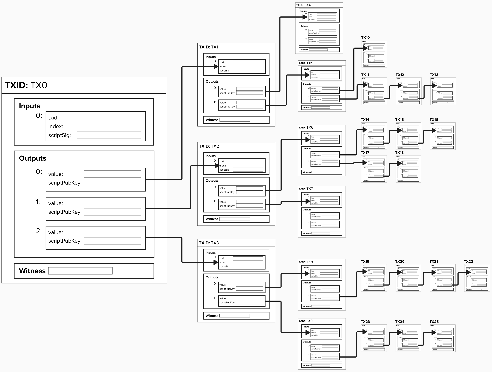

# Mempool Policy

An additional concept to review, which is sometimes overlooked in Lightning education, is mempool policy. 

## What is a mempool?
First and foremost, notice how this section's title is "What is *a* mempool?" and ***not**** "What is *the* mempool". This is a small, but significant, difference!

A **memory pool** (mempool) is a node's local storage of unconfirmed Bitcoin transactions. These transactions are either created by us or relayed to us by other nodes, and they are stored in our node's random access memory (RAM). Once these transactions have been included in a block, they are removed from the mempool.

By default, the mempool is limited to 300MB, but this can be changed by the developer. When your node shuts down, the mempool is persisted to disk.

Given that each node has its own mempool, there is no such thing as a universal mempool for all of Bitcoin. This can be confusing, as we often hear people say "the" mempool, but langauge is a tricky thing. Since we're running a Bitcoin Core node in the background of the Repl, we have our own mempool! Go ahead and type the following command in your terminal:

```
bcli getrawmempool
```

Once you run this, you should see an empty mempool. That's okay, our node is currently unaware of any unconfirmed Bitcoin transactions.

#### Question: Why do nodes have mempools in the first place? Why don't we just send transactions to miners directly?

<details>
  <summary>Answer</summary>

While it might be more convienent to directly send transactions to miners, this would pose serious privacy concerns. For instance, in this secenario, miners would be able to monitor the IP addresses associated with the node's sending transactions to miners. Not only is this a privacy leak, but it opens the door to Denial of Service attacks.

By leveraging the mempool to monitor transactions peer-to-peer, there is no way for a miner to know where transactions originated. Additionally, it's much easier for a new miner to join the network, as they will be relayed new transactions to mine by default.

</details>

## What is mempool policy?
So, we've learned that our node has its own mempool where it temporarily stores unconfirmed Bitcoin transactions. Cool! 

#### Question: Should we have any rules when accepting transactions from peers? Are there risks to accepting all transactions without rules?

<details>
  <summary>Answer</summary>

Yes! At its core, a Bitcoin node is a computer with an internet connection to other, anonymous, internet-connected devices. Given that our peers are anonymous, we cannot 

If a node does not have existing policies when accepting new connections and data, they would be exposed to various Denial of Service (DoS) attacks by peers. One major reason for this is that Bitcoin is private, so you don't know if the peer you're connecting with is honest or a threat when opening the connection.

To ensure that they cannot deliberately send you data and transactions that will use all your node's resources and, possibly, crash your node, your node will abide by a set of policies which dictate how to handle incoming data and connections.

</details>

In an effort to mitigate against Denial of Service attacks from peers, a Bitcoin node will enforce a **transaction relay policy**, which includes a set of **validation** and **consensus** rules to apply to unconfirmed transactions.

<details>
  <summary>Consensus Rules</summary>

Consensus policies are the most straight-forward policy rules, as they strictly define what is a valid or invalid use of Bitcoin. These rules hold across the entire network, regardless of which Bitcoin client you use.

For example, one consensus rule is that **the sum of a transaction's input values must be greater than or equal to the sum of the output values**. In other words, you cannot spend bitcoin you don't own.

A transaction is invalid by Bitcoin Core standardness rules if it has a fee lower than 1sat/vbyte.
Sending an unconfirmed transaction which has 25 or more unconfirmed ancestors violates Bitcoin Core policy rules.

</details>

<details>
  <summary>Standardness Rules</summary>

Standardness rules define a set of *additional* rules that nodes apply to **transactions**. These rules are client-specific and *not* required to be universal across the entire Bitcoin network. These rules are often put in place to ensure the network remains healthy and is resistant to Denial of Service attacks.

As an example, for SegWit transactions, the maximum **consensus** size limit is 4 MB. This means, regardless of which Bitcoin client you use (Bitcoin Core, )

However, the maximum **standardness** size limit is 400 kB. In other words, a SegWit transaction that is less than or equal to 4 MB is valid and can be mined, however, Bitcoin Core nodes will only relay SegWit transactions that are less than or equal to 400 kB. Standardness rules such as this help ensure a healthy and decentralized network by ensuring that, by default, nodes are not relaying large transactions that can be time-consuming and resource intensive to validate.

</details>

<details>
  <summary>Node Policy Rules</summary>

Similar to Standardness Rules, **Mempool Policy Rules** define a set of *additional* rules that nodes apply to components within their node, such as their **mempool** or **transaction-relay** functionality. Again, these rules are also client-specific and can vary across Bitcoin clients.

For example, one Bitcoin Core policy rule is that an unconfirmed mempool transaction can not have more than 25 decendent transactions. This rule is an attempt to find a balance between two large goals of a node's mempool.
1) Relay transactions across the network, helping to serve miners transactions and keep the network healthy. Also, having a robust mempool enables a node to estimate accurate on-chain fees without reliance on a third party!
2) Prevent denial of service attacks. As we mentioned earlier, if  

<p align="center" style="width: 50%; max-width: 300px;">
  
</p>

</details>

