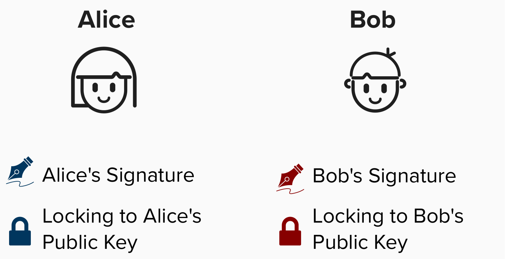
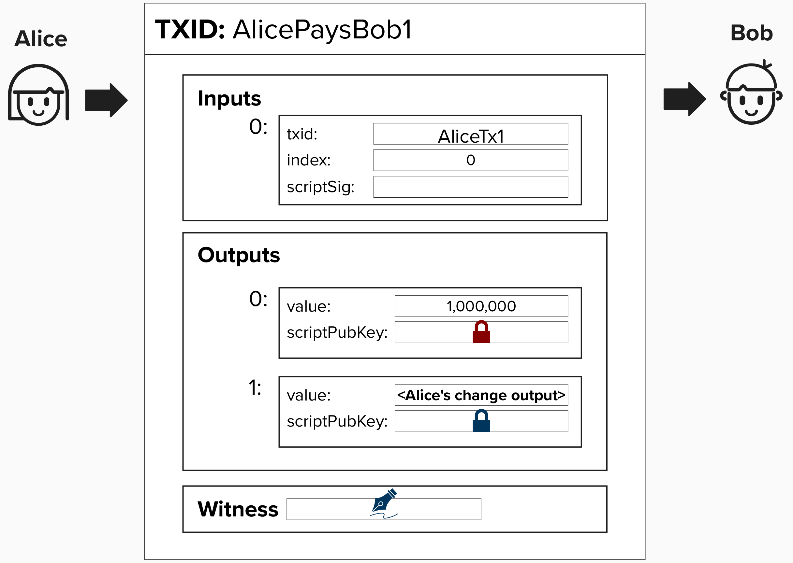
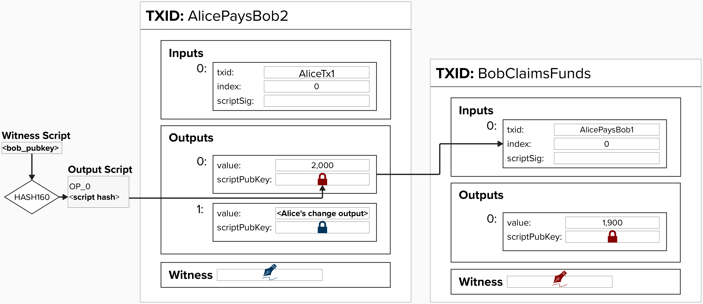
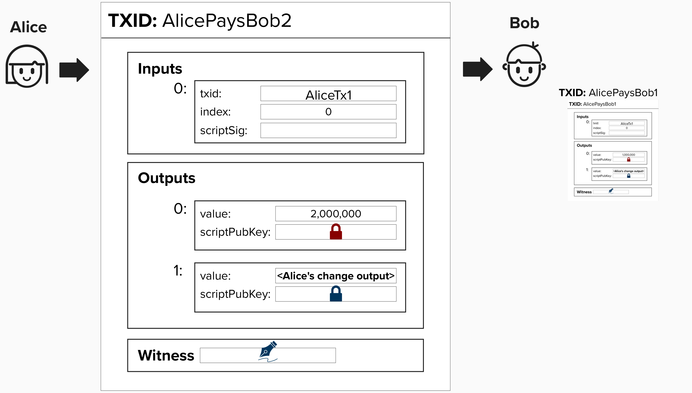
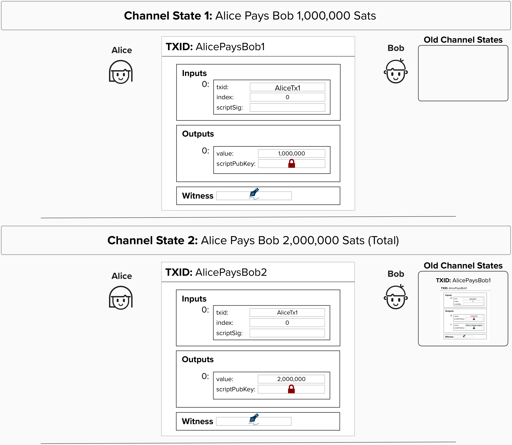

# Irresponsibly Naive Scaling

At the heart of Lightning and other scaling solutions is the concept of exchanging **"off-chain"** transactions. Off-chain transactions are transactions that are **valid**, in that they adhere to the rules of the Bitcoin protocol, but the holders of these transactions choose not to publish them until a later point in time. To make an off-chain payment, you can simply contruct a valid transaction and send it to someone - perhaps via email or text message. After all, under the hood, a transaction is just data.

<details>
  <summary>Click to see an example transaction!</summary>

Unless you have the Bitcoin protocol programmed into your brain, you likely won't understand the byte sequence below, but it's actually a valid Bitcoin transaction. All the necessary details, such as inputs, outputs, and signatures, are encoded into this data.

```
020000000001018d54238793c4547bb913e369a27c74bc08fc20c33197f5690f41565c7cfad12e0000000000ffffffff01784a4c0000000000220020657760ca015175e42ff5b4470563b23adcf0d2973a0506a176a5569690d64437024730440220548d3aeae38390d1d4f79b8756b5758d131051ddce223aa4f395bb88be1ccaeb02201698654ab9c29d41822771cd3a75bffec87488322a46783f64cd53aefb1f5d960121024e77786b0c8bef20ef469345cf4c306b14dee25dd5bab152155bee1e2115e93100000000
```


</details>

## Alice and Bob Exchange Off-Chain Transactions

To help build our intuition, let's discuss what might be the most naive scaling solution possible. **PLEASE DON'T TRY THIS AT HOME!**.

Imagine Alice and Bob are all grown and now drink adult beverages. In fact, Bob started his own bar (good luck!). Since they both love Bitcoin, Alice decides to pay Bob in Bitcoin whenever she goes to his bar, but, to save on transaction fees and receive instant payments, Alice and Bob agree to create an **off-chain** transaction, meaning that Alice will send Bob a valid Bitcoin transaction, and Bob will choose to publish it sometime in the future, perhaps when fees are lower.

To bring this example to life, let's equip Alice and Bob with private and public keys. As we work through this workshop, we'll represent their **signatures** with a **signature** logo, and we'll represent locking to their **public keys** with a **lock** logo.

<p align="center" style="width: 50%; max-width: 300px;">
  
</p>

Now, if Alice wants to pay Bob, she can simply send him a valid transaction off-chain. For example, imagine that Alice buys a glass of wine for 1,000,000 sats. She will just create a transaction locking 1,000,000 sats to Bob's public key.


<p align="center" style="width: 50%; max-width: 300px;">
  
</p>


#### Question: What feerate should Alice set on this transaction?

<details>
  <summary>Answer</summary>

Hmm, this is actually a tricky question. Remember, Alice is giving Bob a transaction for him to broadcast at some arbitrary point in the ***future***. Since there is no way to know what the fees will be then, Alice and Bob have a few options.


### Choose A Conservative Feerate:
Alice and Bob can do their best to predict what the feerate will be in the future, and they can set the fees slightly above that to be safe.

### Child-Pays-For-Parent
If the fee that Alice and Bob originally decide on ends up being too small, then Bob can create a new transaction, which spends from Alice's payment transaction, and moves those funds to a new address controlled by Bob. If Bob sets fees sufficiently high on this transaction, he can, effectively, bump the fees on the original transaction since miners will consider both transaction's fees when determining if they should include these transactions in a block. ***NOTE***: a huge benefit of this approach is that Bob will know the current feerate estimates under this approach, since he will only create the new transation when he wants to publish Alice's off-chain payment.

<p align="center" style="width: 50%; max-width: 300px;">
  
</p>

### Replace-By-Fee Won't Really Work
You've probably heard of replace-by-fee, whereby you re-create the same transaction, but you just add extra fees. Since miners will prefer to mine transactions with the highest fees, they will choose the "updated" transaction with higher fees instead of the lower-fee transaction. The reason this doesn't work that well for Alice's payment to Bob is that there is no guarentee that Alice will be around to cooperate with Bob to create a new transaction with higher fees. Remember, Alice is creating valid transactions and handing them off-chain to Bob in exchange for a drink. If Bob wants to bump the fee via replace-by-fee, Alice will need to agree to re-sign a *new* transaction, which is not very reliable.


</details>

If Alice decides to purchase another glass of wine, she can just create a new transaction that pays Bob 2,000,000 sats. **This will, effectively, replace the old transaction**. 

<p align="center" style="width: 50%; max-width: 300px;">
  
</p>

#### Question: Why didn't Alice just create another transaction for 1,000,000 sats and give it to Bob, leaving Bob with two off-chain transactions - each for 1,000,000 sats?

<details>
  <summary>Answer</summary>

Technically, Alice could easily create another transaction that pays Bob 1,000,000 sats, but then Bob would have to publish two transactions on chain. This means twice the fees! This wouldn't be helpful at all.

Instead, Alice and Bob agree that this new transaction **will update the previous one**, so they should disregard the first transaction.

</details>

## Payment Channels
At the end of the night, Bob can simply publish the **most recent** transaction to the Bitcoin blockchain. Why? Since, for each payment (transaction), Alice simply added more funds to Bob's output, Bob can claim all of his funds by publishing the final transaction to the blockchain. In this way, Alice and Bob have created a **payment channel**. **In it's simplest form, a payment channel is a way for multiple parties to exchange Bitcoin transactions off-chain.**

By not broadcasting each transaction to the chain, the parties do not need to:
1) Wait for confirmations.
2) Pay miner fees.
3) Force resource costs onto the entire network.

## Channel States

In **payment channels**, it’s key to view them through the lens of **channel states**. A channel’s **state** refers to the distribution of funds after each payment. These payments occur off-chain, with only the final state typically posted on-chain. Dividing payments into channel states simplifies tracking each transaction, making the process clear and manageable. This idea of "channel states" is also why you will commonly hear people refer to Lightning as a **state machine**. 

**NOTE: For simplicity, the change output has been removed from the visuals below**.

<p align="center" style="width: 50%; max-width: 300px;">
  
</p>

Another important concept of channel states is that they are meant to convey **direction**. Each update reflects the current fund reality for an instant on-chain close.


## Removing All Trust Assumptions 

You likely read the above channel construction and thought, "OMG, this is bad!". You'd be right.

In the above payment channel, there are many opportunities for both channel parties to steal from each other - whether that be Bitcoin or the goods and services obtained from the Bitcoin payments. Let's address these one by one, working our way towards payment channels that work without trust assumptions!

#### Question: What are some of the ways that Alice or Bob could cheat each other in the above payment channel?

<details>
<summary>Answer</summary>

There are *many* ways the above payment channel could go wrong. We'll start with the **double-spending issue**. In the above channel construction, Alice could double-spend the Bitcoin in the transaction that pays Bob by secretly creating another transaction and moving her bitcoin to a different UTXO! Then, when Bob goes to publish the final transaction at the end of the night, he'll find that the input to his transaction has already been spent, rendering his transaction invalid. Their mom would be so upset!

#### Question: How can we make sure that the Bitcoin allocated to this payment channel stays in this payment channel? In other words, how can we stop it from being double-spent?
<details>
  <summary>Answer</summary>

As we just learned, the core idea of a payment channel is to enable multiple parties to send each other off-chain transactions, resulting in instant and nearly-free payments. However, since these transactions are exchanged off-chain, we need a way to make sure they are not spent on-chain in such a way that renders the off-chain transaction invalid.

To alleviate this concern, we can require both parties to lock funds in a **2-of-2 multisig** output - one public key for each channel member. Therefore, to spend from this output, we'll need one signature from Alice and one signature from Bob. This will ensure that neither Alice nor Bob can double-spend the funds they are using in the payment channel.

</details>

</details>