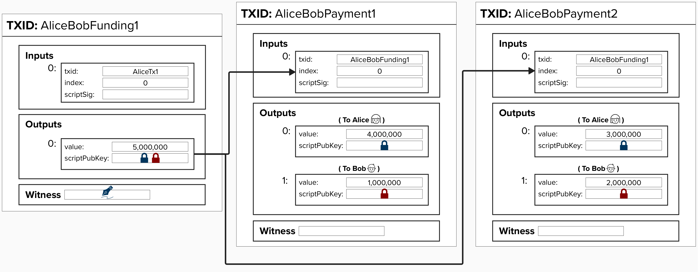

# Locking Funds In Our Payment Channel

For a payment channel to operate in a trustless environment, we're going to need to ensure that the funds being transfered **off-chain** in the payment channel cannot be unilaterally moved **on-chain**. In other words, Alice should not be able to show up to Bob's bar, give him an off-chain transaction in exchange for a glass of wine, and then move the same UTXO referenced in the off-chain transaction - rendering Bob's transansaction invalid.

To mitigate against this vulnerability, we can begin our payment channel by locking the channel funds in a **Pay-to-Witness-Script-Hash (P2WSH) 2-of-2 multisig output** where Alice and Bob both provide one public key. We'll call this transaction our **"Funding Transaction"**. To move the funds out of this UTXO (effectively, closing the channel), Alice and Bob will need to both provide both of their signatures.

To keep things simple, **Alice will initially provide the funds for this payment channel**, so she will provide the input to this **"Funding Transaction"**. You can think of this as Alice showing up to Bob's bar and opening a tab with a pre-allocated amount.

<p align="center" style="width: 50%; max-width: 300px;">
  
</p>

#### Question: You'll see in the above diagram that Funding Transaction UTXO is for 5,000,000 sats. Why is this amount so important for our payment channel?
<details>
  <summary>Answer</summary>

The amount in this UTXO is going to be channel balance for this payment channel. Therefore, neither channel party will be able to send the other channel party **more than this amount** of sats.

There are ways to increase this amount while the channel is active, but that is more advanced and will be covered later in this course.

</details>

### Sending a Payment
To send a payment, Alice and Bob can simply create a new transaction that spends from the funding transaction. Each new transaction will have an output for Alice and Bob with their respective channel balances.

For example, imagine that Alice sends Bob 1 million sats. Perhaps she is celebrating a promotion, so she's buying everyone drinks! 

Alice then decides to send Bob another 1 million sats for another round of drinks (it was a big promotion).

For each payment, Alice is creating a new transaction, moving sats from the output that locks bitcoin to her public key to Bob's output.

***PRO TIP!***: Don't be afraid to zoom in. Some of these diagrams may be hard to read, but the diagram should render quite nicely if you zoom in.

<p align="center" style="width: 50%; max-width: 300px;">
  
</p>

***NOTE***: We've left the `witness` section blank for now so that we can hone our focus on the overall structure of the payment channel, though we will return to this section shortly! 

## ⚡️ Build A Payment Channel Funding Transaction

Complete `build_funding_transaction` in `src/htlc_intro/exercises.rs`. This function takes the following parameters:
- `txins`: A vector of transaction inputs (`Vec<TxIn>`).
- `alice_pubkey`: Alice's public key (`&PublicKey`), which will be included in the 2-of-2 multisig.
- `bob_pubkey`: Bob's public key (`&PublicKey`), which will be included in the 2-of-2 multisig.
- `amount`: The channel amount. This will be an unsigned 64-bit integer `u64` structure.

```rust
pub fn build_funding_transaction(
    txins: Vec<TxIn>,
    alice_pubkey: &PublicKey,
    bob_pubkey: &PublicKey,
    amount: Amount,
) -> Transaction {

  // build output script

  // build tx output
  //    note, we must call .to_p2wsh() on our witness script
  //    to obtain the hash that goes in the output's scriptPubKey field

  // define version and locktime for transaction 

  // build transaction object
}
```

This transaction will return a `Transaction` structure, as defined by rust-bitcoin.

```rust
pub struct Transaction {
    pub version: Version,
    pub lock_time: LockTime,
    pub input: Vec<TxIn>,
    pub output: Vec<TxOut>,
}
```

### To complete this exercise, we'll need to implement the following steps:

#### 1) Build a witness script for our multisig.
<details>
  <summary>Step 1 - More Info</summary>

Use the `two_of_two_multisig_witness_script` function you created in the last exercise.

**Note**, to declare a variable in rust, use the `let` keyword. Also, each statement in Rust, including variable declarations, must end with a semicolon (`;`). For example, to create a variable that holds an integer, we could write:

```rust
let number = 5;
```

</details>

#### 2) Create an output (`TxOut` object) to be included in our funding transaction

<details>
  <summary>Step 2 - More Info</summary>

A `build_output` function is available to you that takes an `amount` and `output_script` as arguments and produces a `TxOut` object that can be passed into a transaction.

**Note**: Before passing your witness script to build_output, you must call `.to_p2wsh()` on it. This converts your witness script into a proper P2WSH output script with format `OP_0 <32-byte-script-hash>`. This is required because P2WSH outputs don't contain the full witness script - only its hash.

```rust
pub fn build_output(amount: u64, output_script: ScriptBuf) -> TxOut {
    
    TxOut {
        value: Amount::from_sat(amount),
        script_pubkey: output_script,
    }
}
```

Below is an example of how `build_output` could be used:

```rust
let output = build_output(500_000, output_script.to_p2wsh());
```


</details>

#### 3) Create a the funding transaction (`Transaction` object).

<details>
  <summary>Step 3 - More Info</summary>

To create a transaction, you can use the following helper function:

```rust
pub fn build_transaction(version: Version, locktime: LockTime, tx_ins: Vec<TxIn>, tx_outs: Vec<TxOut>) -> Transaction {
    Transaction {
        version: version,
        lock_time: locktime,
        input: tx_ins,
        output: tx_outs,
    }
}
```
### When building the transaction, note the following:

### Tx Outputs
`build_transaction` expects `tx_outs` to be a **vector** (think: list) of `TxOut` objects. To wrap your output in a vector, you can use the following notation:

```rust
vec![output]
```

### Version & Locktime
When specifying the version and locktime, you can use the following notation that rust-bitcoin provides. We'll learn about other varieties shortly, but this will help us get started.
- `Version::TWO`: Version 2 is post-BIP-68, which introduced sequence number relative locktimes. 
- `LockTime::ZERO`: This signals that there is no timelock on this transaction.

```rust
let version = Version::TWO;
let locktime = LockTime::ZERO;
```

</details>

## 👉 Get Our Funding Transaction
Now for the fun part! Once your `build_funding_transaction` is passing the tests, go to a **Shell** in your Repl and type in the below command.

```
cargo run -- funding
```

Under the hood, this command fetches a UTXO from our regtest wallet and creates a two-of-two multisig transaction using the function we just created. In case you're wondering which public keys are being used for "Alice" and "Bob", the background code in this Replit is creating new private-public key pairs for Aice and Bob. This will be helpful in the future, as we will need to generate signatures for the off-chain "payments".

Once you run it, you should see an output like this...

```
Tx ID:
8077cb7913e97caefb6199deeb1a14b4ecc740206f05cdfb56605da794ae0e8f

Tx Hex: 020000000001018d54238793c4547bb913e369a27c74bc08fc20c33197f5690f41565c7cfad12e0000000000ffffffff01784a4c0000000000220020657760ca015175e42ff5b4470563b23adcf0d2973a0506a176a5569690d64437024730440220548d3aeae38390d1d4f79b8756b5758d131051ddce223aa4f395bb88be1ccaeb02201698654ab9c29d41822771cd3a75bffec87488322a46783f64cd53aefb1f5d960121024e77786b0c8bef20ef469345cf4c306b14dee25dd5bab152155bee1e2115e93100000000
```

This is our funding transaction. **Note: we have NOT broadcasted this yet**. Go ahead and copy the **Tx Hex** and **Tx ID** and save them in the file `src/ch1_intro_htlcs/transactions.txt` under the headings **Funding Tx Hex** and **Funding Tx ID**. We'll wait to publish it!

Finally, go ahead and run the below command in your shell, replacing **raw tx hex** with the transaction hex we just generated.

```
decodetx <raw tx hex>
```

You should get an output like the below. See if you can map this output back to the diagram above. Most of these fields will not map directly, but the following are represented in the diagram:
- vin: txid
- vin: vout
- vin: scriptSig
- vin: txinwitness
- vout: value
- vout: scriptPubKey

```
{
  "txid": "b43eee65237aaba00e7d2a2b442635d0e973b03515413b4be14f669e7bf09f1f",
  "hash": "81b475238dbf1d0ecee44ec82cf21c803e0314336df32c1f684909943243c749",
  "version": 2,
  "size": 203,
  "vsize": 122,
  "weight": 485,
  "locktime": 0,
  "vin": [
    {
      "txid": "f5e9c01a663dd228485fdf07fb4ae95d46f3ee71ba93a0c2d77fa8998b57c44a",
      "vout": 1,
      "scriptSig": {
        "asm": "",
        "hex": ""
      },
      "txinwitness": [
        "30440220783ff032365771673328b10c7516622eb95337b80a9b781cccec6d7d61e39a2702205174d10e39e667cf32f4ad951f266e1070789010f22b9ad50eb70478164de92401",
        "02d865e012869cc63aafcbcd17561ec971a0ebefdf90d2be191708efe50652a641"
      ],
      "sequence": 4294967295
    }
  ],
  "vout": [
    {
      "value": 0.05000000,
      "n": 0,
      "scriptPubKey": {
        "asm": "0 657760ca015175e42ff5b4470563b23adcf0d2973a0506a176a5569690d64437",
        "desc": "addr(bcrt1qv4mkpjsp2967gtl4k3rs2caj8tw0p55h8gzsdgtk54tfdyxkgsmsvc0c37)#xfhwt3ez",
        "hex": "0020657760ca015175e42ff5b4470563b23adcf0d2973a0506a176a5569690d64437",
        "address": "bcrt1qv4mkpjsp2967gtl4k3rs2caj8tw0p55h8gzsdgtk54tfdyxkgsmsvc0c37",
        "type": "witness_v0_scripthash"
      }
    }
  ]
}
```

## Problem: Potential Loss of Funds

Take another look at the funding transaction output below. How can Alice lose all of her funds in this setup?

<p align="center" style="width: 50%; max-width: 300px;">
  
</p>

<details>
  <summary>Answer</summary>

If Bob stops responding or refuses to cooperate, then there's no way for Alice to retrieve her funds from this payment channel. This is because, to spend from a 2-of-2 multisig, you need signatures from *both* parties.
</details>


How can we address this problem for Alice?

<details>
  <summary>Answer</summary>

There are a few different ways to go about this, but the general solution is that we will need to create a way for Alice to recieve a "refund" or unilateral exit from the channel. Can you think of how we can implement this?
</details>