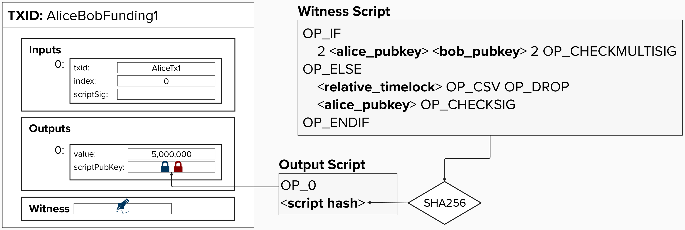
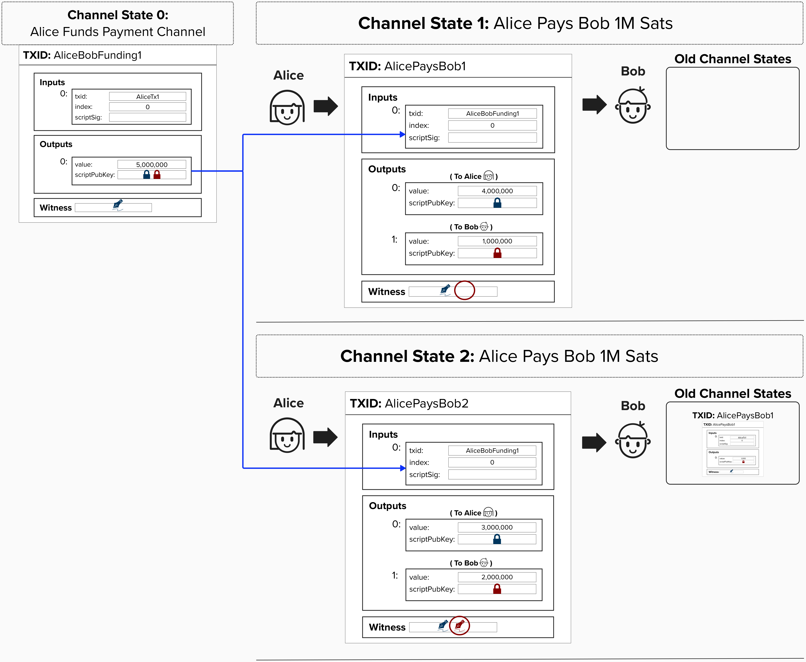
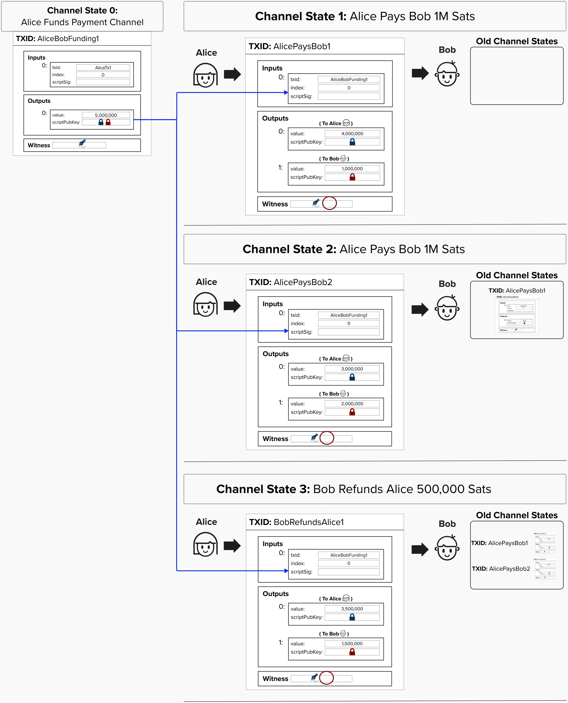

# Refund the Channel

If Bob becomes unresponsive or stops cooperating with Alice, then Alice needs to have a backup plan so that she can retrieve her funds from the payment channel.

## Use Multiple Spending Paths and Timelocks
There are different ways to implement the ability to "refund" a channel balance. One approach is to **use multiple spending paths** and **timelocks** to ensure that the channel balance can be refunded to Alice if something goes wrong. For example, we can implement the following spending paths:

1) The first spending path checks to see if both Aice's and Bob's signatures are provided. If so, that is sufficient to satisfy the conditions on this output and spend the funds. Nice!
2) If not, we can check if a relative timelock has passed since this transaction was confirmed on chain. For example, we could add a condition that says, if 2016 blocks (~2 weeks) have passed since the funding transaction was confirmed, then Alice can spend this output to herself. **This would act as Alice "refunding" her channel balance.**

  

## Updating Our Payment Protocol

Alice is *almost* safe to begin sending payments to Bob. To complete this simple payment channel, we'll need to circle back to the `witness` field. As a reminder, this is where we'll place the signatures required to spend the bitcoin locked in the funding transaction output.

To ensure that Alice and Bob can safely transfer funds off-chain and that Alice and Bob cannot cheat each other, we'll have to implement a fairness protocol. In other words, we must define the rules of this "off-chain payment" game. If Alice or Bob, break the rules, the other person can punish them. For this simple payment channel protocol, the rules of the game will be:
1) Alice and Bob start the game by funding a 2-of-2 multisig where each party contributes 1 key.
2) Whenever Alice sends Bob a payment, she will include her signature.
3) The game ends when either of the following two scenarios occurs:
    - Bob decides to close the channel by **adding his signature to the most recent transaction**. Note, the transaction was not valid to broadcast until Bob added his signature.
    - If the pre-determined timeout period elapses and Bob has not ended the game already (by publishing the final transaction), the game is over, and Alice can retrieve all of her money.

  
Click to see a diagram of the above process.

As you can see below, Alice's payment are all missing Bob's signature. Since Bob knows that, to publish any given transaction, he just needs to add his signature, he accepts Alice's transactions as a form of payment, and is happy to give her drinks once she provides her signed transaction.

Finally, once Bob is ready to close the channel, he adds his signature and publishes the transaction to the chain.

  

### While this is a valid approach to constructing a payment channel, is has some undesirable properties...

#### Question: This channel only trustlessly supports unidirectional payments from Alice to Bob? In other words, it's not safe for Alice to create a transaction that moves funds ***back*** to her side of the channel from Bob's side. Why?

  
Answer

Under this channel construct, every time Alice pays Bob, a new transaction is created with each party's new channel balances.

While Alice, ***the sender***, signs the transactions, Bob, ***the reciever*** does not, thus guaranteeing Alice cannot publish any old transactions.

**However**, if Alice and Bob agreed to create a new transaction that pays Alice (from Bob), there is nothing stopping Bob from publishing an older transaction that paid him more Bitcoin.

Therefore, Alice is only safe as long as she is paying Bob, continously drawing down from her balance.

  

#### Question: What downside did the introduction of timelocks create?

  
Answer

They gave our channels a limited lifetime. Bob must close the channel before the timelock expires otherwise Alice can take all of her funds back using the refund spending path.

