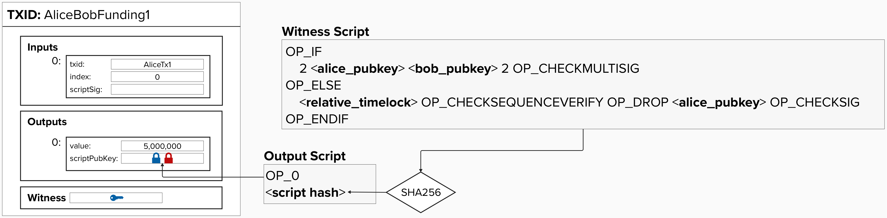

# Refund the Channel

If Bob becomes unresponsive or stops cooperating with Alice, then Alice needs to have a backup plan so that she can retrieve her funds from the payment channel. There are a few different ways she can do this. Can you think any? 

### Approach 1: Use Multiple Spending Paths and Timelocks
One approach would be to use multiple spending paths and timelocks to ensure that the channel balance can be refunded to Alice if something goes wrong. Take a minute to see if you can determine how this approach would be implemented in the output script. Also, try to identify the pros and cons of this approach.

<details>
  <summary>Answer</summary>
  <br/>

In this example, we create multiple spending paths. The first spending path checks to see if both Aice's and Bob's signature are provided. If so, that is sufficient to satisfy the conditions on this output and spend the funds. If not, we can check if a relative timelock has passed since this transaction was confirmed on chain. For example, we could add a condition that says, if 2016 blocks (~2 weeks) have passed since the funding transaction was confirmed, then Alice can spend this output to herself. This would act as Alice "refunding" her channel balance.

<p align="center" style="width: 50%; max-width: 300px;">
  
</p>

While a valid approach to ensuring Alice can get her funds out of the 2-of-2 funding transaction, this approach introduces some undesirable properties.

#### Question: What problem did the introduction of timelocks create?
<details>
  <summary>Answer</summary>
  <br/>
They gave our channels a limited lifetime. Bob must close the channel before the timelock expires otherwise Alice can take all of her funds back using the refund spending path.
</details>

We could build a payment channel off this construct where any new payment creates another transaction with the same properties as this transaction, but with a new channel balance.
#### Question: How come Bob cannot pay Alice using this channel?
<details>
  <summary>Answer</summary>
  <br/>
Under this new construct, every payment from Alice to Bob will be a new 2-of-2 multisig transaction with a timelocked refund to Alice. For example, imagine the following scenario:
  
- The channel starts with 5 bitcoin on Alice's side.
- Alice makes a payment to Bob of 2 bitcoin. Alice now has 3 bitcoin on her side.
- Bob makes a payment back to Alice for 1 bitcoin. Alice now has 4 bitcoin.
  
Since we cannot "cancel" old transactions, Bob can still broadcast the old channel state which pays him 2 bitcoin. To protect from this, the channel would have to be one-way from Alice to Bob.
</details>

</details>

### Approach 2: Create A New "Refund" Transaction That Spends From The Funding Transaction

Another approach would be to create a new transaction that spends from the funding transaction. This transaction will act as a "refund" transaction, as it will pay each channel member the amount of sats that they currently have at the time of opening the channel. Take a minute to see if you can identify how this approach would work.

<details>
  <summary>Answer</summary>
  <br/>

For this approach, we create a second transaction that spends each party's current balance to their public key. This ensures that, if Bob stops responding, Alice can refund her channel balance to herself. Also, there is no arbitrary timeline on this payment channel. Alice can refund the channel balance to herself whenever she likes.

It's important to note that this transaction still needs *both* parties to sign the input to this transaction, which is spending the bitcoin from the funding transaction. Therefore, creating the refund transaction should be thought of as a critical step that needs to be completed *before* a channel is live. Otherwise, if Alice or Bob broadcasted the funding transaction before they have both signed the refund transaction, Bob could still go offline and stop Alice from being able to access her bitcoin.

<p align="center" style="width: 50%; max-width: 300px;">
  
</p>


</details>

## Locking to Each Channel Party's Public Key
Great! We've identified a way to issue a refund transaction. All we have to do is lock bitcoin to a channel party's **public key**. As we learned earlier, this can be achieved by creating a **Pay-To-Public-Key-Hash** (**P2PKH**) transaction. However, Bitcoin Lightning transactions must use SegWit to avoid *transaction malleability*. Fortunately, we can use a **Pay-To-Witness-Public-Key-Hash** (**P2WPKH**) transaction type to accomplish this!

Similar to **Pay-To-Witness-Script-Hash** (**P2WSH**), the first byte in the **scriptPubKey** for a **P2WPKH** transaction will indicate the **witness version**, which is also ```OP_0```.


<p align="center" style="width: 50%; max-width: 300px;">
  
</p>

<p align="center" style="width: 50%; max-width: 300px;">
  
</p>