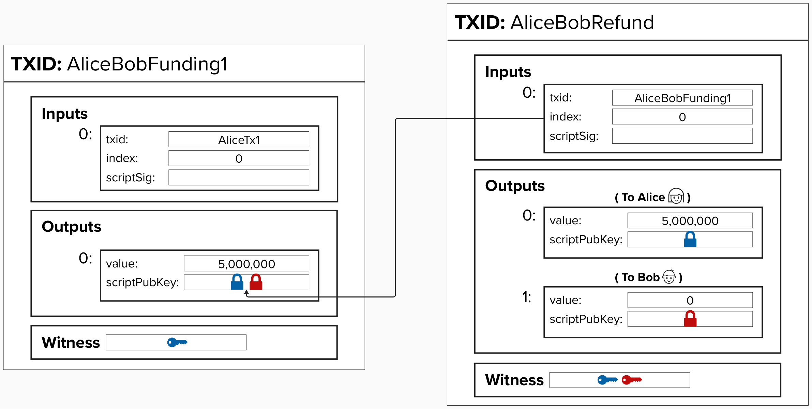
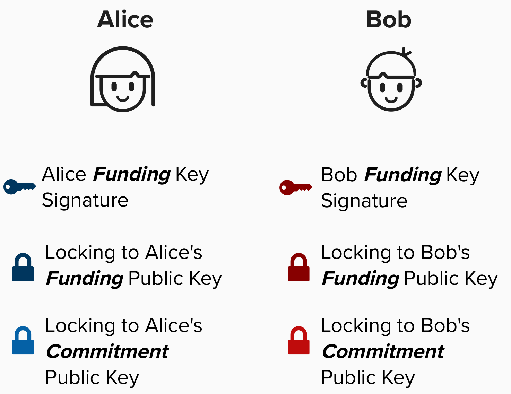
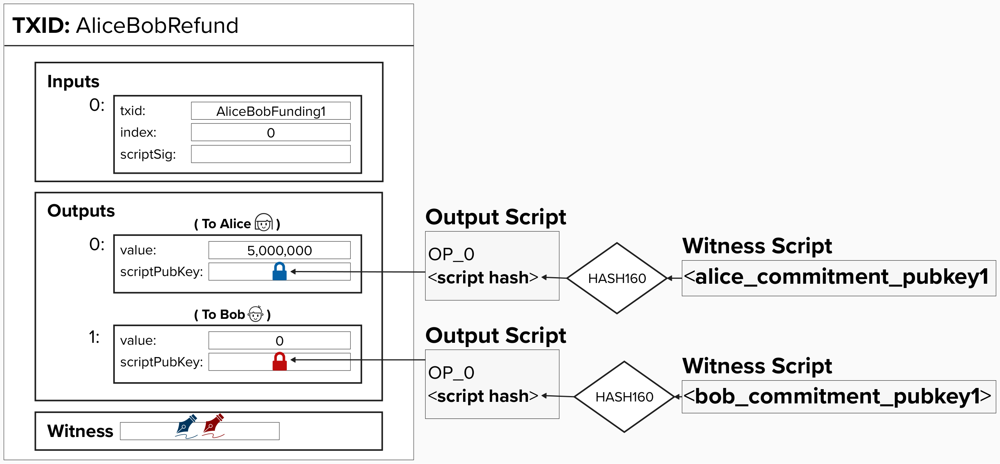

# Enhancing Our Payment Channel

So far, we've learned of one construction for building a payment channel. It works, but it's not ideal, as the channel is time-bound and payments can only, effectively, flow in one direction.

To address these concerns, we'll need to add some bells and whistles to our transaction.

To begin this journey, let's start by making a small improvement over our prior payment channel: 
- **Removing the timelock so that our channel is timeless (not bound by a transaction or output timelock)**.

## Create A New "Refund" Transaction That Spends From The Funding Transaction

Another approach would be to create a new transaction that spends from the funding transaction. This transaction will act as a "refund" transaction, as it will pay each channel member the amount of sats that they currently have at the time of opening the channel. 

To accomplish this, we create a second transaction that locks each party's current balance to their public key. This ensures that, if Bob stops responding, Alice can refund the channel balance to herself. **Also, there is no arbitrary timeline on this payment channel**. Alice can refund the channel balance to herself whenever she likes.

<p align="center" style="width: 50%; max-width: 300px;">
  
</p>

#### Question: Can the refund transaction be created after broadcasting the funding transaction?
<details>
  <summary>Answer</summary>

**NO!**

It's vital to note that the refund transaction still needs *both* parties signatures to spend. Therefore, creating the refund transaction should be thought of as a critical step that needs to be completed *before* publishing the funding transaction. Otherwise, if Alice broadcasts the funding transaction before they have both signed the refund transaction, Bob could refuse to sign the refund transaction, effectively holding Alice's funds hostage.

</details>

</details>


## Locking to Each Channel Party's Public Key
Great! We've identified a way to issue a refund transaction that isn't time-bound. All we have to do is lock bitcoin to a channel party's **public key**. As we learned earlier, this can be achieved by creating a **Pay-To-Witness-Public-Key-Hash** (**P2WPKH**) output. 

To help us build the refund transaction, we'll introduce a new public key, called a **commitment public key**. This key actually has a different name per the Lightning protocol specs, but we're not revealing that name yet for educational purposes! 

Also, note that the **commitment public key** has a `1` appended to the end of it in the **output script**. This is because this public key is specific to this payment (commitment transaction). Each new commitment transaction will have its own *unique* public key.

<p align="center" style="width: 50%; max-width: 300px;">
  
</p>

<p align="center" style="width: 50%; max-width: 300px;">
  
</p>

#### Question: Why do we use a new unique public key for each commitment transaction?
<details>
  <summary>Answer</summary>

</details>

## ⚡️ Build A Payment Channel Refund Transaction

Complete `build_refund_transaction`. This function takes the following parameters:
- `funding_txin`: Funding transaction input (`TxIn`).
- `alice_pubkey`: Alice's public key (`&PublicKey`), which will used to build Alice's output.
- `bob_pubkey`: Bob's public key (`&PublicKey`), which will be used to build Bob's output.

```rust
pub fn build_refund_transaction(
    funding_txin: TxIn,
    alice_pubkey: PublicKey,
    bob_pubkey: PublicKey,
    alice_balance: u64,
    bob_balance: u64
) -> Transaction {

    // create alice and bob's output scripts

    // define alice and bob's unique outputs

    // declare the version and locktime for the transaction

    // build transaction
    // -- remember, inputs and outputs must be passed in as vectors (vec![])
}
```

You can choose to use the following functions from our earlier excercises to help complete the function:
- `build_output`
- `build_transaction`

Also, you can obtain a **P2WPKH output script** by using the below function:

```rust
let p2wpkh_output_script = p2wpkh_output_script(pubkey);
```

## 👉  Get Our Refund Transaction

Once your `build_refund_transaction` is passing the tests, go to a **Shell** in your Repl and type in the below command. Make sure to replace `<funding_tx_id>` with the TxID from our funding transaction!

```
cargo run --bin refund <funding_tx_id> 
```

Once the program runs and you get the **Tx Hex** and **Tx ID**, save them in the file `src/ch1_intro_htlcs/transactions.txt` under the headings **Funding Tx Hex** and **Funding Tx ID**.

#### Question: When you add the refund transaction to `transactions.txt`, you'll likely notice that it's much bigger than the funding transaction. Do you know why?
<details>
  <summary>Answer</summary>

There are multiple answers here, but two big reasons are the following:
1) The refund transaction has two outputs, but our funding transaction only had one.
2) The refund transaction requires two signatures to spend, so the witness data is larger.

Because of these factors, the refund transaction requires more **vbytes** (virtual bytes), which directly translates to a higher mining cost in terms of fees.

Keep this in mind as we begin to explore more complex transactions shortly.

</details>