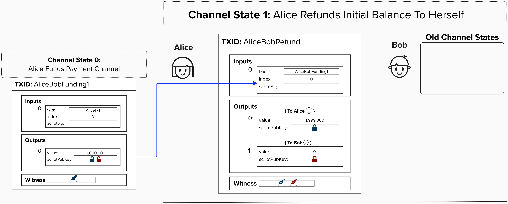
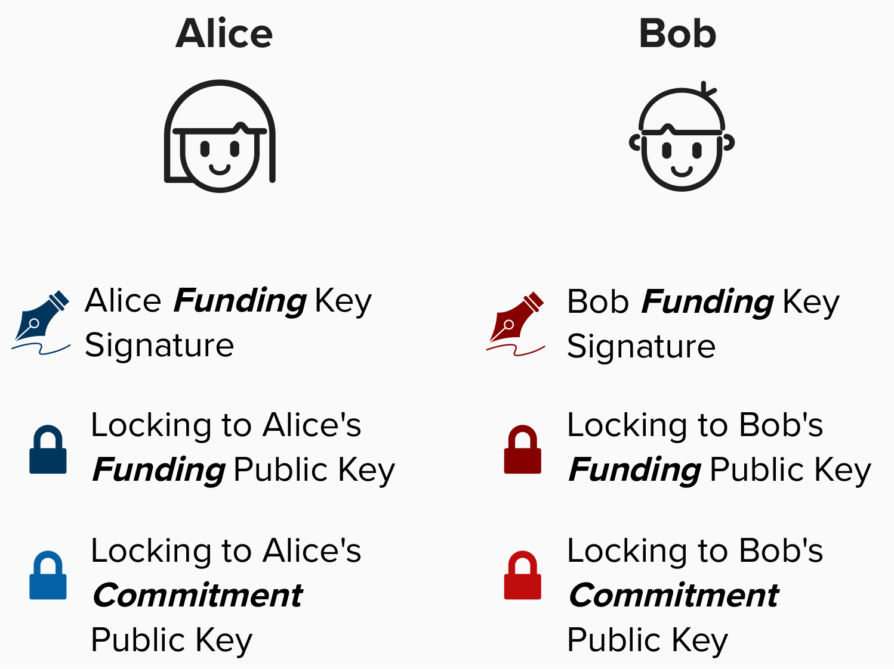
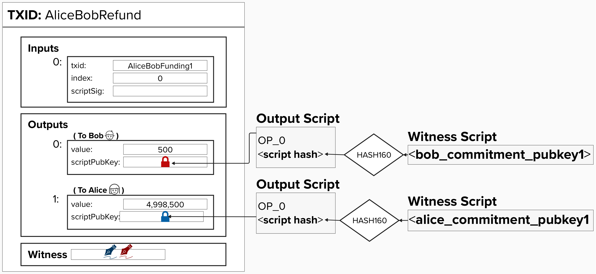
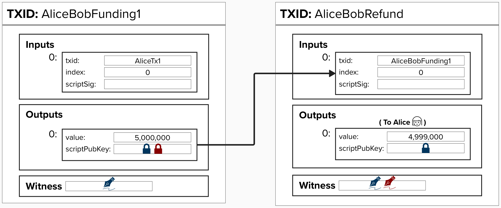
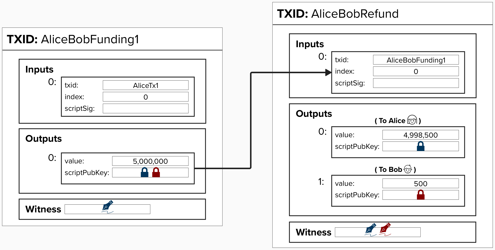

# Enhancing Our Payment Channel Refund

So far, we've learned of one construction for implementing a "refund" for our payment channel. It works, but it's not ideal, as the channel is time-bound. To address this concern, let’s remove the timelock so that our channel doesn't have an arbitrary end date.

## Create A New "Refund" Transaction That Spends From The Funding Transaction

#### ✅ NOTE: This new payment channel construction is actually how Lightning channels work, so we're back on the path to building our own modern channel from the ground up!

Another approach to ensuring Alice can retrieve her Bitcoin if Bob stops cooporating is to create a new transaction that spends from the funding transaction. This transaction will act as a "refund" transaction, as it will pay each channel member the amount of sats that they currently have at the time of opening the channel. 

<p align="center" style="width: 50%; max-width: 300px;">
  
</p>

#### Question: Is it safe to create the "refund" transaction *after* broadcasting the funding transaction?
<details>
  <summary>Answer</summary>

**NO!**

It's vital to note that the refund transaction still needs *both* Alice and Bob's signatures to spend. Therefore, creating the refund transaction should be thought of as a critical step that needs to be completed ***before*** publishing the funding transaction. Otherwise, if Alice broadcasts the funding transaction before they have both signed the refund transaction, Bob could refuse to sign the refund transaction, effectively holding Alice's funds hostage.

</details>

</details>


## Locking to Each Channel Party's Public Key
Great! We've identified a way to issue a refund transaction that isn't time-bound. All we have to do is lock bitcoin to each channel party's **public key**. As we learned earlier, this can be achieved by creating a **Pay-To-Witness-Public-Key-Hash** (**P2WPKH**) output. 

To help us build the refund transaction, we'll introduce a new public key, called a **commitment public key**. This key actually has a different name per the Lightning protocol specs, but we're not revealing that name yet for educational purposes! 

Also, note that the **commitment public key** has a `1` appended to the end of it. Of course, we don't literally append a `1` to public keys when building payment channels. Instead, this is meant to signify that this public key is specific to this payment (commitment transaction). More specifically, each new commitment transaction will have its own *unique* **commitment public key**, and they will be derived deterministically from the same secret key material. This ensures that you do not need to store every public key for each commitment transaction, as you will be able to recreate them from the base key. 

This main portion of this workshop will not dive deep into how public and private keys are derived in a Lightning wallet. However, if you're interested in learning (and building!) your own Lightning key derivation functionality, there is an in-depth tutorial in the **Apendex** section.

<p align="center" style="width: 50%; max-width: 300px;">
  
</p>

<p align="center" style="width: 50%; max-width: 300px;">
  
</p>

#### Question: Why don't we lock the output to the same public key used in the 2-of-2 multisig?
<details>
<summary>Answer</summary>

There are many different keys in the Lightning protocol. There are various reasons for using multiple keys, which we'll learn about as we continue building our payment channel, but one reason is that not all keys have the same storage requirements. For example, this **commitment public key** is simply used to lock funds in a **P2WPKH** output. This private key could be put in cold storage and only used when we need to claim these funds later.

On the other hand, the **funding keys** will need to stay "hot" (online), as we'll need to use them to sign new transactions, which represent new commitment states.

NOTE: The **commitment public key** is not an actual key in the Lightning network, but there is a key that is very similar. For educational purposes, we are not revealing the names of the other keys yet!

</details>

#### Question: Why do we use a new unique public key for each commitment transaction?
<details>
  <summary>Answer</summary>

Changing the public key used in each commitment transaction will ensure that the transaction ID changes for each state, which provides better **privacy**.

For example, if we didn't change the public key for each state, then Alice and Bob's commitment states would have the same transaction ID for whenever the balance distribution repeats (State 1 and State 3).

**State 1**:
- Alice: 5,000,000 sats
- Bob: 0 sats


**State 2**:
- Alice: 4,000,000 sats
- Bob: 1,000,000 sats


**State 3**:
- Alice: 5,000,000 sats
- Bob: 0 sats

Crucially, there is also a Lightning tool, called a Watchtower, that leverages transaction IDs as a way to identify if a counterparty is cheating (more on this soon!). The security of the Watchtower protocol requires that transaction IDs be unique for each state.
  
</details>

#### Question: Will our node be able to broadcast this transaction? Hint: Bob's output!
<details>
  <summary>Answer</summary>

Nope! We can't relay transactions that have outputs below the dust limit. Since Bob has no funds on his side of the channel, we have the following two options:

1) **We can create a refund transaction with no output for Bob.**

<p align="center" style="width: 50%; max-width: 300px;">
  
</p>

2) **We can "push" some sats to Bob's side of the channel at the start.**

This is done by specifying an amount (in milli satoshis) in the `push_msat` field of the `open_channel` message. We'll cover this more later! In the "real-world" this can be seen as an initial payment that is sent to Bob at channel start.

The visuals for the rest of this workshop will be a little smoother if Bob has an output to start, so we'll give him 500 sats because we're nice people.

<p align="center" style="width: 50%; max-width: 300px;">
  
</p>


</details>

## ⚡️ Build A Payment Channel Refund Transaction

Complete `build_refund_transaction`. This function takes the following parameters:
- `funding_txin`: Funding transaction input (`TxIn`).
- `alice_pubkey`: Alice's public key (`&PublicKey`), which will used to build Alice's output.
- `bob_pubkey`: Bob's public key (`&PublicKey`), which will be used to build Bob's output.

```rust
pub fn build_refund_transaction(
    funding_txin: TxIn,
    alice_pubkey: PublicKey,
    bob_pubkey: PublicKey,
    alice_balance: u64,
    bob_balance: u64
) -> Transaction {

    // Step 1: Build a Output Scripts

    // Step 2: Define Outputs

    // Step 3: Define Version and Locktime

    // Step 4: Build and Return the Transaction
    // -- remember, inputs and outputs must be passed in as vectors (vec![])
}
```

<details>
  <summary>Step 1: Build a Output Scripts</summary>

For our refund transaction, we'll be creating individual P2WPKH outputs. To create a P2WPKH output, you can simply use the provided helper function, `p2wpkh_output_script`.

```rust
let alice_script = p2wpkh_output_script(alice_pubkey);
let bob_script = p2wpkh_output_script(bob_pubkey);
```

Under the hood, `p2wpkh_output_script` simply takes a secp256k1 public key and converts it to a P2WPKH output.

```rust
pub fn p2wpkh_output_script(public_key: PublicKey) -> ScriptBuf {
    let pubkey = BitcoinPublicKey::new(public_key);
    ScriptBuf::new_p2wpkh(&pubkey.wpubkey_hash().unwrap())
}
```
</details>

<details>
  <summary>Step 2: Define Outputs</summary>

Similar to what we did for the funding transaction, we'll need to create `TxOut` objects for Alice and Bob using the `build_output` function, which takes each balance and the corresponding P2WPKH script.

```rust
let alice_output = build_output(alice_balance, alice_script);

let bob_output = build_output(bob_balance, bob_script);
```
</details>

<details>
  <summary>Step 3: Define Version and Locktime</summary>

Set the transaction version to 2 and locktime to zero using the provided rust-bitcoin enums.

```rust
let version = Version::TWO;
let locktime = LockTime::ZERO;
```
- `Version::TWO` sets the transaction version to 2, which supports BIP-68 relative locktimes.
- `LockTime::ZERO` indicates no timelock on the transaction.

</details>

<details>
  <summary>Step 4: Build and Return the Transaction</summary>

Construct the `Transaction` object using the `build_transaction` helper function, with the defined version, locktime, inputs, and the output in a vector.

```rust
pub fn build_transaction(version: Version, locktime: LockTime, tx_ins: Vec<TxIn>, tx_outs: Vec<TxOut>) -> Transaction {
    Transaction {
        version: version,
        lock_time: locktime,
        input: tx_ins,
        output: tx_outs,
    }
}
```

Remember, `build_transaction` expects `tx_ins` and `tx_outs` to be a **vector** (think: list) of `TxIn` and `TxOut` objects, respectively. To wrap your inputs or output in a vector, you can use the following notation:

```rust
vec![output_a, output_b]
```

</details>

## 👉  Get Our Refund Transaction

Once your `build_refund_transaction` is passing the tests, go to a **Shell** in your Repl and type in the below command. Make sure to replace `<funding_tx_id>` with the TxID from our funding transaction!

```
cargo run -- refund -t <funding_tx_id> 
```

Once the program runs and you get the **Tx Hex** and **Tx ID**, save them in the file `src/exercises/transactions.txt` under the headings **Refund Tx Hex** and **Refund Tx ID**.

#### Question: When you add the refund transaction to `transactions.txt`, you'll likely notice that it's much bigger than the funding transaction. Do you know why?
<details>
  <summary>Answer</summary>

There are multiple answers here, but two big reasons are the following:
1) The refund transaction has two outputs, but our funding transaction only had one.
2) The refund transaction requires two signatures to spend, so the witness data is larger.

Because of these factors, the refund transaction requires more **vbytes** (virtual bytes), which translates to higher mining fees.

Keep this in mind as we begin to explore more complex transactions shortly.

</details>