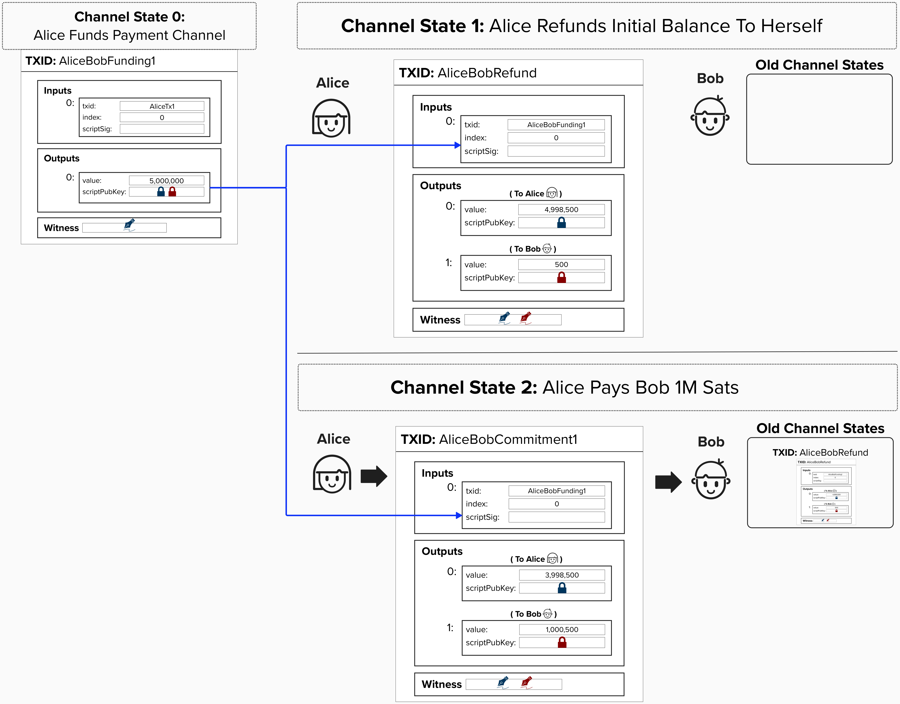
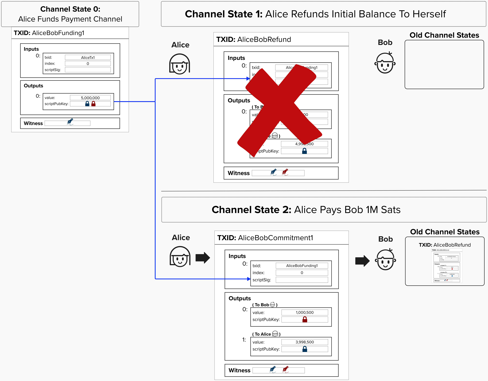

# Making a Payment

Once the funding transaction is published on chain, Alice and Bob can "update" their channel by committing to a new transaction that spends from the funding output. In Lightning world, this new transaction is called a **commitment transaction** because it "commits" to a new channel balance. The new channel balance is reflected as **two** separate outputs - one representing the current balance for each recipient. Alice and Bob can do this as many times as they would like. When they decide to close the channel, they simply publish the most recent transaction to the Bitcoin network, distributing the funds to addresses that each party unilaterally controls.

  

## Security Flaw!

***REMEMBER***: In this new channel construction, Alice and Bob exchange keys for the "Refund Transaction" before they broadcast the "Funding Transaction". This way, Alice can retrieve her funds if Bob goes offline. However, do you see what security issue this exposes?

  
Answer

Since each commitment transaction is a valid transaction that can be broadcasted to the Bitcoin network at any time, there is nothing stopping Alice from broadcasting the refund transaction and claiming the full refund transaction's balance! For example, she could make a payment to Bob and then publish her refund transaction, claiming back all of the bitcoin.

To mitigate this, we need to figure out a way to cancel old committment transactions.

  

Unfortunately, there is no way to cancel or invalidate a bitcoin transaction after its been created, so we need to come up with a clever way to *disincentivize* Alice and Bob from broadcastnig old transactions.

Think back to our story of Alice and Bob splitting cake! **Is there a way to disincenivize cheating such that we can punish someone who publishes an old transaction?** See if you can think of something! 

