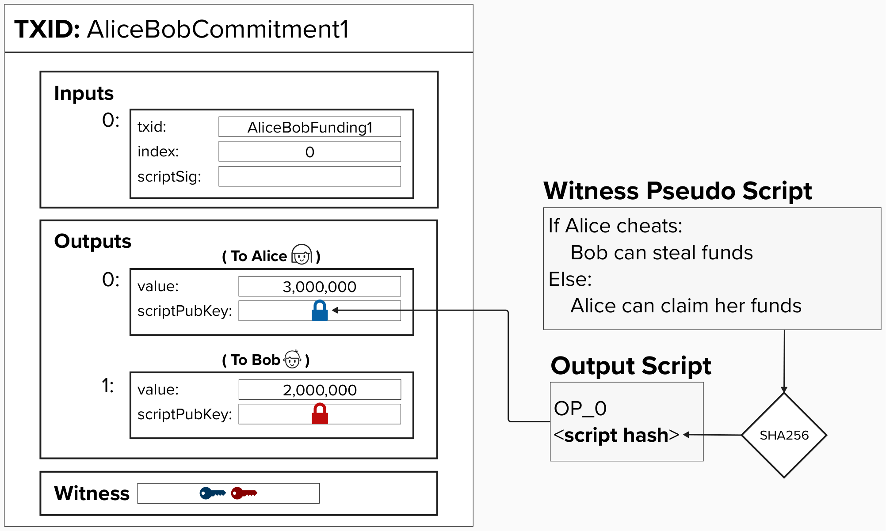

# Revocable Transactions

Recall, our motivation for creating revocable transactions is that we need a way to invalidate old commitment transaction such that Alice and Bob *are disincentivized from* broadcasting them to steal each other's bitcoin. 

Since Bitcoin does not support the ability to cancel transactions, we need a more clever way to *disincentivize* broadcasting old transactions.

<p align="center" style="width: 50%; max-width: 300px;">
  
</p>

## Penalty Mechanism
A **penalty mechanism** is a system, rule, or process that is designed to discourage undesirable or dishonest behavior. It accomplishes this by imposing a negative consequence or penalty on individuals or entities that violate the rules or norms of that system.

Within the context of commitment transactions, we can incentivize good behavior by adding the penalty mechanism rule:

- **If you publish an old commitment transaction, the counterparty is allowed to steal all of the funds you have on your side of the channel.**

Now that we have our penalty mechanism rule, we just need to identify a way to enforce it. Can you think of something?

<details>
  <summary>Answer</summary>
  <br/>

To enforce this rule, we can do the following:
1) Add an additional spending path to the output such that, if the counterparty presents a special key, called a **revocation key**, they are able to claim all of the funds. Otherwise, the funds will be sent directly to the intended owner.
2) For each new transaction, the owner of the funds will provide the counterparty with the information they need to calculate the **revocation key** for the prior transaction. This represents a promise from the owner that they will not publish an old transaction, because, if they did, the counterparty now has the ability to steal all of the owner's funds.

<p align="center" style="width: 50%; max-width: 300px;">
  
</p>

</details>

## ⚡️ Write Function `revokable_output` To Generate A Revokable Output Script For Our Commitment Transaction

`revokable_output` will take a public key as an input and constructs the output script we need to use.

```rust
fn revokable_output(revocation_key: &PublicKey, owner_pubkey: &PublicKey) -> Script {
}
```

## 🤔 Something Isn't Quite Right!

A keen eye may have noticed that this solution seems incompelte. Can you identify why? 

Here is a hint: *Once Alice hands over the revocation key to Bob, are her funds in the old committment transaction still safe?*

<details>
  <summary>Answer</summary>
  <br/>

No! With our current commitment transaction construcion, Bob would be able to spend Alice's funds since he now has the **revocation private key** which can spend from the **revocation public key** spending path in her output. Also, there is a timing issue here, which we will touch on shortly.

</details>