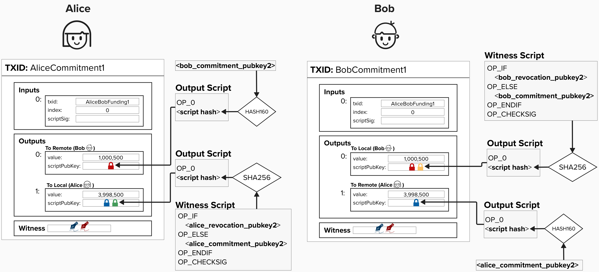
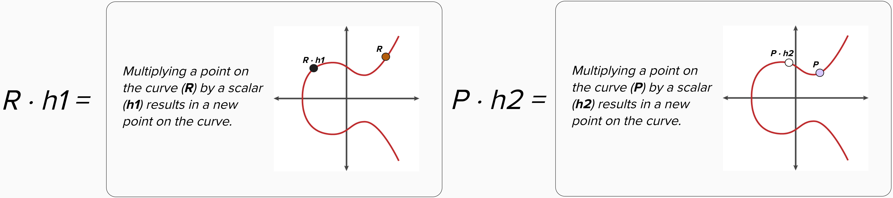

# Developing Our Penalty Mechanism

## Asymmetric Commitment Transactions 
You're probably itching to dig into advanced cryptography and punish some cheaters, but it will make our lives much easier if we introduce the concept of **asymmetric commitment transactions** first.

To build out a robust penalty mechanism, we'll need to first update our payment channel construction so that *each party has their own version of* ***each*** *commitment transaction*. They are mirror images of each other, but their output scripts are slightly different. Furthermore, Alice and Bob will never share their version of each commitment transaction with each other.

In the below example, you can see that both Alice and Bob's versions reflect the same distribution of funds. **However, Alice's transaction has a special locking script for only her output, and Bob's transaction has a special locking script for only his output**.

<p align="center" style="width: 50%; max-width: 300px;">
  
</p>

<details>
  <summary>The concept of "asymmetric commitment transactions" is very important if you want to understand how Lightning works. To help make sure this makes sense, click here and try to validate the following...</summary>

As we mentioned above, both Alice and Bob will have their own commitment transaction **for each channel state**. Take a moment and see if you can verify the following, using the picture below. You will probably have to zoom in!
- For Channel State 1, Alice's `to_local` has the same amount as Bob's `to_remote`. Both of these represent funds that Alice owns.
- For Channel State 1, both of the `to_local` outputs contain a spending path that allows the counterparty to punish the transaction holder *if the transaction holder cheats*. In other words, if Alice publishes and old transaction, her output has a spending path for Bob to steal her funds. If Bob publishes and old transaction, his output has a spending path for Alice to steal his funds. 
- For Channel State 2, once Alice sends 1,000,000 sats to Bob, all outputs for Alice and Bob are updated to reflect this payment. Here, we can see that each party has asymmetric bitcoin transactions for each state in the Lightning channel.

<p align="center" style="width: 50%; max-width: 300px;">
  
</p>

</details>

<details>
  <summary>Why do we need asymetric commitment transactions?</summary>

The Lightning Network fairness protocol is set up up in such a way that **you protect your counterparty** from ***you*** cheating. This is why the output that has ***your*** balance contains the penalty mechanism, while the output with your counterparty's balance is a simple **P2WPKH**. 

Remember, the way to cheat in Lightning is by publishing an old commitment state. Since all of your commitment transactions lock ***your*** bitcoin balance to a special locking script with a penalty mechanism, your counterparty will be able to claim your output if you publish an old state.
</details>

## Introducing Our Penalty Mechanism (Gently)

Before digging into the details for our penalty mechanism, let's review how things work at a higher level. To do this, we'll have to break a core tenent of Bitcoin and introduce a trusted third party. Note, this trusted third party is *only* for educational purposes, as it will make it much easier to conceptually grasp how the penalty mechanism works. Once we have an intuitive understanding of what is going on, we'll replace the trusted third party with a series of cryptographic operations, making everything trustless again!


<p align="center" style="width: 50%; max-width: 300px;">
  
</p>


### Step 1
Imagine that, for each commitment transaction, a trusted third party generates a unique public key for Alice and a unique public key for Bob. **Alice and Bob take their respective public keys and add them to their own output scripts**. We'll call the spending path with this public key the **"revocation path"** as this spending path effectively allows someone to revoke (make invalid) an old transaction state. Remember, it will only be used to punish someone who publishes an old commitment state.

**NOTE: At this point, neither Alice nor Bob know the private keys to either of the public keys that the trusted third party provided**. This is a *very* important property because it means that, if either party attempts to broadcast a transaction from the **current state**, neither would know the private key to spend from the "revocation path". This makes it safe to publish the *current* state, since your counterparty doesn't have the private key to spend from the revocation path.

### Step 2
When Alice and Bob decide to move to a new channel state, the trusted third party will do the following:
1) Provide a new public key for both Alice and Bob to use in their new channel state. As in step 1, these public keys will go in their respective "revocation paths".
2) Provide Alice and Bob the private keys to **the other person's prior state commitment transaction**. By doing this, Alice can spend from Bob's revocation path, and Bob can spend from Alice's revocation path. **However, neither Alice nor Bob can spend from their own revocation path**.

### Step 3 (If someone cheats)
If Alice or Bob cheat, that, by definition, means they published an old commitment state. For example, let's say we're in **Commitment State 2**, but Alice publishes her hold commitment transaction from **Commitment State 1**. She is attempting to steal 1M sats back from Bob by publishing an old transaction that does not have these sats on Bob's side of the channel. Since our trusted third party gave Bob the private key to spend from Alice's **revocation path**, Bob can generate a signature to claim Alice's `to_local` output. Remember, Alice does not have the private key for this spending path, so she cannot claim her output via the **revocation path**.

The above mechanism ensures that old commitment states are effectively revoked, because publishing old commitment states risks losing all of your funds in the channel. Cool, eh?

## Introducing Revocation Keys

Okay, now that we've reviewed this gist of how our penalty mechanism works, let's inch our way towards the actual protocol implementation by removing the third party. Remember, our end goal is to:
1) Create public keys, which we'll call **revocation public keys**, that Alice or Bob can spend from if their counterparty attempts to cheat.
2) Neither Alice nor Bob should know the private key to their own **revocation public key**.
3) When advancing to a new channel state, Alice and Bob should be able to obtain (or, more specifically, calculate) the private key to their counterparty's **revocation public key**. 

This way, each party provides a way for the counterparty to claim their funds ***if and only if*** they attempt to publish an old transaction.

<p align="center" style="width: 50%; max-width: 300px;">
  
</p>

<p align="center" style="width: 50%; max-width: 300px;">
  
</p>


## Calculating A Revocation Public Key And Private Key

Below is a diagram showing how Alice and Bob can exchange public and private key information in such a way that they satisfy the properties listed above (ex: neither party knows the private key to their own revoaction public key).

Note, this diagram does not go into the exact protocol details for how each key is derived. Instead, it's meant to further build your intuition as to how the revocation keys work. For this explanation, we're skipping over how these keys are generated. If you're interested in learning how all Lightning keys can be derived from a single seed, please see the optional section in the appendix, titled "Revocation Keys Deep Dive". 

<p align="center" style="width: 50%; max-width: 300px;">
  
</p>

### Step 1
At the start of Alice and Bob's Lightning channel, each party will generate the following set of public and private keys:
- **Revocation Public Key and Private Key**: This is a public/private key pair that is constant across the entire length of a payment channel. As we'll soon see, this will be one piece that we'll use to create a new key pair for the revocation path.

For each commitment transaction (each new channel state), Alice and Bob will each generate the following set of public and private keys:
- **Per-Commitment Public and Private Key**: For each commitment transaction, Alice and Bob will generate a new public/private key pair that they will use to tweak the Revocation key pair, this creating unique key pairs for each commitment state.

### Step 2
When Alice and Bob set up their channel, they will exchange the following keys:
- **Revocation Public Key**
- **Per-Commitment Public Key**

Once exchanged, each party can combine **their partner's Revocation Public Key** with **their Per-Commitment Public Key**, creating a new public key **that neither of them know the secret key to**. This is what they will use in the revocation spending path of their `to_local` output.

### Step 3
When Alice and Bob decide to advance to a new channel state, they will exchange the following keys:
- **The Current State's Per-Commitment Private Key**
- **The Next State's Per-Commitment Public Key**

By doing this, each party provides **their counterparty** with the neccessary information (the current state's per-commitment private key) to calculate the **their revocation public key**. In other words, Alice gives Bob the information needed for Bob to calculate Alice's **revocation private key** from the current state. Therefore, Bob can spend from Alice's revocation path if she ever publishes the current commitment transaction, which is now considered old since they are moving to a new state.

They also give their counterparty the next public key so that they can build the new state's commitment transactions. This process continues for each new commitment state.

## ⚡️ Generate A Revocation Public Key
For this exercise, we'll get our hands dirty and implement a function that creates a revocation public key for a given channel state.
```rust
fn generate_revocation_pubkey(countersignatory_basepoint: &PublicKey, per_commitment_point: &PublicKey) -> PublicKey {
  
  // calculate `h1` by obtaining the SHA256 of `R` and `P` concatenated.
  
  // calculate `h2` by obtaining the SHA256 of `P` and `R` concatenated.
  
  // multiply `R` by `h1`. Remember, `R` is a public key and `h1` is a SHA256 hash, which will be interpreted as a scalar to "tweak" the public key.
  
  // multiply `P` by `h2`. Remember, `P` is a public key and `h2` is a SHA256 hash, which will be interpreted as a scalar to "tweak" the public key.
  
  // add the result of the two multiplications above. This is effectively adding two public keys together.
}
```
Since we're playing the part of Alice, we'll need to calculate the revocation key that will go in our `to_local` spending path. To do this, we'll build a function that implements this step in the diagram above:

<p align="center" style="width: 50%; max-width: 300px;">
  
</p>

Let's start by converting the above diagram into an equation that we can actually implement. This will get a little mathy, but don't worry! We'll step through it together. Below is the general equation for calculating a revocation public key.

Note, for clarity, we've included Alice and Bob's names in front of their respective keys so that it's easy to map it back to the image above. However, this function, once complete, could be used by Alice, Bob, or anyone. You just need to specify the right **local** (Alice, in this case) and **remote** (Bob, in this case) keys.

<p align="center" style="width: 50%; max-width: 300px;">
  
</p>

<p align="center" style="width: 50%; max-width: 300px;">
  
</p>


<details>
  <summary>Click for an in-depth review of the equation</summary>

Recall that **`R`**, **Bob's revocation basepoint public key**, and **`P`**, **Alice's per commitment public key**. are just points on the **secp256k1 curve**. NOTE: the below images are just visual representations of the curve and public key. The actual curve looks more like a scatter plot. Additionally, **`h1`** and **`h2`** are just the SHA256 hash of both public keys (in serialized format). The **`||`** symbol means "concatenate".

REMEMBER, you can zoom in to see the visuals better!

<p align="center" style="width: 50%; max-width: 300px;">
  
</p>

Once we have **`R`**, **`P`**, **`h1`**, and **`h2`**, we can calculate a new set of public keys by multiplying the public keys (**`R`** and **`P`**) by their respective scalars (**`h1`** and **`h2`**). Remember, to do this, we essentially add the public key to itself many times. For example, we add **`R`** to itself **`h1`** times.

<p align="center" style="width: 50%; max-width: 300px;">
  
</p>

The result of **`R · h1`** and **`P · h2`** will both be new public keys on the secp256k1 curve. Visually, adding two public keys involves the below steps, and the result is a new public key.
- Drawing a line between the two points.
- Finding the point on the curve that intersects the line.
- Finding the reflection of this point across the x-axis.

The resulting public key is our **revocation public key**!

<p align="center" style="width: 50%; max-width: 300px;">
  
</p>


</details>

Here's a quick breakdown of the mathematical operations being performed in this equation:
1) **SHA256 Hashing**: The serialized public keys **`R`** and **`P`** are concatenated together and hashed. These hashes (**`h1`** and **`h2`**) are treated as very large numbers (scalars) in subsequent operations.
2) **Elliptic Curve Multiplication (Tweaking)**: The public keys **`R`** and **`P`** are multiplied by the scalar representation of their respective hashes (i.e., the large numbers derived from hashing). This operation essentially adds the public key (**`R`** or **`P`**) to itself **`h1`** or **`h2`** times. This process is commonly referred to as **"tweaking"** a public key, as it modifies the original public key to produce a new one that depends on the scalar.
3) **Elliptic Curve Addition**: Finally, the tweaked public keys (**`R ⋅ h1 `** and **`P  ⋅ h2`**) are added together using elliptic curve point addition. The result is a new public key that is a unique combination of the original public keys and the hashes. This new key is cryptographically tied to both inputs and cannot be reverse-engineered.

Helper function have been provided to you to help perform each of the mathematical operations listed above. To see them, click to dropdowns below!

<details>
<summary>Hash Two Public Keys</summary>

```rust
pub fn hash_pubkeys(key1: &PublicKey, key2: &PublicKey) -> [u8; 32] {
  // Computes the SHA-256 hash of the two public keys in the order of key1 || key2
  // Returns a 32-byte array representing the hash of the concatenated serialized public keys.
}
```

<details>
  <summary>Click here to learn how to calculate the SHA256 yourself without the helper function!</summary>

Hello ambitious learner! If you clicked this, you probably want to learn how to calculate the SHA256 of the keys yourself. Let's learn how to do it...

First, you will have to define a SHA256 object that can do the hashing for you. In **Rust**, we need to make this object **mutable**, since we will be chaning it's internal state.

```rust
let mut sha = Sha256::engine();
```

Next, we'll need to input the actual data we want to hash - in this case, our public keys! However, we can't just pass the in the `PublicKey` type, since that is a **rust-bitcoin** type and contains more information than we need. Instead, we want to pass in the serialized version of the key. We can do that by using the below notation. NOTE: we pass in a reference to the key, which is indicated by putting a `&` in front of the `key`. This tells Rust that we want to pass in a pointer to the data, enuring that the `input()` function does not take ownerhsip of the data. 

```rust
sha.input(&key.serialize());
```

Finally, once we've added **both keys in the correct order**, we can calculate the SHA256 using the below notation. To get an array of bytes, which we'll ultimately need for the next step, we will need to call `to_byte_array()`.

```rust
let result = Sha256::from_engine(sha).to_byte_array();
```

</details>

</details>

<details>
<summary>Tweak A Public Key</summary>


```rust
pub fn pubkey_multipication_tweak(pubkey1: PublicKey, sha_bytes: [u8; 32]) -> PublicKey {
  // Multiplies a public key by a scalar derived from a 32-byte hash.
  // Returns the resulting public key after scalar multiplication.
}
```

<details>
  <summary>Click here to learn how to tweak a public key without the helper function!</summary>

Hello again, ambitious learner!

First, you will have to define a `Secp256k1` that can perform elliptic curve operation over the Secp256k1 curve. You can do this by using the following notation.

```rust
let secp = Secp256k1::new();
```

For this function, the public key input is the type `PublicKey`, which is defined in the `bitcoin::secp256k1` crate. This type comes equipped with the `mul_tweak` method, which requires a `Secp256k1` context for curve operations and a `Scalar` value. Both of these inputs are passed as references, as we do not want the method to take ownership of the variables. If you're unfamiliar with the concept of ownership in Rust, that's okay. Just remember to add the `&` before the variables when passing them in!

Oh, it's also important to note that `mul_tweak` returns a `Result` type, so we have to call `unwrap()` to retrieve the resulting value.

```rust
let pubkey_tweak = pubkey1.mul_tweak(&secp, &scalar_tweak).unwrap();
```

Now, you may be wondering, "where does the scalar_tweak come from?". Let's discuss that now! As an input to this function, we're passing in the bytes returned from the prior SHA256 operation. However, before we can tweak the public key, we need to convert the bytes to a scalar. We can do this using the 'from_be_bytes' method on the `Scalar` type, provided by the `bitcoin::secp256k1` crate. Again, similar to above, we have to unwrap the result using `.unwrap()`.

```rust
let pubkey_tweak = &Scalar::from_be_bytes(sha_bytes).unwrap()
```

</details>

</details>

<details>
<summary>Add Two Public Keys</summary>


```rust
pub fn add_pubkeys(key1: &PublicKey, key2: &PublicKey) -> PublicKey {
  // Adds two public keys.
  // Returns the resulting public key after addition.
  
}
```

<details>
  <summary>Click here to learn how to add two public keys without the helper function!</summary>

This is a little simpler than the previous helper functions! To add two public keys, which are both of type `bitcoin::secp256k1::PublicKey`, we can use the `combine()` method, which is available on the public key. All we need to do is pass a reference to the public key we'd like to add, and unwrap the result.

```rust
let pk = key1.combine(&key2).unwrap();
```

</details>
</details>


## ⚡️ Generate A Revocation Private Key
For this exercise, we'll continue digging in the cryptographic mud and implement a function that creates a revocation private key for a previous channel state.

If you look at the diagram above, we'll be building a function that implements this step:

<p align="center" style="width: 50%; max-width: 300px;">
  
</p>

Just like we did in the previous exercise, we'll need to get convert the above diagram into an equation that we can actually implement.

<p align="center" style="width: 50%; max-width: 300px;">
  
</p>

<p align="center" style="width: 50%; max-width: 300px;">
  
</p>

***NOTE***: The function `generate_revocation_privkey` only takes two variables as inputs. This may seem confusing at first, since the above diagram shows four inputs. However, remember that we can calculate a public key by multiplying the secp256k1 generator point by our private key! So, we really only need two variables, `per_commitment_secret` and `countersignatory_revocation_base_secret` to complete this function.

```rust
fn generate_revocation_privkey(per_commitment_secret: &SecretKey, countersignatory_revocation_base_secret: &SecretKey) -> PublicKey {

  // calculate `R` by multiplying countersignatory_revocation_base_secret by G

  // calculate `P` by multiplying per_commitment_secret by G

  // calculate `h1` by obtaining the SHA256 of `R` and `P` concatenated

  // calculate `h2` by obtaining the SHA256 of `P` and `R` concatenated

  // calculate `ph1` by performing scalar multiplication on per_commitment_secret and `h1`

  // calculate `rh2` by performing multiplication on countersignatory_revocation_base_secret and `h2`

  // perform scalar addition of `ph1` and `rh2`
}
```

<details>
  <summary>Click for an in-depth review of the equation</summary>

To understand *how* and *why* the above equation allows Alice to calculate **Bob's revocation private key**, it's helpful to review how the revocation public key was created.

Recall that we calculated the revocation public key by adding (**`R · h1`**) and (**`P · h2`**), which were both public keys.


<p align="center" style="width: 50%; max-width: 300px;">
  
</p>

Furthermore, recall that every public key is can be represented as a scalar (very large number) multiplied by the **secp256k1 curve's generator point**, **`G`**. We can use this information in a few ways.

First, let's re-write our **revocation public key** equation to show how **`R`** and **`P`** are really just their respective private keys multiplied by **`G`**.

<p align="center" style="width: 50%; max-width: 300px;">
  
</p>

Next, note how we can leverage the **property of scalar multiplication** to refactor the equation such that **`G`** is factored out, and now it's just a scalar multiplied by **`G`**! In other words, the first portion, **`(r · h1 + p · h2)`**, is the **revocation private key**. When multiplied by **`G`**, we get the **revocation public key**.

<p align="center" style="width: 50%; max-width: 300px;">
  
</p>


Of course, when creating the **revocation public key**, neither party knows both of the secrets **`r`** and **`p`**. However, once they recieve the secrets from their counterparty when they move to the next channel state, they are then able to calculate the **revocation private key** and revoke old states **if and only if** their counterparty publishes an old commitment transaction.

<p align="center" style="width: 50%; max-width: 300px;">
  
</p>

</details>

Just like the previous exercise, helper function have been provided to you to help perform each of the mathematical operations listed above. To see them, click to dropdowns below!

<details>
<summary>Get Public Key From Private Key</summary>

```rust
pub fn pubkey_from_secret(secret: SecretKey) -> PublicKey {
  // given a secret key, returns a public key on the secp256k1 curve
}
```
<details>
  <summary>Click here to learn how to obtain a public key from a secret key without the helper function!</summary>

We can obtain a public key from a secret key by using the below notation, provided by `bitcoin::secp256k1::PublicKey`.

```rust
let secp = Secp256k1::new();
let pubkey = secp256k1::PublicKey::from_secret_key(&secp, &secret)
```

</details>

</details>

<details>
<summary>Hash Two Public Keys</summary>

```rust
pub fn hash_pubkeys(key1: &PublicKey, key2: &PublicKey) -> [u8; 32] {
  // Computes the SHA-256 hash of the two public keys in the order of key1 || key2
  // Returns a 32-byte array representing the hash of the concatenated serialized public keys.
}
```

<details>
  <summary>Click here to learn how to calculate the SHA256 yourself without the helper function!</summary>

Hello ambitious learner! If you clicked this, you probably want to learn how to calculate the SHA256 of the keys yourself. Let's learn how to do it...

First, you will have to define a SHA256 object that can do the hashing for you. In **Rust**, we need to make this object **mutable**, since we will be chaning it's internal state.

```rust
let mut sha = Sha256::engine();
```

Next, we'll need to input the actual data we want to hash - in this case, our public keys! However, we can't just pass the in the `PublicKey` type, since that is a **rust-bitcoin** type and contains more information than we need. Instead, we want to pass in the serialized version of the key. We can do that by using the below notation. NOTE: we pass in a reference to the key, which is indicated by putting a `&` in front of the `key`. This tells Rust that we want to pass in a pointer to the data, enuring that the `input()` function does not take ownerhsip of the data. 

```rust
sha.input(&key.serialize());
```

Finally, once we've added **both keys in the correct order**, we can calculate the SHA256 using the below notation. To get an array of bytes, which we'll ultimately need for the next step, we will need to call `to_byte_array()`.

```rust
let result = Sha256::from_engine(sha).to_byte_array();
```

</details>

</details>

<details>
<summary>Tweak A Private Key</summary>

```rust
pub fn privkey_multipication_tweak(secret: SecretKey, sha_bytes: [u8; 32]) -> SecretKey {
  // Multiplies a private key by a scalar derived from a 32-byte hash.
  // Returns the resulting private key after scalar multiplication.
}
```

<details>
  <summary>Click here to learn how to tweak a private key without the helper function!</summary>

From a Rust notation perspective, tweaking a private key is very similar to tweaking a public key. The largest notable difference is that we do not need a `Secp256k1` context like we did previously. This is because tweaking a private key is essentially scalar multiplication, which does not involve elliptic curve point multiplication.

```rust
let scalar = Scalar::from_be_bytes(sha_bytes).unwrap();
let privkey_tweak = secret.mul_tweak(&scalar).unwrap();
```

</details>

</details>


<details>
<summary>Add Two Private Keys</summary>

```rust
pub fn add_privkeys(key1: &SecretKey, key2: &SecretKey) -> SecretKey {
  // Adds two private keys (scalars).
  // Returns the a new private key

}
```

<details>
  <summary>Click here to learn how to add private keys without the helper function!</summary>

To add two private keys, which are both of type `bitcoin::secp256k1::SecretKey`, we can use the `add_tweak()` method, which is available on the secret key. All we need to do is pass the scalar we'd like to add.

To get the scalar, we can convert the key to its byte representation and then turn it into a scalar. This is similar to what we've done previously. Then, we can pass a reference to the scalar to the private key's `add_tweak` method and, as always, unwrap the result.

```rust
let tweak = Scalar::from_be_bytes(key2.secret_bytes()).unwrap();
let key3 = key1.add_tweak(&tweak).unwrap();
```

</details>

</details>