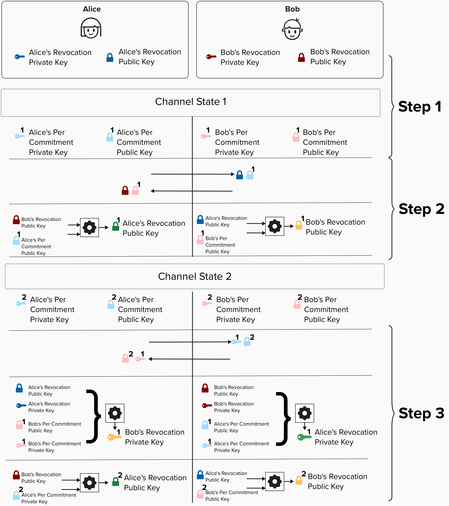

# Developing Our Penalty Mechanism

## Asymmetric Commitment Transactions 
You're probably itching to dig into advanced cryptography and punish some cheaters, but it will make our lives much easier if we introduce the concept of **asymmetric commitment transactions** first.

In our new and advanced payment channel, each party will have their own version of ***each*** commitment transaction. They are mirror images of each other, but their output scripts are slightly different.

In the below example, you can see that both Alice and Bob's versions reflect the same distribution of funds, however, Alice's transaction provides a spending path for Bob to claim her funds if she attempts to cheat Bob - and vice versa.

<p align="center" style="width: 50%; max-width: 300px;">
  
</p>

***NOTE***: The Lightning Network fairness protocol is setup up in such a way that **you protect your counterparty** from ***you*** cheating. This is why the output that has ***your*** balance contains the penalty mechanism, while the output with your counterparty's balance is a simple **P2WPKH**. Put simply, if you cheat, your opponent can steal ***your*** output immediately.

<details>
  <summary>The concept of "asymmetric commitment transactions" is very important to grasp to understand how Lightning works. Click here and try to validate the following...</summary>

As we mentioned above, both Alice and Bob will have their own commitment transaction **for each channel state**. Take a moment and see if you can verify the following, using the picture below. You will probably have to zoom in!
- For Channel State 1, Alice's `to_local` has the same amount as Bob's `to_remote`. Both of these represent funds that Alice owns.
- For Channel State 1, both of the `to_local` outputs contain a spending path that allows the counterparty to punish the transaction holder *if the transaction holder cheats*.
- For Channel State 2, once Alice sends 1,000,000 sats to Bob, all outputs for Alice and Bob are updated to reflect this payment.

<p align="center" style="width: 50%; max-width: 300px;">
  
</p>

</details>

## Introducing Our Penalty Mechanism (Gently)

Before digging into the details for our penalty mechanism, let's review how things work at a higher level. To do this, we'll have to break a core tenent of Bitcoin and introduce a trusted third party. Note, this trusted third party is *only* for educational purposes, as it will make it much easier to conceptually grasp how the penalty mechanism works. Once we have an intuitive understanding of what is going on, we'll replace the trusted third party with a series of cryptographic operations, making everything trustless again!


<p align="center" style="width: 50%; max-width: 300px;">
  
</p>


#### Step 1
Imagine that, for each commitment transaction, a trusted third party generates a new public key for Alice and Bob. Alice and Bob take their respective public keys and add them to their own output scripts. We'll call the spending path with this public key the **"punishment path"** as this spending path will only be used to punish someone who publishes an old commitment state. **NOTE: At this point, neither Alice nor Bob know the private keys to either of the public keys that the trusted third party provided**. 

#### Step 2
When Alice and Bob decide to move to a new channel state, the trusted third party will do the following:
1) Provide a new public key for both Alice and Bob. As in step 1, these will be the new public keys that they will put in their "punishment paths".
2) Provide Alice and Bob the private keys to **the other person's** public key. Therefore, Alice can spend from Bob's punishment path, and Bob can spend from Alice's punishment path. **Neither Alice nor Bob can spend from their own punishment path**.

#### Step 3 (If someone cheats)
If Alice or Bob cheat, that, necessarily, means they published an old commitment state. For example, let's say wer're in **Commitment State 2**, but Alice publishes her hold commitment transaction from **Commitment State 1**. She is attempting to steal 500,000 sats back from Bob by publishing an old transaction that does not have these sats on Bob's side of the channel. Since our trusted third party gave Bob the private key to spend from Alice's **punishment path**, Bob can generate a signature to claim Alice's `to_local` output. Remember, Alice does not have the private key for this spending path, so she cannot claim her output via this path.

The above mechanism ensures that old commitment states are effectively revoked, because publishing old commitment states risks losing all of your funds in the channel. Cool, eh?

## Introducing Revocation Keys

Okay, now that we've reviewed this gist of how our penalty mechanism works, let's dig into the details. Remember, our end goal is to:
1) Create public keys, which we'll call **revocation public keys**, that Alice and Bob can use to punish their counterparty by spending from the **penalty** spending path.
2) Neither Alice nor Bob should know the private key to their own **revocation public key**.
3) When advancing to a new channel state, Alice and Bob should be able to obtain (or, more specifically, calculate) the private key to their counterparty's **revocation public key**. 

This way, each party provides a way for the counterparty to claim their funds ***if and only if*** they attempt to publish an old transaction.

<p align="center" style="width: 50%; max-width: 300px;">
  
</p>

<p align="center" style="width: 50%; max-width: 300px;">
  
</p>


## Calculating A Revocation Public Key And Private Key

<p align="center" style="width: 50%; max-width: 300px;">
  
</p>

## ⚡️ Generate A Revocation Public Key
For this exercise, we'll get our hands dirty and implement a function that creates a revocation public key for a given channel state.
```rust
fn generate_revocation_pubkey(countersignatory_basepoint: &PublicKey, per_commitment_point: &PublicKey) -> PublicKey {
  
  // calculate `h1` by obtaining the SHA256 of `R` and `P` concatenated.
  
  // calculate `h2` by obtaining the SHA256 of `P` and `R` concatenated.
  
  // multiply `R` by `h1`. Remember, `R` is a public key and `h1` is a SHA256 hash, which will be interpreted as a scalar to "tweak" the public key.
  
  // multiply `P` by `h2`. Remember, `P` is a public key and `h2` is a SHA256 hash, which will be interpreted as a scalar to "tweak" the public key.
  
  // add the result of the two multiplications above. This is effectively adding two public keys together.
}
```

If you look at the diagram above, we'll be building a function that implements this step:

<p align="center" style="width: 50%; max-width: 300px;">
  
</p>

To do this, we'll need to get convert the above diagram into an equation that we can actually implement. This will get a little mathy, but don't worry! We'll step through it together. Below is the general equation for calculating a revocation public key.

<p align="center" style="width: 50%; max-width: 300px;">
  
</p>

<p align="center" style="width: 50%; max-width: 300px;">
  
</p>


<details>
  <summary>Click for an in-depth review of the equation</summary>

Recall that **`R`**, the **Bob's revocation basepoint public key**, and **`P`**, **Alice's per commitment public key**. are just points on the **secp256k1 curve**. NOTE: the below images are just visual representations of the curve and public key data. The actual curve looks more like a scatter plot.

Additionally, **`h1`** and **`h2`** are just the SHA256 hash of both public keys (in serialized format). The **`||`** symbol means "concatenate".

<p align="center" style="width: 50%; max-width: 300px;">
  
</p>

Once we have **`R`**, **`P`**, **`h1`**, and **`h2`**, we can calculate a new set of public keys by multiplying the public keys (**`R`** and **`P`**) by their respective scalars (**`h1`** and **`h2`**). Remember, to do this, we essentially add the public key to itself many times. For example, we add **`R`** to itself **`h1`** times.

<p align="center" style="width: 50%; max-width: 300px;">
  
</p>

The result of **`R · h1`** and **`P · h2`** will both be new public keys on the secp256k1 curve. Visually, adding two public keys involves the below steps, and the result is a new public key.
- Drawing a line between the two points.
- Finding the point on the curve that intersects the line.
- Finding the reflection of this point across the x-axis.

The resulting public key is our **revocation public key**!

<p align="center" style="width: 50%; max-width: 300px;">
  
</p>


</details>

Here's a quick breakdown of the mathematical operations being performed in this equation:
1) **SHA256 Hashing**: The public keys **`R`** and **`P`** are concatenated together and hashed. These hashes (**`h1`** and **`h2`**) are treated as very large numbers (scalars) in subsequent operations.
2) **Elliptic Curve Multiplication (Tweaking)**: The public keys **`R`** and **`P`** are multiplied by the scalar representation of their respective hashes (i.e., the large numbers derived from hashing). This operation essentially adds the public key (**`R`** or **`P`**) to itself **`h1`** or **`h2`** times. This process is commonly referred to as **"tweaking"** a public key, as it modifies the original public key to produce a new one that depends on the scalar.
3) **Elliptic Curve Addition**: Finally, the tweaked public keys (**`R ⋅ h1 `** and **`P  ⋅ h2`**) are added together using elliptic curve point addition. The result is a new public key that is a unique combination of the original public keys and the hashes. This new key is cryptographically tied to both inputs and cannot be reverse-engineered without knowledge of the specific scalars used in tweaking.

Helper function have been provided to you to help perform each of the mathematical operations listed above.


```rust
pub fn hash_pubkeys(key1: &PublicKey, key2: &PublicKey) -> [u8; 32] {
  // Computes the SHA-256 hash of the two public keys
  // Returns a 32-byte array representing the hash of the concatenated serialized public keys.
}
```

```rust
pub fn tweak_pubkey(pubkey1: PublicKey, sha_bytes: [u8; 32]) -> PublicKey {
  // Multiplies a public key by a scalar derived from a 32-byte hash.
  // Returns the resulting public key after scalar multiplication.
}
```

```rust
pub fn add_pubkeys(key1: &PublicKey, key2: &PublicKey) -> Pubkey {
  // Adds two public keys.
  // Returns the resulting public key after addition.
  
}
```


## ⚡️ Generate A Revocation Private Key
For this exercise, we'll continue digging in the cryptographic mud and implement a function that creates a revocation private key for a previous channel state.

If you look at the diagram above, we'll be building a function that implements this step:

<p align="center" style="width: 50%; max-width: 300px;">
  
</p>

Just like we did in the previous exercise, we'll need to get convert the above diagram into an equation that we can actually implement.

<p align="center" style="width: 50%; max-width: 300px;">
  
</p>

<p align="center" style="width: 50%; max-width: 300px;">
  
</p>

***NOTE***: The function `generate_revocation_privkey` only takes two variables as inputs. This may seem confusing at first, since the above diagram shows four inputs. However, remember that we can calculate a public key by multiplying the secp256k1 generator point by our private key! So, we really only need two variables, `per_commitment_secret` and `countersignatory_revocation_base_secret` to complete this function.

```rust
fn generate_revocation_privkey(per_commitment_secret: &SecretKey, countersignatory_revocation_base_secret: &SecretKey) -> PublicKey {

  // calculate `R` by multiplying countersignatory_revocation_base_secret by G

  // calculate `P` by multiplying per_commitment_secret by G

  // calculate `h1` by obtaining the SHA256 of `R` and `P` concatenated

  // calculate `h2` by obtaining the SHA256 of `P` and `R` concatenated

  // calculate `ph1` by performing scalar multiplication on per_commitment_secret and `h1`

  // calculate `rh2` by performing multiplication on countersignatory_revocation_base_secret and `h2`

  // perform scalar addition of `ph1` and `rh2`
}
```

<details>
  <summary>Click for an in-depth review of the equation</summary>

To understand *how* and *why* the above equation allows Alice to calculate **Bob's revocation private key**, it's helpful to review how the revocation public key was created.

Recall that we calculated the revocation public key by adding (**`R · h1`**) and (**`P · h2`**), which were both public keys.


<p align="center" style="width: 50%; max-width: 300px;">
  
</p>

Furthermore, recall that every public key is can be represented as a scalar (very large number) multiplied by the **secp256k1 curve's generator point**, **`G`**. We can use this information in a few ways.

First, let's re-write our **revocation public key** equation to show how **`R`** and **`P`** are really just their respective private keys multiplied by **`G`**.

<p align="center" style="width: 50%; max-width: 300px;">
  
</p>

Next, note how we can leverage the **property of scalar multiplication** to refactor the equation such that **`G`** is factored out. Does the below look familiar?! It's a scalar multiplied by **`G`**! In other words, the first portion, **`(r · h1 + p · h2)`**, is the **revocation private key**. When multiplied by **`G`**, we get the **revocation public key**.

<p align="center" style="width: 50%; max-width: 300px;">
  
</p>


Of course, when creating the **revocation public key**, neither party knows both of the secrets **`r`** and **`p`**. However, once they recieve the secrets from their counterparty when they move to the next channel state, they are then able to calculate the **revocation private key** and revoke old states ***if and only if** their counterparty publishes an old commitment transaction.

<p align="center" style="width: 50%; max-width: 300px;">
  
</p>

</details>