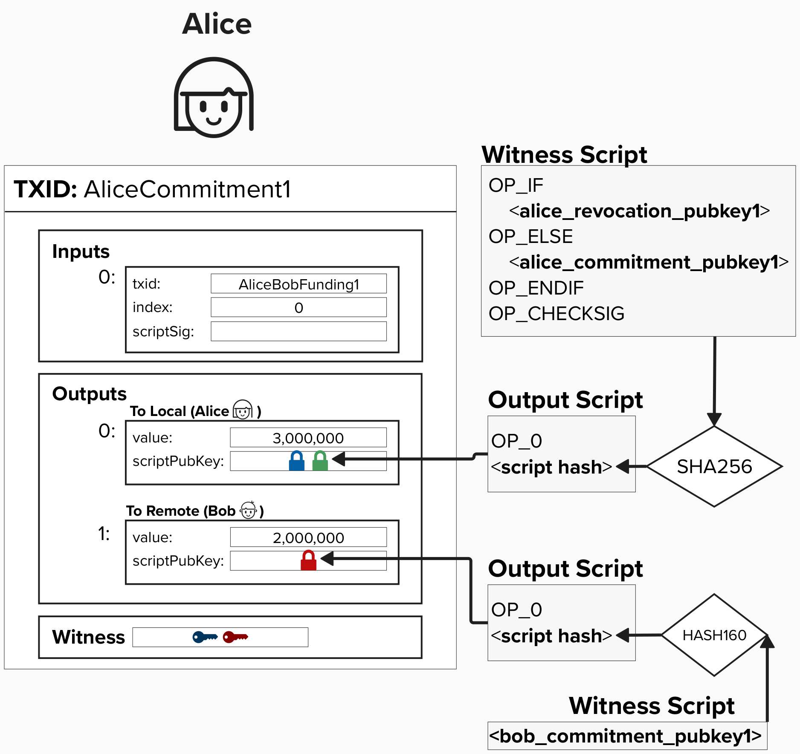

# Finalizing Our Penalty Mechanism

We're getting close to building a robust penalty mechanism that allows us to, in practice, revoke old commitment transactions.

Below is Alice's commitment transaction from the last page. Do you see an issue with this commitment transaction? Even if Alice gives Bob the information to calculate the private key for **alice_revocation_pubkey2**, is Bob still protected from Alice cheating?

<details>
  <summary>Answer</summary>

No, not really! If Alice attempts to publish an old transaction, it would become a *race condition* to see who can mine a new transaction that spends from this output. Even worse, since Alice is publishing the transaction, she has a huge head start.

How can we fix this?

<details>
  <summary>Answer</summary>

If you guessed **timelocks**, you'd be correct! Do you know which type of timelock is best to use? Once you think you've got it, scroll down this page to see how we can use timelocks to protect Bob from Alice cheating.

</details>

</details>

<p align="center" style="width: 50%; max-width: 300px;">
  
</p>

## Updating Our Commitment Transaction

To resolve the *race condition* we identified above and ensure that Bob has time to punish Alice if she attempts to cheat, we can add a relative timelock to the output such that Alice can only spend that output *after* a certain amount of blocks have been mined. To do this, we can leverage the **Check Sequence Verify** ```OP_CSV``` opcode within our output script. Remember, commitment transactions are symetirical, so Bob will also add this to his output to protect Alice from him cheating.

By including the ```OP_CSV``` opcode in our script, we ensure that the output cannot be spent until a pre-specified amount of blocks have passed *since the transaction was mined on chain*. This solves the problem we identified previously because, if a channel partner tries to publish an old state (whether publically, via the mempool, or privately, by handing the transacation directly to a miner), the counterparty just has to monitor the blockchain to see if an old transaction is published. If they see the old transaction, they now have time (usually 144 blocks) to punish their counterparty and claim those funds via the revocation key spending path.

### Adding A New Public Key
If you've heard that the Lightning Network uses lots of public keys, you've heard correct! Let's add another key for Alice and Bob - this will be called **Delayed Public Key** and will be used in each parties delayed payment path in their **to_local** output.

<p align="center" style="width: 50%; max-width: 300px;">
  
</p>

<p align="center" style="width: 50%; max-width: 300px;">
  
</p>

#### In Alice's commitment transaction, her spending path is timelocked with `bob_to_self_delay`. Is this a mistake? Why would it have Bob's timelock?

<details>
  <summary>Answer</summary>

When two channel partners decide to open a channel, they exchange some expectations as to how the channel will operate. For example, what the fees should be for commitment transactions and how long outputs should be delayed when spending to the commitment transaction's owner.

Do you think the delay is the same across all channels? Are there ever situations where someone's delay preference will be shorter or longer?

<details>
  <summary>Answer</summary>

Of course, part of this depends on someones risk preference. If they prefer to be very cautious, they will likely prefer that their counterparties use longer `to_self` delays so that they have more time to act. Additionally, if the channel balance quite larger, the users may perfer longer delays to be extra cautious.

</details>

</details>


## ⚡️ Write Function `to_local` To Generate A ```to_local``` Output Script For Our Commitment Transaction

`to_local` will take a ``revocation_key``, ```to_local_delayed_pubkey```, and ```to_self_delay``` number of blocks as an input. It will return the output script we need to use.


```rust
fn to_local(revocation_key: &PublicKey, to_local_delayed_pubkey: &PublicKey, to_self_delay: &i64) -> Script {
}
```

## ⚡️ Update Our Commitment Transaction With Our ```to_local``` Output Script

Now that we have a robust mechanism to revoke old channel states and punish our counterparty (if needed), let's update our channel state. To to this, we'll complete the `build_commitment_transaction` function.

In the "real world", we'd also update our refund transaction to include these new spending paths and recovation logic, since the "refund" transaction is actually the first "commitment" transaction in our channel.

```rust
pub fn build_commitment_transaction(
    funding_txin: TxIn,
    revocation_pubkey: &PublicKey,
    to_local_delayed_pubkey: &PublicKey,
    remote_pubkey: PublicKey,
    to_self_delay: i64,
    local_amount: u64,
    remote_amount: u64,
) -> Transaction {

    // build to local script

    // build to remote script

    // build local output
    //    note, we must call .to_p2wsh() on any P2WSH outputs
    //    to obtain the hash that goes in the output's scriptPubKey field

    // build remote output

    // declare version and locktime

    // build transaction

    }
```

## 👉  Get Our Commitment Transaction

Once your `build_commitment_transaction` is passing the tests, go to a **Shell** in your Repl and type in the below command. Make sure to replace `<funding_tx_id>` with the TxID from our funding transaction!

```
cargo run --bin commit <funding_tx_id> 
```

Head over to `src/ch1_intro_htlcs/transactions.txt` and add the **Tx ID** and **Tx Hex** to the **HTLC Timeout Tx ID** and **Commitment Tx Hex** sections. 

Once this is done, we now have our commitment transaction ready to broadcast, if needed. Nice!