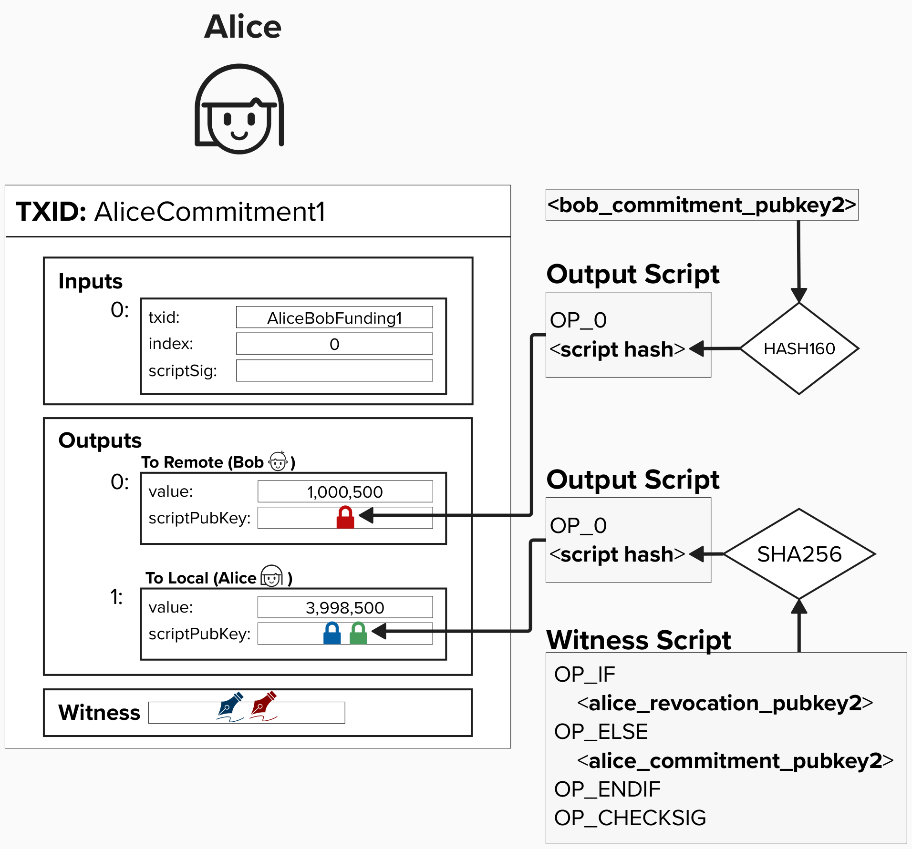
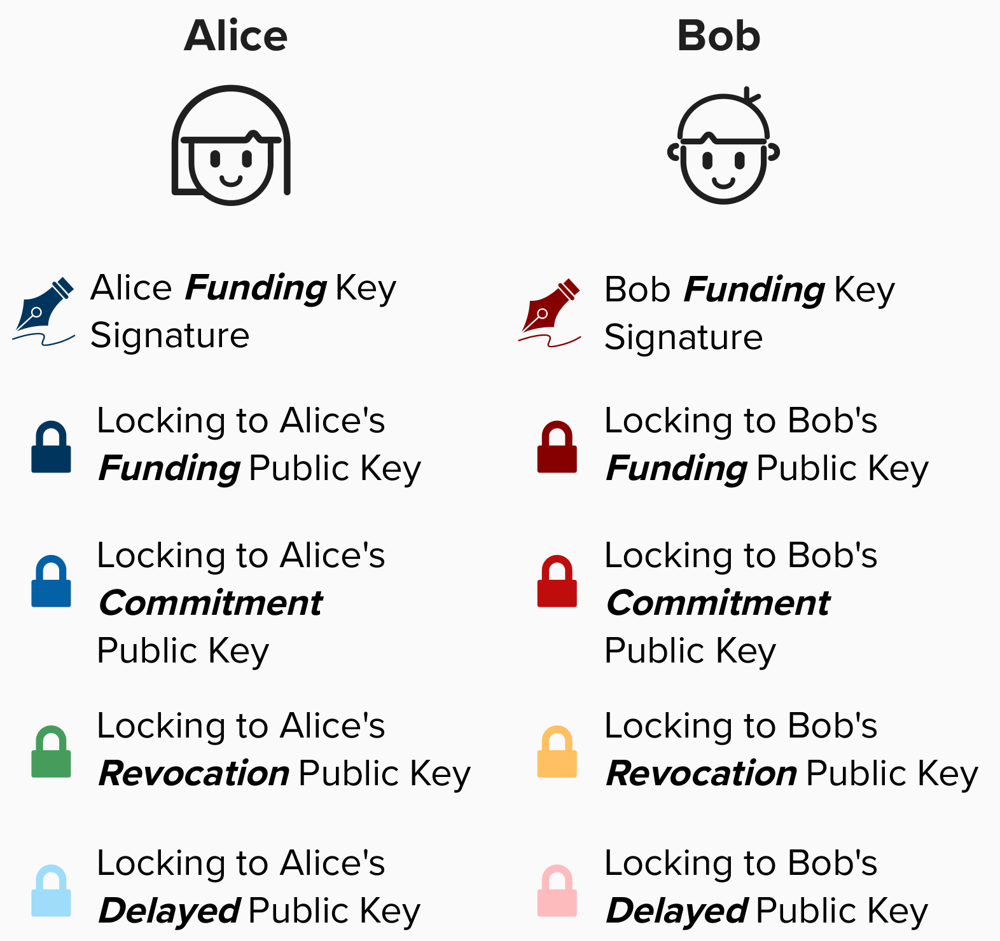

# Finalizing Our Penalty Mechanism

We're getting close to building a robust penalty mechanism that allows us to, in practice, revoke old commitment transactions.

Below is Alice's commitment transaction from the last page. Do you see an issue with it? Even if Alice gives Bob the information to calculate the private key for **alice_revocation_pubkey2**, is Bob still protected from Alice cheating?

<details>
  <summary>Answer</summary>

No, not really! If Alice attempts to publish an old transaction, it would become a *race condition* to see who can mine a new transaction that spends from this output. Even worse, since Alice is publishing the transaction, she has a head start.

How can we fix this?

<details>
  <summary>Answer</summary>

If you guessed **timelocks**, you'd be correct! Do you know which type of timelock is best to use? Once you think you've got it, scroll down this page to see how we can use timelocks to protect Bob from Alice cheating.

</details>

</details>

<p align="center" style="width: 50%; max-width: 300px;">
  
</p>

## Updating Our Commitment Transaction

To resolve the *race condition* we identified above and ensure that Bob has time to punish Alice if she attempts to cheat, we can add a relative timelock to the output such that Alice can only spend that output *after* a certain amount of blocks have passed since the transaction has been mined. To do this, we can leverage the `OP_CHECKSEQUENCEVERIFY` opcode within our output script. Remember, commitment transactions are asymmetrical, so Bob will also add this to his output to protect Alice from him cheating.

By including the `OP_CHECKSEQUENCEVERIFY` opcode in our script, we ensure that the output cannot be spent until a pre-specified amount of blocks have passed *since the transaction was mined on chain*. This solves the problem we identified previously because, if a channel partner tries to publish an old state, the counterparty just has to monitor the blockchain to see if an old transaction is published. If they see the old transaction, they now have time (usually 144 blocks) to punish their counterparty and claim those funds via the revocation key spending path.

### Adding A New Public Key
If you've heard that the Lightning Network uses lots of public keys, you've heard correct! Let's add another key for Alice and Bob - this will be called the **Delayed Public Key**, and it will be used in each party's delayed payment path in their **to_local** output.

<p align="center" style="width: 50%; max-width: 300px;">
  
</p>

<p align="center" style="width: 50%; max-width: 300px;">
  
</p>

#### In Alice's commitment transaction, her spending path is timelocked with `bob_to_self_delay`. Is this a mistake? Why would it have Bob's timelock?

<details>
  <summary>Answer</summary>

When two channel partners decide to open a channel, they exchange some expectations as to how the channel will operate. For example, what the fees should be for (pre-anchor output) commitment transactions and how long the delayed spending path should be timelocked for.

Do you think the delay is the same across all channels? Are there ever situations where someone's delay preference will be shorter or longer?

<details>
  <summary>Answer</summary>

Part of this depends on someone's risk preference. If they prefer to be very cautious, they will likely prefer that their counterparties use longer `to_self` delays so that they have more time to act. Additionally, if the channel balance is quite large, the users may prefer longer delays to be extra cautious.

</details>

</details>

#### Imagine Bob goes offline and Alice needs to broadcast her latest commitment transaction! If the on-chain fees are high, can Alice increase the fee on this commitment transaction?

<details>
  <summary>Answer</summary>

Unfortunately, no!

You may be tempted to think that Alice can just bump the fees using **Child Pays For Parent** (CPFP), but it's a little trickier than that. Alice's output has a relative timelock, which doesn't start until the commitment transaction is mined. Since mempool policy restricts nodes from broadcasting transactions that have non-final timelock conditions, our CPFP transaction will not propogate through the network. 

There are a few options to remedy this, and the chosen solution will depend on if our Lightning channel supports "anchor outputs". If it does, then "anchor outputs" will enable us to fee-bump our commitment transaction at any point in time. Anchor outputs also have a crucial benefit of mitigating "pinning attacks". 

On the other hand, if our node does not support anchor outputs, then we will have to be very deliberate to select a feerate that is sufficiently high, thus reducing the probability of running into feerate issues if we have to broadcast a commitment transaction later. It's also worth nothing that this issue is more prevelant when our peer is offline or unreachable. If they are online and cooperative, we can simply work with them to update the fees.

</details>


## ⚡️ Write Function `to_local` To Generate A ```to_local``` Output Script For Our Commitment Transaction

`to_local` will take a ``revocation_key``, ```to_local_delayed_pubkey```, and ```to_self_delay``` number of blocks as an input. It will return the output script we need to use.


```rust
fn to_local(revocation_key: &PublicKey, to_local_delayed_pubkey: &PublicKey, to_self_delay: &i64) -> ScriptBuf {
    // OP_IF
      // revocation_key
    // OP_ELSE
      // to_self_delay
    // OP_CSV
    // OP_DROP
    // to_local_delayed_pubkey
    // OP_ENDIF)
    // OP_CHECKSIG
}
```

As a reminder, the following methods are available to you on Rust Bitcoin's `Builder` object:
* `Builder::new()` - construct a new builder object
* `.push_opcode(op)` - add an opcode to the script
* `.push_int(num)` - add a number to the script
* `.push_key(public_key)` - add a `PublicKey` to the script
* `.push_pubkey_hash(public_key)` - add a `PubkeyHash` of a `PublicKey` to the script
* `.push_signature(signature)` - add a signature to the script
* `.push_script(script)` - add another script to this script
* `.into_script()` - return the resulting `ScriptBuf` from the `Builder`  


## ⚡️ Update Our Commitment Transaction With Our ```to_local``` Output Script

Now that we have a robust mechanism to revoke old channel states and punish our counterparty (if needed), let's update our channel state. To to this, we'll complete the `build_commitment_transaction` function.

***NOTE***: In the "real world", our refund transaction would have included this revocation logic, **since the "refund" transaction is actually the first "commitment" transaction in our channel**. However, for educational purposes, we waited to introduce the revocation path until after we sent our first payment. 

```rust
pub fn build_commitment_transaction(
    funding_txin: Vec<TxIn>,
    revocation_pubkey: &PublicKey,
    to_local_delayed_pubkey: &PublicKey,
    remote_pubkey: PublicKey,
    to_self_delay: i64,
    local_amount: u64,
    remote_amount: u64,
) -> Transaction {

    // Step 1: Build to_local and to_remote Scripts

    // Step 2: Build to_local and to_remote Outputs

    // Step 3: Declare Version and Locktime

    // Step 4: Build and Return the Transaction

    }
```

<details>
  <summary>Step 1: Build to_local and to_remote Scripts</summary>

### to_local
Use the `to_local` function from the previous exercise to create this commitment transaction's `to_local` script.

```rust
    let to_local_script =
        to_local(revocation_pubkey, to_local_delayed_pubkey, to_self_delay);
```

### to_remote
Remember, in Lightning, the fairness protocol is set up in such a way that you protect your counterparty from *you* cheating, so the `to_remote` output is a simple **Pay-To-Witness-Public-Key-Hash** output. This is why any output that locks funds to *your* channel balance will have recovation logic, but your counterparty's balance will not have extra protection logic.

To create a P2WPKH output, you can simply use the provided helper function, `p2wpkh_output_script`.

```rust
let to_remote_script = p2wpkh_output_script(remote_pubkey);
```

Under the hood, `p2wpkh_output_script` simply takes a secp256k1 public key and converts it to a P2WPKH output.

```rust
pub fn p2wpkh_output_script(public_key: PublicKey) -> ScriptBuf {
    let pubkey = BitcoinPublicKey::new(public_key);
    ScriptBuf::new_p2wpkh(&pubkey.wpubkey_hash().unwrap())
}
```

</details>

<details>
  <summary>Step 2: Build to_local and to_remote Outputs</summary>

Now we'll need to create two `TxOut` objects - one for each output. To do this, you can use the `build_output` function, which takes the amount and an output script.

One nuance to be aware of is that `to_local` returns a **witness script**, which must be converted to an **output script** (`OP_0 <32-byte-script-hash>`) before passing it into `build_output`. You can do this using `.to_p2wsh()`. However, the remote script does not need this conversion because it is already formatted as a Pay-to-Witness-Public-Key-Hash (P2WPKH) output.

```rust
let local_output = build_output(local_amount, to_local_script.to_p2wsh());
let remote_output = build_output(remote_amount, to_remote_script);
```

<details>
  <summary>Click to learn more about build_output</summary>

`build_output` is a helper function available to you. It takes an `amount` and `output_script` as arguments and produces a `TxOut` object that can be passed into a transaction.

```rust
pub fn build_output(amount: u64, output_script: ScriptBuf) -> TxOut {

    TxOut {
        value: Amount::from_sat(amount),
        script_pubkey: output_script,
    }
}
```

Below is an example of how `build_output` could be used:

```rust
let output = build_output(500_000, output_script.to_p2wsh());
```

</details>

</details>

<details>
  <summary>Step 3: Declare Version and Locktime</summary>

Set the transaction version to 2 and locktime to zero using the provided rust-bitcoin enums.

```rust
let version = Version::TWO;
let locktime = LockTime::ZERO;
```
- `Version::TWO` sets the transaction version to 2, which supports BIP-68 relative locktimes.
- `LockTime::ZERO` indicates no timelock on the transaction.

</details>

<details>
  <summary>Step 4: Build and Return the Transaction</summary>

Construct the `Transaction` object using the `build_transaction` helper function, with the defined version, locktime, inputs, and the output in a vector.

```rust
pub fn build_transaction(version: Version, locktime: LockTime, tx_ins: Vec<TxIn>, tx_outs: Vec<TxOut>) -> Transaction {
    Transaction {
        version: version,
        lock_time: locktime,
        input: tx_ins,
        output: tx_outs,
    }
}
```

Remember, `build_transaction` expects `tx_outs` to be a **vector** (think: list) of `TxOut` objects. To wrap your output in a vector, you can use the following notation:

```rust
vec![output]
```

Below is an example of what it would look like to use the `build_transaction` helper function.
```rust
let tx = build_transaction(
    version,
    locktime,
    txins,
    vec![txout],
);
```

</details>


## 👉  Get Our Commitment Transaction

Once your `build_commitment_transaction` is passing the tests, go to a **Shell** in your Repl and type in the below command. Make sure to replace `<funding_tx_id>` with the TxID from our funding transaction!

```
cargo run -- commit -t <funding_tx_id> 
```

Head over to `src/exercises/transactions.txt` and add the **Tx ID** and **Tx Hex** to the **HTLC Timeout Tx ID** and **Commitment Tx Hex** sections. 

Once this is done, we now have our commitment transaction ready to broadcast, if needed. Nice!