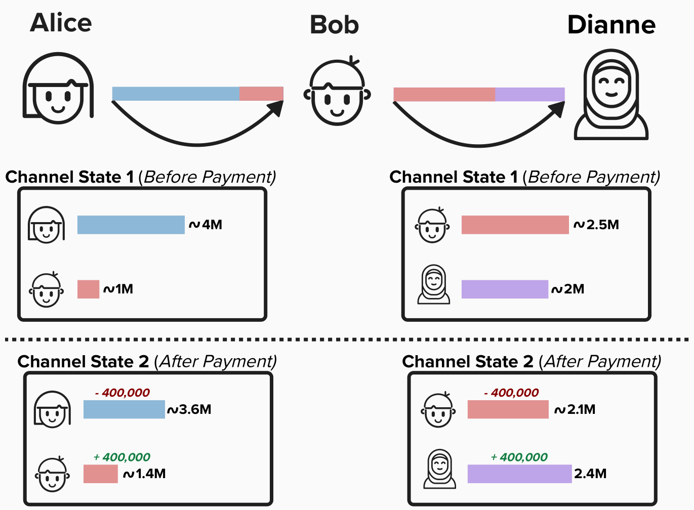
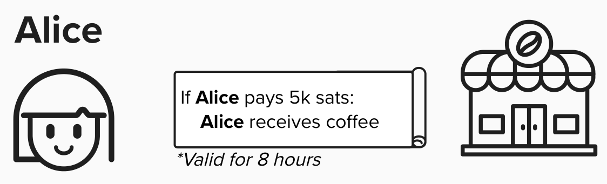
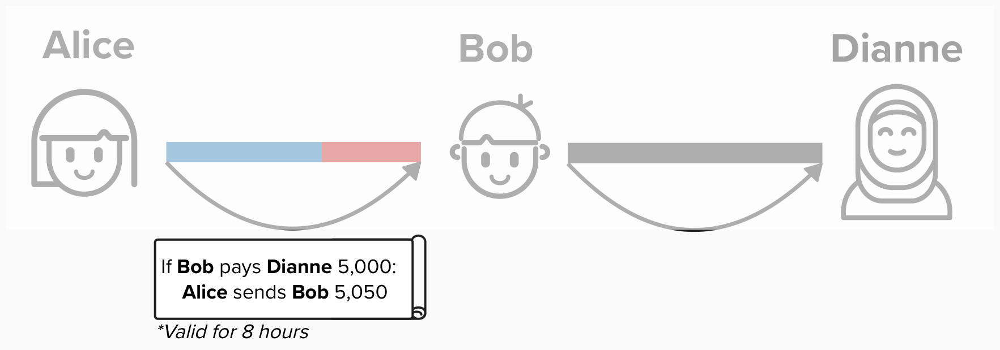
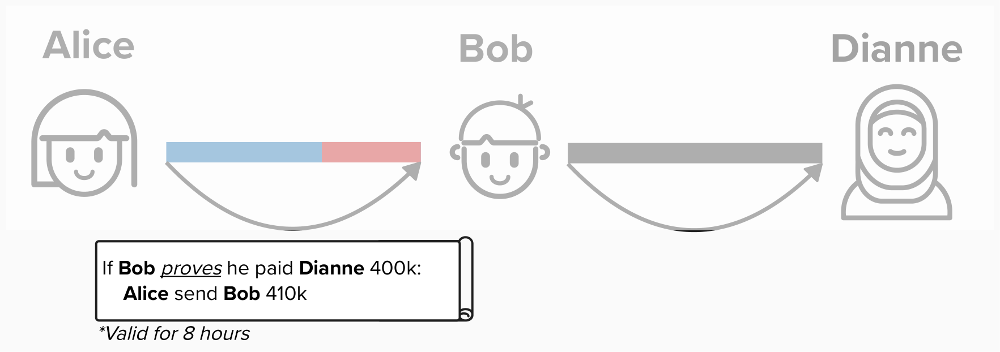
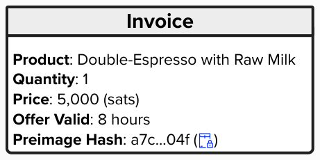
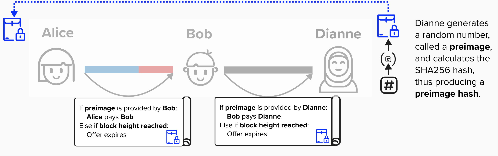

# Introduction to Hash-Time-Locked-Contracts (HTLCs)

## Starting With The End In Mind

Introducing the famous ***HTLC*** will get a little complicated! While it's nothing we can't handle, it will be helpful if we start with the end in mind.

Routing a payment across the Lightning network just means that the **channel balance distributions** will change for each channel, such that, ***for every channel pair***, when the payment is complete:
- The sender will have less Bitcoin on their side of the channel
- The receiver will have more Bitcoin on their side of the channel

For example, imagine Alice routes 400,000 sats to Dianne through Bob. You can see the original channel balances and updated channel balances in the visual below. **NOTE**: for simplicity, Alice and Bob's channel balances start at 4M (Alice) and 1M (Bob), which is slightly different than what we saw in the last section. This is just to make the mental math easier to follow.

#### Take a moment and verify the following:
- **Total Channel Balances Remain Consant**: The total amount of bitcoin in each channel has not changed. More specifically, Alice and Bob's channel has 5M sats in both channel states, while Bob and Dianne have 4.5M in both channel states.
- **Individual Channel Balances Are Updated**: Alice now has 405,000 less sats than she had prior to the payment, while Dianne has 400,000 more.
- **Bob Has More Bitcoin**: Before the payment, Bob had a cliam to 3,500,000 sats **across both channels**. After the payment, Bob has a claim to 3,505,000 sats **across both channels**. He now has 5,000 more sats.

  

#### Question: Why did Bob's balance increase by 5,000 sats? Shouldn't Alice have only sent him 400,000 sats?

  
Answer

The 5,000 sats are fees paid to Bob! We'll discuss the nuances of fees later in this course, but, for now, it's important to note that Alice will have to pay fees to each hop along the payment route to incentivize the node to forward the payment. Otherwise, Bob has no real reason to adjust is liquidity between his channels with Alice and Bob.

## Invoice
Let's build our intuition of Lightning payments by going through an example. Imagine Alice goes to the local coffee shop, which Dianne owns. She is interested in buying a double espresso with raw milk, since that's what the influencers on Twitter are recommending.

She asks Dianne to generate an **invoice** for her. This invoice will provide basic payment information, such as the product that Alice is buying, the cost, and how long this offer is valid for. 

  

## Contracts
When we think of payments, we may think of simply sending money and getting something in return, but there is more going on here. Each payment is actually a **contract**. For instance, when Alice buys a coffee, she sets up the following informal agreement with the coffee shop:

**If Alice pays 400,000 sats, then the vendor will give her coffee. This offer is valid for 8 hours, as the vendor may change their prices tomorrow.**

  

## Contracts on Lightning
Since Alice does not have a channel open with Dianne, the coffee shop owner, Alice will create a payment contract with Bob instead, since Bob has a channel open with Dianne. This contract will have the following condition: **If Bob pays Dianne 400,000 sats, Alice will send Bob 405,000 sats**, effectively refunding him *and providing a tip for his service*.

  

#### Question: What could go wrong here?

  
Answer

I'll admit, since this graphic is very high-level and doesn't provide actual Bitcoin script, it's hard to say exactly what could go wrong. That's okay. This question is more meant to spark consideration as to what issues could go wrong when routing payments through other nodes. Below are a few major ones:

1) Bob needs a guarantee that Alice will refund him. For example, if he sent Dianne 400,000 sats and Alice refused to refund him, he would lose 400,000 sats.
2) Similar to the above issue, Alice needs a guarantee that Bob paid Dianne. Bob could attempt to lie to Alice and say he sent 400,000 sats when he did not. If Alice believes him and sends Bob 405,000 sats, she could lose those funds.

**How can we fix this**?

## Proof of Payment
What we really need is a mechanism to prove that Bob paid Dianne. For example, if Bob is able to provide Alice with a *verifiable* **receipt** from Dianne, then Alice can be assured that Bob actually paid Dianne.

  

#### Question: How can we use cryptography to create a verifiable receipt?

  
Answer

To create a **proof of payment** mechanism, Dianne can generate a large, 256-bit random number (**Preimage**) and then take the SHA256 hash of it, which is called the **Preimage Hash**. For example, Dianne could generate the following:
- Preimage (Secret): `8845245608872841509637822048114565670970616821530093488522820396031866013946`
- Preimage Hash: `566d49f57a1914e8c648d6bd169401b4f4e0fc9cf4ac2f4715ab01216b480c62`

Dianne would then take the **Preimage Hash** and include it in the invoice that she gives Alice, but Dianne will keep the **Preimage** to herself for now!

  

Alice can now update the contract with Bob, requiring that Bob provide the **Preimage** in order to claim the 405,000 from Alice. Since the **Preimage** is only known by Dianne, Bob will set up a contract with Dianne with the same **Preimage Hash** that Alice gave him. 

This ensures that Bob will only pay Dianne if she provides Bob with the **Preimage**, which is exactly what Bob needs to be able to claim the 405,000 from Alice.

Since these contracts won't last forever, we will implement an expiry time - measured in **block height**. If the **Preimage** is not provided by the timeout, then the contract expires and the funds are no longer cliamable by Bob or Dianne.

  

Together, the above components allow Alice to create a **Hash-Time-Locked-Contract** (**HTLC**), meaning that the contract is "locked" such that the receiver of the contract (Bob or Dianne) must provide the **Preimage** within a specific amount of blocks to be able to claim the locked funds.

**Take a minute to think through how we can set up these contracts in Bitcoin. How will we represent them? When you're ready, head over to the next section to learn how to implement a simple HTLC!**

