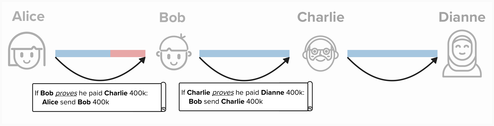
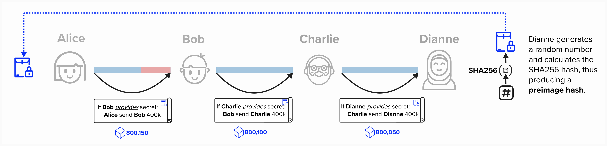

# Introduction to Hash-Time-Locked-Contracts (HTLCs)

## Starting With The End In Mind

Introducing the famous ***HTLC*** will get a little complicated! While it's nothing we can't handle, it will be helpful if we start with the end in mind.

Routing a payment across the Lightning network just means that the **channel balance distributions** will change for each channel, such that, when the payment is complete:
- The sender will have less Bitcoin on their side of the channel
- The receiver will have more Bitcoin on their side of the channel

The above is true for **all** nodes in the route. For example, imagine Alice routes 400,000 sats to Dianne through Bob. You can see the original channel balances and updated channel balances in the visual below. **Take a moment and verify the following**:
- The total amount of Bitcoin in the payment route has *not changed*. More specifically, Alice and Bob's channel has 5M sats in both Channel States, while Bob and Dianne have 4.5M.
- The channel balances are updated such that Alice now has 400,000 less sats than she had prior to the payment, while Dianne has 400,000 more. Bob's balance remains unchanged.

**NOTE**: In reality, Bob would have received a fee for "forwarding" the payment (i.e., letting Alice us his channel liquidity to pay Dianne). If Bob didn't recieve a fee, he would have no incentive to pay Dianne.

<p align="center" style="width: 50%; max-width: 300px;">
  
</p>

## Contracts
Now that we have an idea of what the end-goal is, the question becomes - how do we get there? As always, our method needs to be:
- **Trustless**:
- **Atomic**: 

let's see how we can implement a payment protocol that gets us there!

Let's get our mind in the right headspace and, perhaps, get a little philosophical. What does it mean for Alice to pay Dianne? When we think of payments, we may think of going to a coffee shop to buy a double espresso (or tripple if we're feeling adventurous), but there is a lot more going on here. Each payment is actually a **contract**. For instance, when buying a coffee, we set up an informal agreement that, if we give the vendor money, they will then give us coffee. Furthermore, the cost of the coffee is only valid for a certain time period. If we go back in one year, they may charge a different price for the same cup of coffee.

So, returning to Alice, imagine she wants to send Dianne 400k sats. In return, Dianne will provide some goods or service. This offer will only be vaid for 8 hours. After that, Dianne may change the price.

<p align="center" style="width: 50%; max-width: 300px;">
  
</p>

However, recall that Alice is *not* directly connected to Dianne over the Lightning Network. So, instead, Alice will have to forward payments across the network via the following channels:
- Alice to Bob
- Bob to Dianne

**In other words, Alice will pay Bob. Bob will pay Charlie. Charlie will pay Dianne.**

We can imagine a situation where each pair of channel partners, **A** and **B**, set up the following contract:
- A will pay B ***if and only if*** B proves (ex: provides a receipt) that they forwarded the funds to C, where C is the next hop in the route from B to the final destination.

***PRO TIP!***: When reading the payment flows below, try thinking about the flow from **right-to-left**. Ultimately, this is how the payment would have to work. For example, in the contract below, Alice will only provide funds to Bob ***if*** Bob pays Charlie, BUT Bob will only pay Charlie ***if*** Charlie pays Dianne. So, it may be helpful to think of the payment flow in reverse.

<p align="center" style="width: 50%; max-width: 300px;">
  
</p>

#### Question: What could go wrong?
<details>
  <summary>Answer</summary>

A major issue with this payment construction is that any participant in this route could refuse to cooporate with the agreement. For example, Charlie could pay Dianne, but Bob can refuse to pay Charlie. This would mean Charlie is now at a loss of 400k sats.

In the "real world", Bob may be able to contact authorities and take legal action to get his funds back. However, Lightning operates across the world, and you may not know who you're forwarding payments through or where they live, making it very difficult to take legal action.

</details>

#### Question: Why does Charlie & Dianne's contract have "...." in the contract? You're not expected to know this, as we haven't covered it, but here is a hint: do you think Charlie know's the final destination for this payment?
<details>
  <summary>Answer</summary>

We haven't covered this yet, so don't worry if you don't know the answer!

In the Lightning network, when payments are routed across the network, the given hop only knows who they are sending to next. They don't know the final destination, even if their counterparty is the final destination. So, in this case, Charlie is routing a payment to Dianne by moving funds from his side to her side, **but he doesn't know Dianne is the recipient**.

</details>

When it comes to payment routing, we need a way to ensure that the **entire payment either succeeds or fails**. This fancy word for this is "atomicity".


## Atomic Payments

### Gentle Introduction

We need to make sure that the entire payment either succeeds or fails. In other words, either *everyone* will succeed in moving funds across their channels or *nobody* will.

To build our intuition of how atomic payments work, let's temporarily introduce a trusted third party. Just as we did earlier with revocation keys, we'll replace our trusted third party with cryptographic skillz shortly!

When setting up contracts, the ***sender*** will deposit their funds into an account with a third party - say, an escrow service. The ***reciever*** will only be able to retrieve these funds if a final receipt is provided to the third party, proving the recipient recieved the funds. Once this happens, the third party will relinquish control of the funds to their new owners.

<p align="center" style="width: 50%; max-width: 300px;">
  
</p>

#### Question: What is a good "Proof of Payment"? Can you think of something that leverages cryptography?
<details>
  <summary>Answer</summary>

In this case, the **Proof of Payment** will act as a receipt, and it means that Alice has recieved the funds she requested. In this case, 400k sats.

We can use cryptographic hash functions create a **Proof of Payment** mechansism in the following way:
1) Dianne, the recipient, generates a veryyyyy large random number (256 bits). This is called the **preimage**, and will act as the **secret** or **proof of payment**.
2) Dianne will take the **SHA256** of the **preimage** and send it to Alice.
3) Alice will provide the **preimage hash** to the third party and lock up 400k sats. Alice will tell the third party escrow service that they should only release the funds **if and only if** they receive the **preimage** that, when hashed, equals the **preimage hash**.
4) Bob will do the same when setting up a contract with Charlie.
5) Charlie will do the same when setting up a contract with Dianne.
6) When Dianne receives this contract, she will recognize the **preimage hash**, so she will provide the **preimage** to the third party.
7) At this point, everyone will be able to claim their funds from the third party.

<p align="center" style="width: 50%; max-width: 300px;">
  
</p>

</details>

### Bitcoin Script

Now that we've reviewed, generally, how atomic payment work with a third party, let's discuss them in the context of Bitcoin.

First and foremost, we're going to have to have to move our contracts into Bitcoin script. The person offering the funds will set up a "contract" with the receiver such that:
- The receiver can claim the funds if they are able to provide the preimage to the preimage hash, which is specified in the Bitcoin script.
- The sender can claim the funds if the offer times out. The time period is specified as an **absolute timelock**. So each contract will only be valid until a certain block height is reached.

The above contract construction actually enables atomic payments. This will become more clear in the next section.

<p align="center" style="width: 50%; max-width: 300px;">
  
</p>

Together, the above components enable Alice to create a **Hash-Time-Locked-Contract** (**HTLC**), meaning that the contract is "locked" such that the reciever of the contract must provide the preimage within a specific amount of time to be able to claim the locked funds.

#### Question: Why are the block height timeouts decreasing along the path from sender (Alice) to reciever (Dianne)?
<details>
  <summary>Answer</summary>

Decreasing block height timeouts is crucial to achieving atomicity. If all channels in the route had the same timeout, then there is a chance that Dianne reveals the preimage right before the timeout. In this scenario, she may have enough time to claim the HTLC funds from Charlie, but Charlie may not have enough time to claim his funds from Bob before the contract expires. To ensure that all participants have time to claim the funds, we decrease the timeout with each step along the route towards the final destination.

</details>

**Take a minute to think through how we can set up a new commitment transaction that does this. How will we represent this new output? Will it be included in the ```to_local``` or ```to_remote``` outputs, or will it be its own output?**