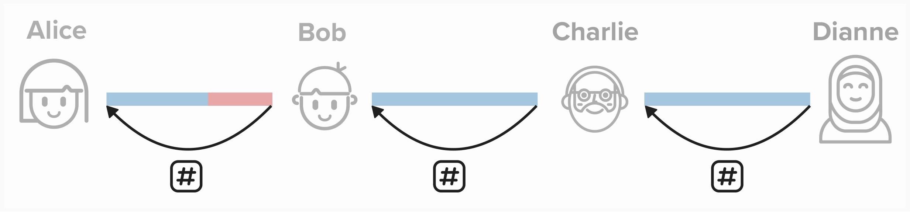

# Introduction to HTLCs

## Contracts
Before we introduce the famous ***HTLC***, let's get our mind in the right headspace and, perhaps, get a little philosophical. What does it mean for Alice to pay Dianne? When we think of payments, we may think of going to a coffee shop to buy a double espresso (or tripple if we're feeling adventerous), but there is a lot more going on here. Each payment is actually a **contract**. For instance, when buying a coffee, we set up an informal agreement that, if we give the vendor money, they will then give us coffee. Furthermore, the cost of the coffee is only valid for a certain time period. If we go back in one year, they may charge a different price for the same cup of coffee.

So, returning to Alice, imagine she wants to send Dianne 400k sats. In return, Dianne will provide some goods or service. This offer will only be vaid for 8 hours. After that, Dianne may change the price.

<p align="center" style="width: 50%; max-width: 300px;">
  
</p>

However, recall that Alice is *not* directly connected to Dianne over the Lightning Network. So, instead, Alice will have forward payments across the network via the following channels:
- Alice to Bob
- Bob to Charlie
- Charlie to Dianne

Alice will send sats to Bob if he agrees to forward the sats to Charlie, who agrees to pay Dianne.

***PRO TIP!***: When reading the payment flows below, try going from **right-to-left**. Ultimately, this is how the payment would have to work. For example, in the contract below, Alice will only provide funds to Bob ***if*** Bob pays Charlie, BUT Bob will only pay Charlie ***if*** Charlie pays Dianne. So, it may be helpful to think of the payment flow in reverse.

<p align="center" style="width: 50%; max-width: 300px;">
  
</p>

#### Question: What could go wrong? Why would this not be a trustless way to route payments?
<details>
  <summary>Answer</summary>

A major issue with this payment construction is that any routing node (ex: Bob or Charlie) can steal funds. For example, Bob or Charlie could ***say*** they will forward the funds but then decide not to ***after*** they recieve the sats from their channel partner.

In the "real world", Alice may contact authorities and take legal action to get her funds back. However, Lightning operates across the world, and you often do not know who you're forwarding payments through or where they live, making it effectively impossible to take legal action.

</details>

A better solution would be to implement contracts that require **proof** of payment before relinquishing funds. This is an improvement, but we still can't be sure that every node will faithfully abide by the contract. We need a way to ensure that the **entire payment either fails or succeeds**. This fancy word for this is "atomicity".

<p align="center" style="width: 50%; max-width: 300px;">
  
</p>

## Atomic Payments

To ensure trustless payments, we need to make sure that the entire payment either fails or succeeds. In other words, either *everyone* will succeed in moving funds across their channels or *nobody* will.

To accomplish this, we can create contracts between each channel party that locks funds up such that a secret needs to be provided to unlock these funds. **We'll use the same secret for all output scripts**. This will ensure that all payments either suceed or fail, and we'll learn shortly *why* that is the case.

<p align="center" style="width: 50%; max-width: 300px;">
  
</p>

So, where will we get the secret from? Dianne will provide it to Alice, who is initiating this payment. To do this, Dianne will generate a very large random number, called the **preimage**. *This is the secret*.

Dianne will then take the SHA256 of the **preimage**, resulting in the **preimage hash**. It's practically impossible to guess the preimage from the preimage hash alone, **so the only way to obtain the preimage is for Dianne to provide it.**

Once Alice recieves the **preimage hash** (the secret), she will instruct all channels in the path to make their payments conditional on this secret being revealed.

Finally, each payment will only be valid for a certain time period. For instance, 150 blocks (~25 hours). The time period is specified as an **absolute timelock**. So each contract will only be valid until a certain block height is reached.

<p align="center" style="width: 50%; max-width: 300px;">
  
</p>

Together, the above components enable Alice to create a **Hash-Time-Locked-Contract** (**HTLC**), meaning that the contract is "locked" such that the reciever of the contract must provide the preimage within a specific amount of time to be able to claim the locked funds.

#### Question: Why are the block height timeouts decreasing along the path from sender (Alice) to reciever (Dianne)?
<details>
  <summary>Answer</summary>

Decreasing block height timeouts is crucial to achieving atomicity. If all channels in the route had the same timeout, then there is a chance that Dianne reveals the preimage right before the timeout. In this scenario, she may have enough time to claim the HTLC funds, but Bob wouldnt have time to claim the funds in his channel with Alice. To ensure that all participants have time to claim the funds, we decrease the timeout with each step along the route towards the final destination.

</details>

Once Dianne finally recieves this contract from Charlie, she'll notice that she knows the secret for the **preimage hash** that the funds are locked to! So, she will reveal the **preimage** and claim the funds for herself. This will spark an "unwinding" of all HTLCs. Now that Charlie has the **preimage**, he will give it to Bob, who will then give it to Alice.

At this point, there is a ***very*** good question that some may be wondering... What if Charlie or Bob refuse to relay the preimage? There are a few answers to this:
1) They are incentivized to reveal the preimage since that it how they will collect routing fees. Also, they would have already passed on their funds to their channel partner, so they wouldn't want to lose out re-caiming this balance.
2) We'll learn more about this shortly, but if one of the channels in the payment route closes in the middle of the payment, the preimage will actually be broadcasted on-chain (if it has already been revealed by Dianne). So any other parties in the route (ex: Alice, Bob, Charlie) will be able to see the preimage on chain and continue unwinding the payment.

<p align="center" style="width: 50%; max-width: 300px;">
  
</p>


**Take a minute to think through how we can set up a new commitment transaction that does this. How will we represent this new output? Will it be included in the ```to_local``` or ```to_remote``` outputs, or will it be its own output?**