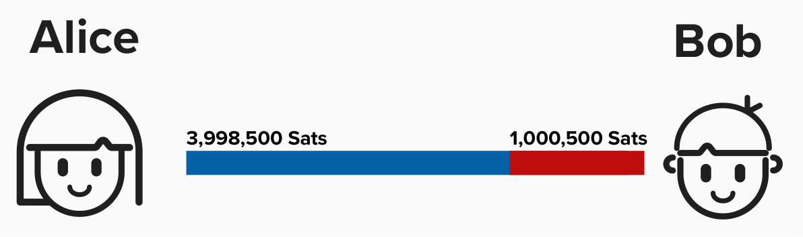
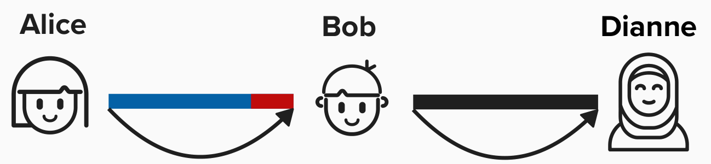

# The Lightning Network: A Collection of Payment Channels

We've now seen how Alice and Bob can use a combination of an off-chain protocol and bitcoin transactions to build a payment channel between themselves. In this payment channel, Alice and Bob can transfer funds in such a way that they do not need to trust eachother - they only need to trust the protocol.

As we saw in the last exercise, Alice and Bob now have a new commitment transaction that pays Alice 3,998,500 sats and Bob 1,000,500 sats. This represents their respective channel balances.

  

The magic of Lightning is that Alice and Bob can create payment channels with other nodes, creating a network of payment channels. Each payment channel represents its own set of funding and commitment transactions between the two parties in the payment channel. For example, imagine that Bob is also connected to Dianne. In this case, we have the following payment channels:
1) Alice & Bob
2) Bob & Dianne

  

# Routing Payments

Let's imagine Alice wants to send a payment to Dianne. Using the Lightning Network, she can route a payment across these payment channels to Dianne. It's important to note that Alice is aware of this path because her node continuously updates its **network graph** by listening to **"gossip"** from other nodes. Gossip is simply a communication protocol that defines how nodes should inform eachother of updates to the network.

Utilizing what we've learned about so far, we can build upon our payment channel and set up a way to trustlessly route payments across this network. 