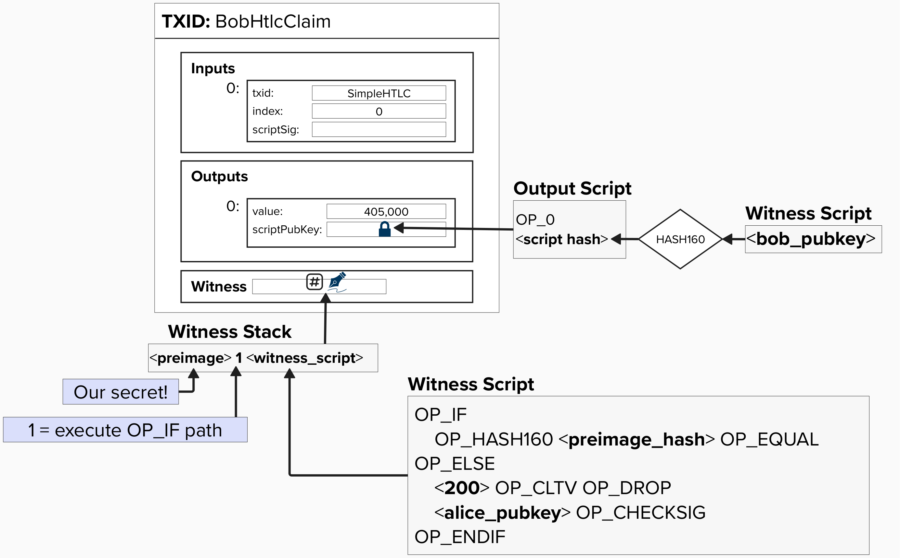

# Simple HTLC Example

Now that we have a high-level understanding of how HTLCs will be set up such that we can route payments across the Lightning network, let's see how they are implemented at the **transaction level**! We'll start with a simple HTLC and then work our way towards the complex versions that are used in the Lightning network.

Let's begin our journey by zooming into Alice's contract with Bob. As you can see, it has the following spending conditions:
- If Bob provides a **preimage**, he can claim the funds.
- If a **block height** is reached, then the contract expires.

<p align="center" style="width: 50%; max-width: 300px;">
  
</p>

If we were to translate the above contract to a Bitcoin transaction, we would represent it as a witness script, and it would look like the below. ***NOTE***: To allow us to focus on HTLCs, let's simplify the commmitment transaction for the moment and not worry about the revocation keys or asymmetric commitment transactions. We'll add the complexities back in later! For now, just imagine a Bitcoin transaction with the following outputs:
- Alice's balance
- Bob's balance
- HTLC balance


**Take a moment to examine the HTLC witness script and confirm that you understand what is happening!** This is really where all of the magic is happening. If Bob is able to obtain the **preimage** this is how he can claim the funds from Alice in a contractual manner. Furthermore, the only way to get the **preimage** is for Dianne to provide it.

<p align="center" style="width: 50%; max-width: 300px;">
  
</p>

<details>
  <summary>Click to learn more about the Witness Script</summary>

This witness script has the following two spending paths:
1) If the preimage is provided, then Bob can spend from this path and claim any funds locked in this output. You may be wondering why OP_HASH160 is being used here. Wasn't the preimage hashed using SHA256? Yes! We will discuss this more shortly.
2) The second path is timelocked with an OP_CHECKLOCKTIMEVERIFY opcode, meaning that it is only valid once we've reached block height 200. This path also requires a signature from Alice. Together, these components allow Alice to reclaim this output once the timelock expires. 

</details>

If Bob manages to obtain the preimage, then he can generate a new transaction, which will spend from this output and move the funds to a new output that Bob unilaterally controls. Below is an example of what it would look like if Bob created a new transaction to claim this HTLC. **Take a moment to examine the witness stack and confirm that you understand what is happening!** 

<p align="center" style="width: 50%; max-width: 300px;">
  
</p>

<details>
  <summary>Click to learn more about the Witness Stack</summary>

P2WSH Script evaluation involves the following three steps. While the below diagram does not explicitly detail the entire script evaluation for this HTLC, it provides the majority of the information needed to understand how Bob would claim the funds.

<p align="center" style="width: 50%; max-width: 300px;">
  
</p>

</details>

## ⚡️ Claim The HTLC!
For this exercise, we'll pretend to be Bob and claim the HTLC from the commitment transaction above. Most of the work is already done for us. The main purpose of this exercise is to dig into the details of transaction and see *how* we can lock/unlock funds using a preimage hash.

### Step 1: Initiating The Contract

To initiate the contract, Alice will give Bob the below transaction hex. **NOTE**, the make this exercise a little easier, this transaction is already mined within a block in this workbook.

```
02000000000101e2ede772166309824266dddf80af44fd462e6b7276080a21b14ef7154423f4c70000000000ffffffff0304d93600000000002200202f18ac783f7312976cb6a5cc83c699507c614283d14fa1840af37636fa89407934440f0000000000160014888dbbd7998f9f80d4f82b4f9ce6d5882f310aec082e060000000000220020284fae8f0d6e48cf1958e36647eab5d4e7b2f8a419f703482d58f61a059aabe70247304402203e65536dd12f0b085e821ad1bd3fce9c49b60e25a80cf995dcfc830c51ebcb22022075865e09f457b36a818d6ad983506e05eee7c242dc1d77d76c42d57bfdb1f4850121024bfc7e708d6fe70518cbf5dd63ea63dd485913f6d6c92b020d8f93f7849c30b800000000
```

#### ⚡️ View the details of the transaction hex!

You can see the details of the transaction if you run the following command in the **shell**.

```
decodetx <tx_dex>
```

There is a lot going on here, but the important piece to focus on is the **vout**. This part of the transaction lists all of the outputs, their amounts, their index, and the locking script. Find the **output script*** for the HTLC output and verify that it's the same as below.

```
"asm": "0 284fae8f0d6e48cf1958e36647eab5d4e7b2f8a419f703482d58f61a059aabe7"
```

If you forget what this is, look at the diagram above! You'll see that we put the hash of the witness script, preceded by OP_0, in the `scriptPubKey`. In other words, this is the SHA256 of the HTLC script!

### Step 2: Verify The Locking Script

Now, you may have read the above and thought, "How am I supposed to verify that locking script? I have no idea what that hash means!". That's a great point.

When Alice sets up this contract with you, she will provide the following pieces of information:
- Her Public Key
- The locktime
- The Preimage Hash

Therefore, you would be able to create the witness script yourself and verify that the contract locks bitcoin to the right output! Below, you'll see how the witness script is converted into hexadecimal. For this exercise, a public key and secret have been created for us. The only thing we need to spend this output is the secret!

***NOTE***: In Bitcoin, all opcodes have a hex representation so that they can be effectively communicated between computers. You can view a list of them all [here](https://en.bitcoin.it/wiki/Script).

<p align="center" style="width: 50%; max-width: 300px;">
  
</p>

If we combine all of the above into a single hex representation, we get the below.

```
63a9148e0290d1ea6eca43cbcb422dca5b6e0ce847696d876702c800b17521031b84c5567b126440995d3ed5aaba0565d71e1834604819ff9c17f5e9d5dd078fac68
```

#### ⚡️ Validate The Output Script

Okay, now that we've seen how to convert our witness script to hex, let's take the SHA256 of it and verify that it's the same as the output script in Alice's transaction. To do that, you can enter the below command in the **shell**. This command passes the above hex data into a simple function within this workbook that takes the SHA256 of the provided data.

```
cargo run -- sha256 -d 63a9148e0290d1ea6eca43cbcb422dca5b6e0ce847696d876702c800b17521031b84c5567b126440995d3ed5aaba0565d71e1834604819ff9c17f5e9d5dd078fac68
```

Is the output the same as what we saw before?

```
"asm": "0 284fae8f0d6e48cf1958e36647eab5d4e7b2f8a419f703482d58f61a059aabe7"
```

**Yes!**. 

### Step 3: Retrieve Preimage

Great, at this point, we've confirmed that we can claim this output if we have the preimage. We just need to find a secret that, when hashed, equals the **RIPEMD160( SHA256(`preimage`) )**.

#### Question: Per BOLT 3, which describes how HTLCs work, we learn that the preimage is the SHA256 of a random 256 bit number, but we lock the output to the **RIPEMD160( SHA256(`preimage`) )**. Why is that?

<details>
  <summary>Answer</summary>

There are a few reasons here. First, SHA256 provides stronger **collision resistance**, meaning that it would take many more hash computations to find two inputs with the same SHA256 result. Specifically, it would take about 2^128. On the other hand, RIPEMD160 estimated 2^80 operations before there is a collision. Therefore, **SHA256 provides better security against collision resistance**.

However, there is a tradeoff here. Specifically, SHA256 provides better security because its output has a larger space (256 bits) as opposed to RIPEMD160, which is 160 bits. If we just put the SHA256 output in the script, it would take up more space, which means higher fees. **Therefore, to reduce the fees that would need to be paid to claim this output, we lock the output to the RIPEMD160( SHA256(`preimage`) )**

</details>

#### ⚡️ Find The Preimage

The below command will take the **RIPEMD160( SHA256() )** of whatever string you put in the quotes. To make this exercise a little simpler, this HTLC output is locked to the hash of a string (converted to bytes) instead of a 256-bit number, which is standard for the Lightning protocol.

**Try entering in a random string and see if you can guess the preimage!**

Remember, the preimage hash is: `8e0290d1ea6eca43cbcb422dca5b6e0ce847696d`. You can verify that by looking at the witness script above!

```
cargo run -- ripemd-sha -d <preimage>
```

<details>
  <summary>Click here to see the preimage</summary>

Well, surprise surpise - the preimage is: `ProgrammingLightning`!

The below command should prove that **"ProgrammingLightning"** will provide the preimage hash that this contract is locked to.
```
cargo run -- ripemd-sha -d ProgrammingLightning
```

</details>

### Step 4: Claim HTLC

Now that we have identified the preimage, let's claim the funds!

Building an entire transaction to spend from Alice's HTLC would take some time, so a transaction has already been created for you. You can find it below.

```
02000000000101f878a95b467bbee61c5ef99d333b65eaa3a02b81ef539b4f1c51953f7956adb302000000000000000001082e06000000000016001479b000887626b294a914501a4cd226b58b235983031450726f6772616d6d696e674c696768746e696e6701014263a9148e0290d1ea6eca43cbcb422dca5b6e0ce847696d876702c800b17521031b84c5567b126440995d3ed5aaba0565d71e1834604819ff9c17f5e9d5dd078fac6800000000
```

#### ⚡️ Verify The Preimage

Go ahead and decode the above transaction using the below alias. Remember, we're looking at the hex representation of Bob's claim transaction.

<p align="center" style="width: 50%; max-width: 300px;">
  
</p>

```
decodetx <tx_hex>
```

Once you do that, check out the **txinwitness** field. You should see the following:
- Preimage: `50726f6772616d6d696e674c696768746e696e67`
- Path Identifier (OP_IF): `01`
- Witness Script: `63a9145f8ad6404f3f5eebbfeffd1b01d37cfc648b7f7d876702c800b17521031b84c5567b126440995d3ed5aaba0565d71e1834604819ff9c17f5e9d5dd078fac68`

```
"txinwitness": [
  "50726f6772616d6d696e674c696768746e696e6721",
  "01",
"63a9145f8ad6404f3f5eebbfeffd1b01d37cfc648b7f7d876702c800b17521031b84c5567b126440995d3ed5aaba0565d71e1834604819ff9c17f5e9d5dd078fac68"
      ]
```

So, according to the above, `50726f6772616d6d696e674c696768746e696e67` is our preimage? Is that right? Well, since we have to represent all data in hex format, then we shouldn't expect to see "ProgrammingLightning" here. Try entering the below command in your **shell** to convert "ProgrammingLightning" to hex. Is it the same as the preimage?
```
cargo run -- to-hex -d ProgrammingLightning
```

#### ⚡️ Publish Transaction And Claim Funds

Great, nice job! You've successfully, dug deeeeeeeep into Bitcoin script and validated how an HTLC output works. Publish your transaction, claim your rewards, and let's see how HTLCs can route payments across the Lightning network!

```
sendtx 02000000000101f878a95b467bbee61c5ef99d333b65eaa3a02b81ef539b4f1c51953f7956adb302000000000000000001082e06000000000016001479b000887626b294a914501a4cd226b58b235983031450726f6772616d6d696e674c696768746e696e6701014263a9148e0290d1ea6eca43cbcb422dca5b6e0ce847696d876702c800b17521031b84c5567b126440995d3ed5aaba0565d71e1834604819ff9c17f5e9d5dd078fac6800000000
```

## Recap
So, let's do a quick recap of the above exercise. We started by examining an HTLC output, and we confirmed that the locking script had the following spending paths:
1) If you know the **preimage**, you can claim the funds.
2) Otherwise, after **block height 200**, Alice can claim the funds by providing a signature.

We then examined what the claim transaction would look like, and we saw how the **preimage** would need to be provided **on-chain** to claim the funds.

# Oops!

Take another look at this HTLC transaction. Do you notice anything wrong with this setup? Can anyone else claim Bob's output?

<p align="center" style="width: 50%; max-width: 300px;">
  
</p>

<details>
  <summary>Answer</summary>

The current P2WSH output script has the following spending paths:
1) If the preimage is provided, the **provider of the preimage** can spend the funds.
2) If block height 200 is reached, **Alice** can claim the funds.

Notice that **Bob** is not explicitly defined in these payment paths. Therefore, if someone else were to figure out what the preimage is, there is nothing stopping them from claiming all of the funds in the output.

How can we fix this?

<details>
  <summary>Answer</summary>

We can update Bob's spending path to require *both* a **signature**, produced by his private key, and the **preimage**. This way, Bob is the only one who can claim the funds from this spending path.

</details>

</details>