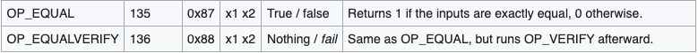
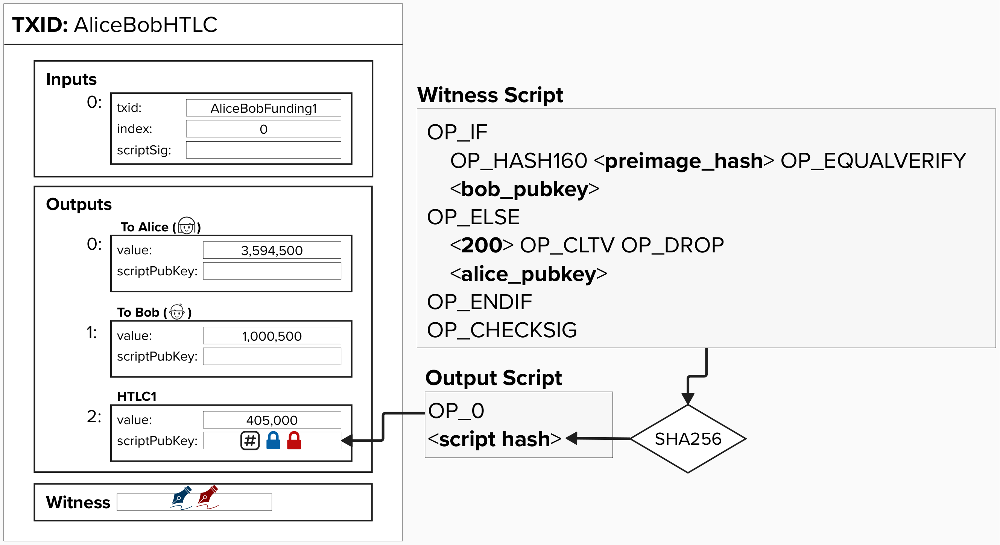
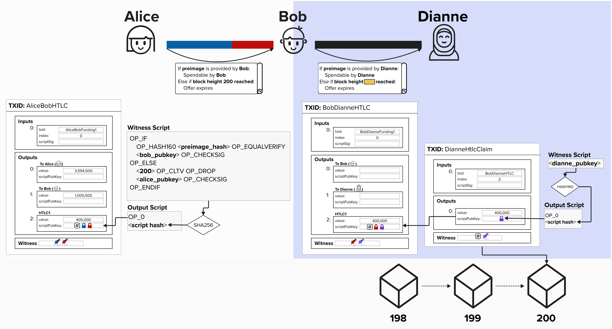
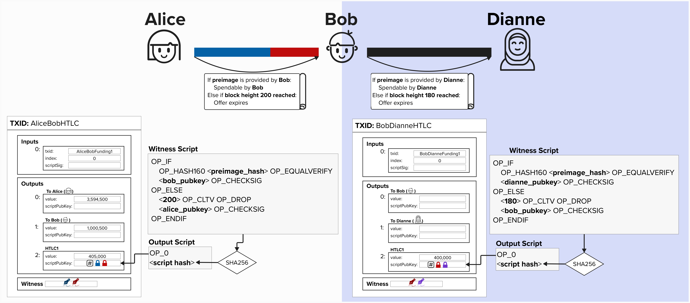

# Updating Our HTLC

Great, we've now dug into the weeds and learned how an HTLC works. However, to ensure that only the intended recipient of the HTLC can claim the funds (Bob, in this case), we need **bind the HTLC to the recipient's public key**, thus ensuring that only the recipient can claim the funds using the preimage and their signature.

Below is what our updated Witness Script would look like.

  

#### Question: Why did the `OP_EQUAL` change to a `OP_EQUALVERIFY`?

  
Answer

Take a look at the below excerpt from the [script](https://en.bitcoin.it/wiki/Script) page on the Bitcoin Wiki and see if you can determine why we changed the script. *HINT*: it has to do with script execution!

  

As you can see in the above picture, `OP_EQUAL` will return a `True` or `False` to the stack, depending on if the preimage that Bob provides is correct. In our prior script, this is perfect, since we want the script to end with a `True` if the preimage is correct. However, now that we've added an `OP_CHECKSIG`, we don't want a `True` left on the stack. Instead, we'd simply like to continue script execution and proceed to the next step, which involves checking Bob's signature. For this reason, we use `OP_EQUALVERIFY`, which will fail the script if the preimage is incorrect and simply continue otherwise.

#### Bonus Question: How can we reduce the size (in bytes) of this output without changing any of the logic? 

  
Answer

Since the entire unhashed witness script must be provided when spending from a P2WSH output, we'd like to minimize the script length (in bytes) if possible.

To accomplish this, we could move the `OP_CHECKSIG` outside of the IF-ELSE condition. This way, it will check the given signature against whichever public key is left on the stack after the IF-ELSE is executed.

Since the savings would be small and it's slightly easier to conceptualize the output if we have an `OP_CHECKSIG` in each IF-ELSE path, we'll keep them here for the rest of this exercise.
  

  

# Routing Payments (HTLCs)

Now that we've seen how a simple HTLC would work between Alice and Bob, let's extend this concept to see how we can route a payment to Dianne.

Recall from earlier that Dianne provided Alice with a **preimage hash**, which is the SHA256 hash of a randomly generated number that *only Dianne knows*. This hash is currently included in the HTLC that Alice set up with Bob. Take a moment to re-read the last few sentences, if you need to. This is very important!

  

Furthermore, Alice can instruct Bob to create an HTLC with Dianne that uses **the same preimage hash**.

Take a moment to examine the below diagram.

  

#### Question: You probably noticed that the block height expiry is not visible for Bob and Dianne's HTLC output. This is on purpose! What do you think it should be? Remember, Alice and Bob's HTLC output expires at block height 200.

  
Answer

This is actually a ***very*** important part of Lightning security, as it relates to both payment **security** and **atomicity** (more on this in a moment). So, let's take a moment to stress this point.

Imagine that Bob and Dianne's HTLC output expired at block height 200 - the same as Alice and Bob's. If this were the case, it would be possible for Dianne to wait until block 200 to claim the HTLC from Bob (remember, she knows the secret, because she generated it!). Simultaneously, Alice might assume the payment is going to expire, so we will reclaim her HTLC output at block height 200. If this were to happen, Dianne would have claimed the 400,000 sats from Bob, but he would **NOT** be able to claim his 405,000 sats from Alice. Ouch!

  

To protect Bob against this sort of attack, Bob may decide that he requires, at least, a 20 block delay to claim the HTLC from Alice. Therefore, he will create an HTLC that times out at **block height 180**. This ensures that, if Dianne provides the preimage right before the HTLC expires, Bob has plently of time to claim his HTLC from Alice before it expires.

## Atomic Payments

Okay, great - we've fixed the expiry attack! Our payment is now **atomic**. In other words, it will either entirely succeed - meaning Dianne will be paid from Bob, and Bob will be paid from Alice - or it will entirely fail.

  

#### Question: Why is the routed payment atomic? Even if Dianne decides to NOT give Bob the preimage and, instead, publish an on-chain transaction to claim the HTLC output, the payment is still atomic. Do you see why?

  
Answer

If still you're unsure, take a moment and look at the on-chain transaction below that Dianne would have to publish to claim the HTLC.

  

To claim the HTLC, Dianne will have to publish the preimage **on-chain**! Recall, we just did this ourselves in the last exercise! Therefore, if Dianne did decide to close the channel at block height 180, Bob could simply get the preimage **on-chain**, hand it to Alice, and claim his 405,000 sats.

The beauty of this payment construction is that, even if the payment channel had 15 hops instead of one, this still holds true! As long as each node has sufficient time in between HTLC expirys, then they will be able to pick up the **preimage** on-chain and continue unwinding the payment - making it atomic!

All that said, let's briefly review the happy path. Under ideal circumstances, Dianne would simply send Bob the **preimage**, and they would work together to update their commitment transaction such that Dianne's output was 400,000 sats larger. This way, they would not have to close their channel by publishing an on-chain transaction. Once Bob receives the **preimage** from Dianne, he would work with Alice to update their channel state. Rememebr, the point of Lightning is to scale off-chain payments, so the goal is to *not* make on-chain payments.

