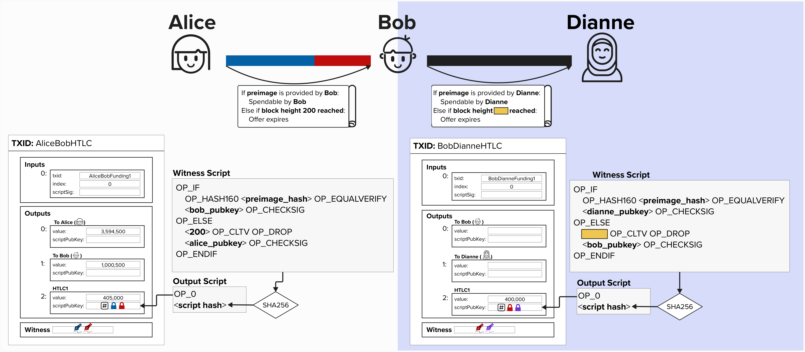

# Updating Our HTLC

Great, we've now dug into the weeds and learned how an HTLC works. However, to ensure that only the receiver of the HTLC can claim the funds (Bob, in this case), we need to lock the spending path such that only the receiver can claim them with the preimage.

Below is what our updated Witness Script would look like.

  

# Routing Payments (HTLCs)

Now that we've seen how a simple HTLC works, let's extend this concept to see how we can leverage it to *atomically* route payments across the Lightning network.

Let's return to our example from earlier where Alice wishes to pay Dianne. To start this process, Dianne provides Alice with a **preimage hash**, which is the SHA256 hash of a randomly generated number that only Dianne knows.

  

Alice can use this **preimage hash** to create an HTLC with Bob, and she can instruct Bob to create an HTLC with Alice that **locks the spending path to the same preimage hash**.

For the moment, we've removed some of additional complexities that we've seen earlier, such as revocation paths, delayed `to_local` spending paths, and asymmetric commitment transactions. The main point here is to showcase how we can link transaction outputs in such a way that multiple paths are locked with the same **preimage hash**. Take a moment to examine the below diagram.

  

#### Question: You probably noticed that the block height expiry is not visible for Bob and Dianne's HTLC output. This is on purpose! What do you think it should be? Remember, Alice and Bob's HTLC output expires at block height 200.

  
Answer

This is actually a ***very*** important part of Lightning security, as it relates to both payment **security** and **atomicity** (more on this in a moment). So, let's take a moment to stress this point.

Imagnie that Bob and Dianne's HTLC output expired at block height 200 - the same as Alice and Bob's. If this were the case, it would be possible for Dianne to wait until block 200 to claim the HTLC from Bob (remember, she knows the secret, because she generated it!). Simultaneously, Alice can reclaim her HTLC output, since it's technically expired, at block height 200. Therefore, Bob would have effectively paid Dianne, but he would **NOT** be able to claim his HTLC funds from Alice. Ouch!

  

To protect Bob against this sort of attack, Bob may decide that he requires, at least, a 20 block delay to claim the HTLC from Alice. Therefore, he will create an HTLC that times out at **block height 180**. This ensures that, if Dianne provides the preimage right before the HTLC expires, Bob has plently of time to claim his HTLC from Alice before it expires.

## Atomic Payments

Okay, great - we've fixed the expiry attack! Our payment is now **atomic**. In other words, it will either entirely succeed - meaning Dianne will be paid from Bob, and Bob will be paid from Alice - or it will entirely fail.

  

#### Question: Why is the routed payment atomic? Even if Dianne decides to NOT give Bob the preimage and, instead, publish an on-chain transaction to claim the HTLC output, the payment is still atomic. Do you see why?

  
Answer

If still you're unsure, take a moment and look at the on-chain transaction below that Dianne would have to publish to claim the HTLC.

  

To claim the HTLC, Dianne will have to publish the secret on-chain! Remember, we just did this ourselves in the last exercise! Therefore, Bob would be able to retrieve the secret on-chain and, subsequently, hand it over to Alice so that he can retrieve his funds locked in their HTLC.

The beauty of this payment construction is that, even if the payment channel had 15 hops instead of one, this still holds true! As long as each node has sufficient time in between HTLC expirys, then they will be able to pick up the **preimage** on-chain and continue unwinding the payment - making it atomic!

