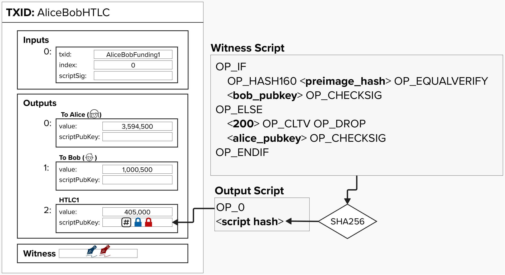

# HTLC Transactions in Lightning

Now that we've built our intuition around how HTLCs work, let's make things complicated again!

<p align="center" style="width: 50%; max-width: 300px;">
  
</p>

#### Question: Why would this output be insufficient for our Lightning payment channel?
<details>
  <summary>Answer</summary>

There are a few issues, and we'll tackle them one by one. The first is that there is no revocation path!

Imagine this payment was made at block height 160, and now it's block height 300. Since block height 160, Alice and Bob have moved forward several channel states.

If Alice or Bob decide to cheat and publish this old channel state, there is no protection stopping them from sweeping these funds immediately! How can we fix that?

</details>

# Building Lightning HTLCs

As you probably expected by now, let's add another public key for both Alice and Bob. These public keys will be used in the scripts for the HTLC output.

<p align="center" style="width: 50%; max-width: 300px;">
  
</p>

<p align="center" style="width: 50%; max-width: 300px;">
  
</p>

We'll look at the output scripts in on the next page, but, for now, we can note that much of the commitment transaction is similar to the previous commitment transactions we've looked at. For example:
- The ```to_local``` output for Alice and Bob will still have two spending paths.
  - One spendable by the local node after ```to_self_delay``` blocks have passed.
  - The other spendable by the remote node if they have the revocation key.
- The ```to_remote``` output for Alice and Bob are still immediately spendable by the owner of those funds.

## HTLC Output
The HTLC output is going to be a little gnarly. In fact, it won't be the same for Alice and Bob. Instead, it will change depending on if you are ***offering*** the HTLC or if you are ***recieving*** the HTLC. 