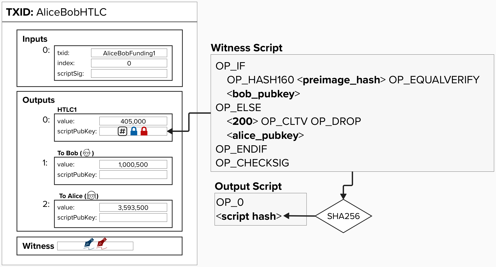

# HTLC Transactions in Lightning

Now that we've built our intuition around how HTLCs work, let's make things complicated again!

First, let's update our script so that the preimage spending path includes Bob's public key, ensuring that he is the only person able to redeem from this path.

  

#### Question: Why would this output be insufficient for our Lightning payment channel?

  
Answer

There are a few issues, and we'll tackle them one by one. The first is that there is no revocation path!

Imagine this payment was made at block height 160, and now it's block height 300. Since block height 160, Alice and Bob have moved forward several channel states.

If Alice or Bob decide to cheat and publish this old channel state, there is no protection stopping them from sweeping these funds immediately! How can we fix that?

# Building Lightning HTLCs

Before we can add back in revocation path, we need to bring back our asymmetric commitment transactions. Below is a diagram of the same transactions we saw earlier, but a new HTLC output has been added for Alice and Bob.

The HTLC output is going to be a little gnarly. In fact, it won't be the same for Alice and Bob. Instead, it will change depending on if they are ***offering*** the HTLC or ***recieving*** the HTLC. Head on over to the next page to learn how full HTLCs are implemented in Lightning!

  

  

