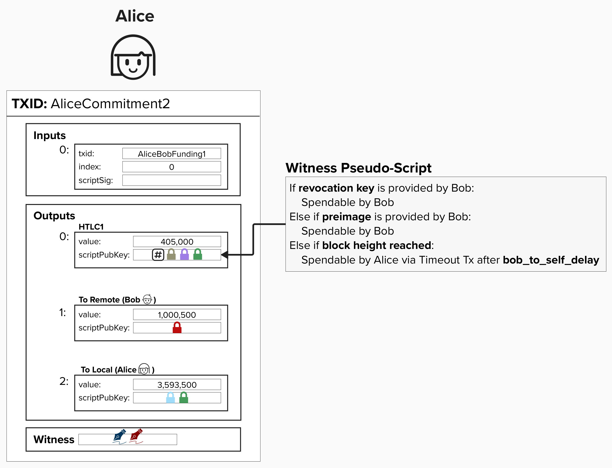
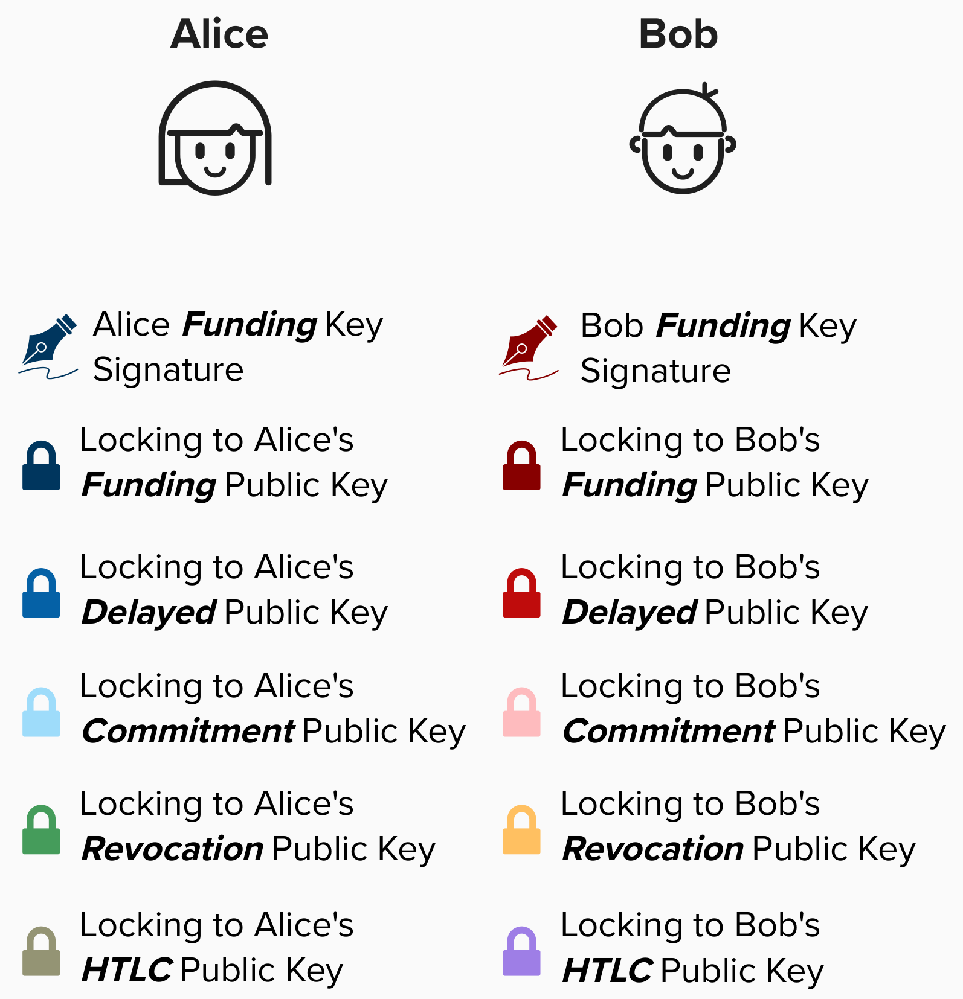
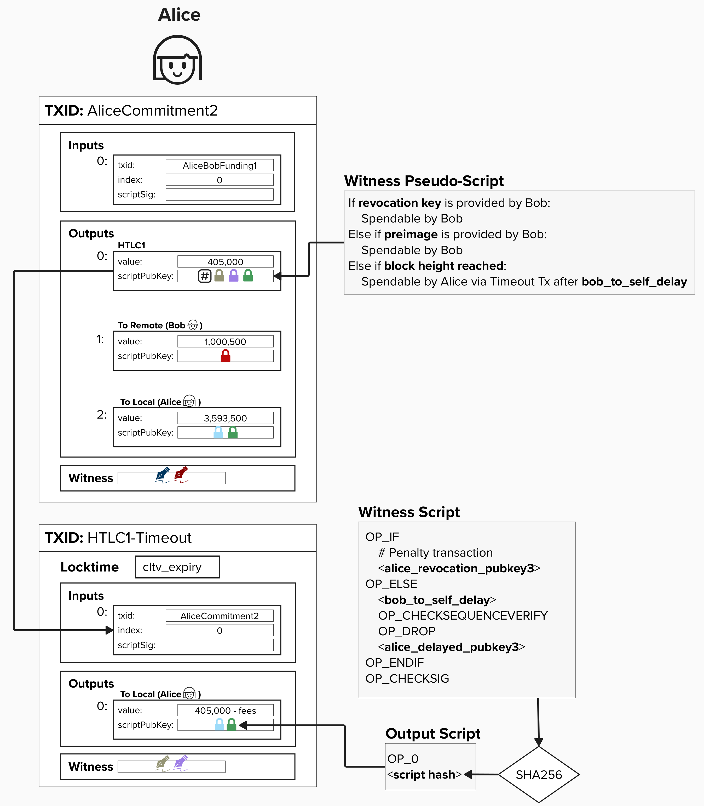
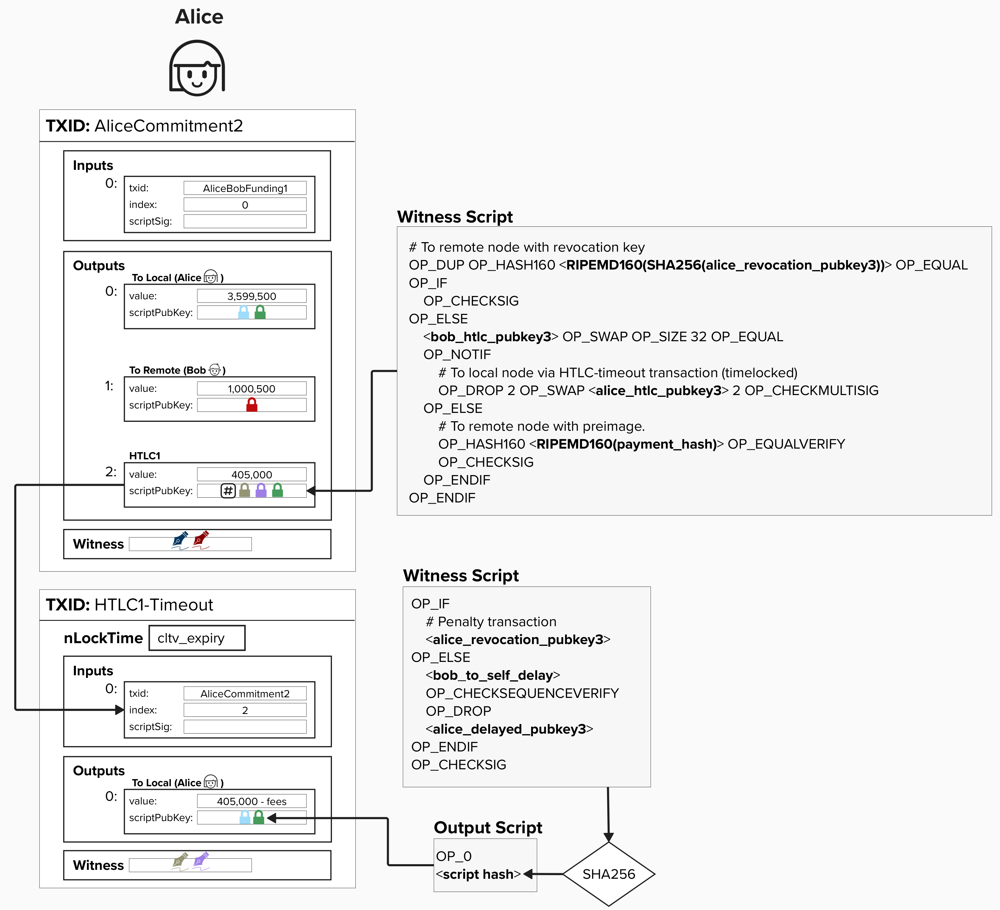

# HTLC Offerer
The HTLC scripts are not easy on the eyes, so let's inch our way towards them, starting with pseudo script. As a reminder, "pseudo script" means we'll be writing the script in plain english, describing the spending paths that we will need to support once we implement the contract in bitcoin's programming language, [**Script**](https://en.bitcoin.it/wiki/Script).

Alice, the ***HTLC offerer***, has to create an output where:
1) **Bob** can spend the output if he has the **revocation key**. This protects Bob in the future if Alice attempts to publish this HTLC commitment transaction after they have agreed to move to a new channel state.
2) **Bob** can spend the output if he can prove he has the **preimage**.
3) **Alice** can spend (effectively, reclaim) the output if the HTLC expires. Remember, Alice proposed a block height at which the HTLC must be completed by.

<p align="center" style="width: 50%; max-width: 300px;">
  
</p>

**This is very nuanced and hard to see, but there is actually a bit of a dilema here!** Remember, all to-self spending paths *must* be delayed by `to_self_delay` blocks to ensure that your counterparty has time to cliam your funds if you attempt to cheat in the future. Therefore, Alice must timelock her spending path using `OP_CHECKSEQUENCEVERIFY`, which is a **relative timelock** that only starts once the transaction is mined.

#### Question: Looking at the simplified transaction, can you spot why this commitment transaction structure would be a problem? HINT: it has to do with the timelocks.
<details>
  <summary>
    Answer
</summary>

The HTLC needs to be timelocked with an **absolute timelock** set to some block height in the future. This ensures that Bob can safely forward the HTLC without Alice arbitrarily deciding to expire the contract early. If she was able to do this, there is a chance she expires the contract *after* Bob pays Dianne but *before* Bob claims his funds from Alice.

Additionally, as we just discussed, Alice's expiry path has a **relative timelock**, which provides Bob with a `to_self_delay` block delay to sweep Alice's funds via the revocation path, if Alice attempts to cheat in the future.

If we tried to lock the same output with both timelocks, we'd run into a bit of an issue. Namely, the **relative timelock**, `OP_CHECKSEQUENCEVERIFY`, does not start until the transaction is mined, which can only happen *after* the **absolute timelock** is satisfied.

This means, in the worst case, if Alice times out the HTLC once the contract expires, **she would still have to wait another** `to_self_delay` **blocks before she can spend the output**. This gives Bob extra time to provide the preimage and claim the output. Do you know how we can fix this?

</details>

## Addressing The Dilema
To fix this timelock dilema, we'll add a second transaction for Alice, known as the **HTLC Timeout Transaction**. This transaction will use the same script as our `to_local` output, however, it will feature the following key differences:
1) The transaction with have an `nLocktime` set to the payment expiration date, known as `cltv_expiry` in the protocol. This means that the transaction cannot be mined until the `cltv_expiry` block height has passed. Therefore, Alice cannot claim back her funds until the HTLC has expired.
2) The input for this transaction is the HTLC output on the commitment transaction.
3) The HTLC spending path requires signatures from both Alice and Bob to spend. **They will pre-sign the HTLC Timeout transaction ahead of time**, effectively both agreeing to the "expiry" terms of the contract. 

Together, these changes allow for Alice to enforce the **absolute timelock** and **relative timelock**. This is because Alice cannot publish the **HTLC Timeout Transaction** until the HTLC expires at block height `cltv_expiry`. Furthermore, once published, she will need to wait an additional `to_self_delay` blocks (via the `OP_CHECKSEQUENCEVERIFY` timelock) to claim her funds from this output.

Let's introduce a new key for Alice and Bob: the **HTLC Public Key**. As we'll soon see, this public key will be embedded in the HTLC locking script.

<p align="center" style="width: 50%; max-width: 300px;">
  
</p>


<p align="center" style="width: 50%; max-width: 300px;">
  
</p>


## Putting It All Together

Putting it all together, the HTLC output has the following spending conditions:

1) **Revocation Path**: If Bob has the revocation key (in case Alice cheats by broadcasting an old transaction), he can immediately claim the output.
2) **Preimage Path**: If Bob provides the preimage, he can immediately claim the output.
3) **Expiry Path**: If Bob doesn't provide the preimage, Alice can claim the output via the HTLC Timeout Transaction, **which is set up in advance with Bob's signature for the 2-of-2 multisig condition** (more on this below). This allows Alice to expire the HTLC and reclaim her funds - while also enforcing the `to_self_delay`. 

For the HTLC Timeout Transaction, we have the following spending paths:
- **Revocation Path**: Bob can claim the output immediately with the revocation key.
- **Delayed Path**: Alice can claim the output after the `to_self_delay`.

<p align="center" style="width: 50%; max-width: 300px;">
  
</p>

We won't go over the entire script in detail, but the one thing we will draw attention to is the `OP_CHECKMULTISIG` spending path, which sends to the **HTLC Timeout** transaction. Take a moment to review this and confirm that you understand the following:
- To expire the HTLC, the HTLC offerer must publish the HTLC Timeout transaction. This transaction is spending from a 2-of-2 multisig path, which Alice and Bob agree to pre-sign when creating the HTLC.
- Since the transaction is created ahead of time and signed by both parties, Bob can rest assured that Alice is only able to expire the HTLC using the **HTLC Timeout** transaction, which Bob knows has an absolute timelock set to `cltv_expiry`.


## ⚡️ Build An HTLC Offerer Commitment Transaction

Complete `build_htlc_commitment_transaction`.

```rust
pub fn build_htlc_commitment_transaction(
    funding_txin: TxIn,
    revocation_pubkey: &PublicKey,
    remote_htlc_pubkey: &PublicKey,
    local_htlc_pubkey: &PublicKey,
    to_local_delayed_pubkey: &PublicKey,
    remote_pubkey: &PublicKey,
    to_self_delay: i64,
    payment_hash160: &[u8; 20],
    htlc_amount: u64,
    local_amount: u64,
    remote_amount: u64,
) -> Transaction {

  // create htlc, to_local, and to_remote scripts

  // create htlc, to_local, and to_remote outputs
  //    note, we must call .to_p2wsh() on our P2WSH scripts
  //    to obtain the hash that goes in the output's scriptPubKey field

  // declare the version and locktime for the transaction

  // build transaction
  // -- remember, inputs and outputs must be passed in as vectors (vec![])


}
```


As we saw earilier, you can choose to use the following functions to help complete this exercise:
<details>
  <summary>to_local()</summary>

Our `to_local` function from an earlier exercise will be helpful here.

```rust
pub fn to_local(
    revocation_key: &PublicKey,
    to_local_delayed_pubkey: &PublicKey,
    to_self_delay: i64,
) -> ScriptBuf {
    Builder::new()
        .push_opcode(opcodes::OP_IF)
        .push_key(revocation_key)
        .push_opcode(opcodes::OP_ELSE)
        .push_int(to_self_delay)
        .push_opcode(opcodes::OP_CSV)
        .push_opcode(opcodes::OP_DROP)
        .push_key(to_local_delayed_pubkey)
        .push_opcode(opcodes::OP_ENDIF)
        .push_opcode(opcodes::OP_CHECKSIG)
        .into_script()
}
```

</details>

<details>
  <summary>build_output()</summary>

A `build_output` function is available to you that takes an `amount` and `output_script` as arguments and produces a `TxOut` object that can be passed into a transaction.

```rust
pub fn build_output(amount: u64, output_script: ScriptBuf) -> TxOut {

    TxOut {
        value: Amount::from_sat(amount),
        script_pubkey: output_script,
    }
}
```

Below is an example of how `build_output` could be used:

```rust
let output = build_output(500_000, output_script.to_p2wsh());
```

</details>

<details>
  <summary>build_transaction()</summary>

To create a transaction, you can use the following helper function:

```rust
pub fn build_transaction(version: Version, locktime: LockTime, tx_ins: Vec<TxIn>, tx_outs: Vec<TxOut>) -> Transaction {
    Transaction {
        version: version,
        lock_time: locktime,
        input: tx_ins,
        output: tx_outs,
    }
}
```
### When building the transaction, note the following:

### Tx Inputs / Outputs
`build_transaction` expects `tx_ins` and `tx_outs` to be a **vector** (think: list) of `TxIn` and `TxOut` objects, respectively. To wrap your inputs or output in a vector, you can use the following notation:

```rust
vec![output_a, output_b]
```

### Version & Locktime
When specifying the version and locktime, you can use the following notation that rust-bitcoin provides. We'll learn about other varieties shortly, but this will help us get started.
- `Version::TWO`: Version 2 is post-BIP-68, which introduced sequence number relative locktimes. 
- `LockTime::ZERO`: This signals that there is no timelock on this transaction.

```rust
let version = Version::TWO;
let locktime = LockTime::ZERO;
```

</details>

<details>
  <summary>build_htlc_offerer_witness_script()</summary>

You can obtain an **HTLC Offerer** output script by using the below function. Yes, you can relax knowing you will not be asked to build an HTLC offerer script yourself, though you are welcome to do so for "fun" if you would like!

Remember, you will need to call `.to_p2wsh()` when building your output. See `build_output` for more info!
```rust
pub fn build_htlc_offerer_witness_script(
    revocation_pubkey: &PublicKey,
    remote_htlc_pubkey: &PublicKey,
    local_htlc_pubkey: &PublicKey,
    payment_hash160: &[u8; 20],
) -> ScriptBuf {
    Builder::new()
        .push_opcode(opcodes::OP_DUP)
        .push_opcode(opcodes::OP_HASH160)
        .push_slice(&PubkeyHash::hash(&revocation_pubkey.serialize()))
        .push_opcode(opcodes::OP_EQUAL)
        .push_opcode(opcodes::OP_IF)
        .push_opcode(opcodes::OP_CHECKSIG)
        .push_opcode(opcodes::OP_ELSE)
        .push_slice(&remote_htlc_pubkey.serialize())
        .push_opcode(opcodes::OP_SWAP)
        .push_opcode(opcodes::OP_SIZE)
        .push_int(32)
        .push_opcode(opcodes::OP_EQUAL)
        .push_opcode(opcodes::OP_NOTIF)
        .push_opcode(opcodes::OP_DROP)
        .push_int(2)
        .push_opcode(opcodes::OP_SWAP)
        .push_slice(&local_htlc_pubkey.serialize())
        .push_int(2)
        .push_opcode(opcodes::OP_CHECKMULTISIG)
        .push_opcode(opcodes::OP_ELSE)
        .push_opcode(opcodes::OP_HASH160)
        .push_slice(payment_hash160)
        .push_opcode(opcodes::OP_EQUALVERIFY)
        .push_opcode(opcodes::OP_CHECKSIG)
        .push_opcode(opcodes::OP_ENDIF)
        .push_opcode(opcodes::OP_ENDIF)
        .into_script()
}
```

</details>


Additionally, the following two funcitons will be useful:

You can obtain a **P2WPKH** output script by using the below function.
```rust
let p2wpkh_output_script = p2wpkh_output_script(pubkey);
```

## 👉 Get Our HTLC Transaction

Once your `build_htlc_commitment_transaction` is passing the tests, go to a **Shell** in your Repl and type in the below command. Make sure to replace `<funding_tx_id>` with the TxID from our funding transaction!

```
cargo run -- htlc -t <funding_tx_id> 
```

You should know by now! Head over to `src/ch1_intro_htlcs/transactions.txt` and add the **Tx ID** and **Tx Hex** to the **HTLC Tx ID** and **HTLC Tx Hex** sections.


## ⚡️ Build An HTLC Timeout Transaction

Let's bring this HTLC commitment full circle by building our HTLC Timeout transaction. To do this, complete the function `build_htlc_timeout_transaction`.

Note, since the witness script is the same structure as the `to_local`, you can use the `to_local()` function you created earlier!

```rust
pub fn build_htlc_timeout_transaction(
    htlc_txin: TxIn,
    revocation_pubkey: &PublicKey,
    to_local_delayed_pubkey: &PublicKey,
    to_self_delay: i64,
    cltv_expiry: u32,
    htlc_amount: u64
) -> Transaction {
    // create htlc script 

    // create htlc outputs
    //    note, we must call .to_p2wsh() on our P2WSH scripts
    //    to obtain the hash that goes in the output's scriptPubKey field

    // declare the version and locktime for the transaction

    // build transaction
    // -- remember, inputs and outputs must be passed in as vectors (vec![])
}
```

By now, you should be familiar with most of the inputs to this function, however, there is one new one: `cltv_expiry`. This is the expiry (block height) for the HTLC, and it is specified in the `LockTime` field.

You can specify an absolute locktime using `LockTime::from_consensus(<block_height>)`. For example, if you wanted to put an absolute locktime on a transaction such that it couldn't be mined until block height 900,000, you would do the following.

```rust
let locktime = LockTime::from_consensus(900_000);
```

Try completing the function! Click "Run" when you're finished to see if the test passes!

## 👉 Get Our HTLC Timeout Transaction

Once your `build_htlc_timeout_transaction` is passing the tests, go to a **Shell** in your Repl and type in the below command. Make sure to replace `<htlc_tx_id>` with the TxID from our **HTLC Timeout Tx ID** transaction. **NOTE**: the timeout transaction spends from an output within the commitment transaction, so you must specify the commitment transaction's TX ID.

```
cargo run -- htlc-timeout -t <htlc_tx_id> 
```

Once again, head over to `src/ch1_intro_htlcs/transactions.txt` and add the **Tx ID** and **Tx Hex** to the **HTLC Timeout Tx ID** and **HTLC Timeout Tx Hex** sections.