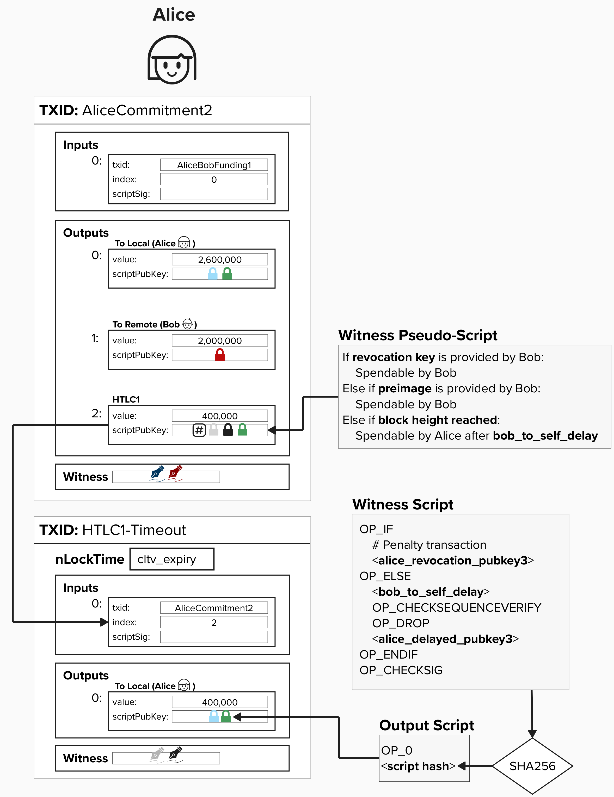

# HTLC Offerer

Alice, the ***HTLC offerer***, has to create an output where:
1) **Bob** can spend the output if he has the **revocation key**. This protects Bob in the future if Alice attempts to publish this HTLC commitment transaction after they have agreed to move to a new channel state.
2) **Bob** can spend the output if he can prove he has the **preimage**.
3) **Alice** can spend (effectively, reclaim) the output if the HTLC expires. Remember, we proposed a block height at which the HTLC must be completed by.

<p align="center" style="width: 50%; max-width: 300px;">
  
</p>

**This is very nuanced are hard to see, but there is actually a bit of a dilema here!** Alice's spending path must be delayed by ```to_self_delay``` blocks so that Bob always has time to spend the funds via the recovation path if Alice cheats in the future.

#### Question: Looking at the simplified transaction, can you spot why this commitment transaction structure would be a problem?
<details>
  <summary>
    Answer
</summary>

Since the transaction is timelocked with an **absolute timelock** set to some block height in the future, the output cannot be spent until that block height has passed. This is meant to give Bob a specific timeframe for which he can retrieve the preimage and claim the funds.

**However**, Alice must enforce a ```to_self_delay``` **relative timelock** on her ability to spend the output. This means, in the worst case, if Alice tries to spend this output after the contract expires expires, **she will still have to wait another** ```to_self_delay``` **blocks before she can spend that output**. This effectively gives extra time to Bob to provide the preimage and spend this output to himself. Do you know how we can fix this?

</details>

## Addressing The Dilema
To fix this timelock dilema, we'll add a second transaction for Alice, known as the **HTLC Timeout Transaction**. This transaction will use the same script as our ```to_local``` output, however, it will feature the following key differences:
1) The transaction with have an ```nLocktime``` set to the payment expiration date, known as ```cltv_expiry``` in the protocol. This means that the transaction cannot be mined until the ```cltv_expiry``` block height has passed. Therefore, Alice cannot claim back her funds until the HTLC has expired.
2) The input for this transaction is the HTLC output on the commitment transaction.
3) This spending path requires signatures from both Alice and Bob to spend. They will pre-sign the HTLC Timeout transaction ahead of time, effectively both agreeing to the "expiry" terms of the contract.

Together, these changes allow for Alice to claim back her funds once the HTLC expires while also enforcing the ```to_self_delay``` in a manner that allows Bob to steal the funds via the revokation key, if needed. **However, crucially, Bob can no longer claim the HTLC via the primage after it expires, since Alice can now publish and claim those funds exactly when the HTLC expires.**

<p align="center" style="width: 50%; max-width: 300px;">
  
</p>


<p align="center" style="width: 50%; max-width: 300px;">
  
</p>


## Putting It All Together

Putting it all together, the HTLC output has the following spending conditions:

1) **Revocation Path**: If Bob holds the revocation key (in case Alice cheats by broadcasting an old transaction), he can immediately spend the output.
2) **Preimage Path**: If Bob provides the preimage, he can spend the output immediately.
3) **Timeout Path**: If Bob doesn't provide the preimage, Alice can spend the output via the HTLC Timeout Transaction, **which is set up in advance with Bob's signature for the 2-of-2 multisig condition. This allows Alice to reclaim the funds after the `cltv_expiry`.**

For the HTLC Timeout Transaction:
- **Revocation Path**: Bob can spend the output immediately with the revocation key.
- **Delayed Path**: Alice can spend the output after the `to_self_delay`.

<p align="center" style="width: 50%; max-width: 300px;">
  
</p>


## ⚡️ Build An HTLC Offerer Commitment Transaction

Complete `build_htlc_commitment_transaction`.

```rust
pub fn build_htlc_commitment_transaction(
    funding_txin: TxIn,
    revocation_pubkey: &PublicKey,
    remote_htlc_pubkey: &PublicKey,
    local_htlc_pubkey: &PublicKey,
    to_local_delayed_pubkey: &PublicKey,
    remote_pubkey: &PublicKey,
    to_self_delay: i64,
    payment_hash160: &[u8; 20],
    htlc_amount: u64,
    local_amount: u64,
    remote_amount: u64,
) -> Transaction {

  // create htlc, to_local, and to_remote scripts

  // create htlc, to_local, and to_remote outputs
  //    note, we must call .to_p2wsh() on our P2WSH scripts
  //    to obtain the hash that goes in the output's scriptPubKey field

  // declare the version and locktime for the transaction

  // build transaction
  // -- remember, inputs and outputs must be passed in as vectors (vec![])


}
```


As we saw earilier, you can choose to use the following functions to help complete this exercise:
- `to_local`
- `build_output`
- `build_transaction`

Additionally, the following two funcitons will be useful:

You can obtain a **P2WPKH** output script by using the below function.
```rust
let p2wpkh_output_script = p2wpkh_output_script(pubkey);
```

You can obtain an **HTLC Offerer** output script by using the below function. Yes, you can relax knowing you will not be asked to build an HTLC offerer script yourself, though you are welcome to do so for "fun" if you would like!
```rust
let htlc_offerer_script = build_htlc_offerer_witness_script(
      revocation_pubkey,
      remote_htlc_pubkey,
      local_htlc_pubkey,
      payment_hash160,
  );
```

## 👉 Get Our HTLC Transaction

Once your `build_htlc_commitment_transaction` is passing the tests, go to a **Shell** in your Repl and type in the below command. Make sure to replace `<funding_tx_id>` with the TxID from our funding transaction!

```
cargo run --bin htlc <funding_tx_id> 
```

You should know by now! Head over to `src/ch1_intro_htlcs/transactions.txt` and add the **Tx ID** and **Tx Hex** to the **HTLC Tx ID** and **HTLC Tx Hex** sections.


## ⚡️ Build An HTLC Timeout Transaction

Let's bring this HTLC commitment full circle by building our HTLC Timeout transaction. To do this, complete the function `build_htlc_timeout_transaction`.

```rust
pub fn build_htlc_timeout_transaction(
    htlc_txin: TxIn,
    revocation_pubkey: &PublicKey,
    broadcaster_delayed_payment_key: &PublicKey,
    contest_delay: i64,
    cltv_expiry: u32,
    htlc_amount: u64,
) -> Transaction {
    // create htlc script 

    // create htlc outputs
    //    note, we must call .to_p2wsh() on our P2WSH scripts
    //    to obtain the hash that goes in the output's scriptPubKey field

    // declare the version and locktime for the transaction

    // build transaction
    // -- remember, inputs and outputs must be passed in as vectors (vec![])
}
```

This is very similar to the previous exercise. The notable difference here is that you will need to account for the absolute locktime on this transaction!

You can specify an absolute locktime using `LockTime::from_consensus(<block_height>)`. For example, if you wanted to put an absolute locktime on a transaction such that it couldn't be mined until block height 900,000, you would do the following.

```rust
let locktime = LockTime::from_consensus(900_000);
```

Try completing the function! Click "Run" when you're finished to see if the test passes!

## 👉 Get Our HTLC Timeout Transaction

Once your `build_htlc_timeout_transaction` is passing the tests, go to a **Shell** in your Repl and type in the below command. Make sure to replace `<htlc_tx_id>` with the TxID from our **HTLC Timeout Tx ID** transaction. **NOTE**: the timeout transaction spends from an output within the commitment transaction, so you must specify the commitment transaction's TX ID.

```
cargo run --bin htlc_timeout <htlc_tx_id> 
```

Once again, head over to `src/ch1_intro_htlcs/transactions.txt` and add the **Tx ID** and **Tx Hex** to the **HTLC Timeout Tx ID** and **HTLC Timeout Tx Hex** sections.