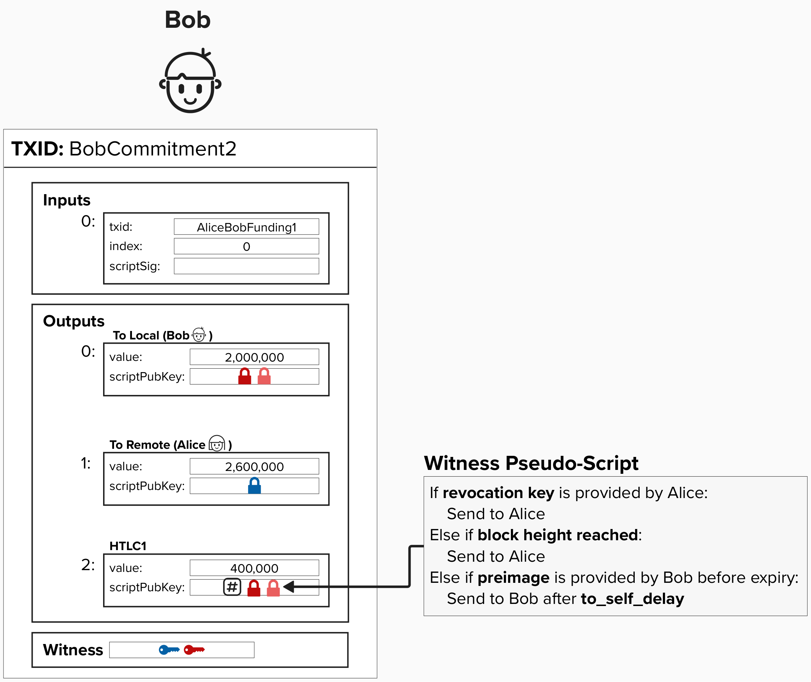
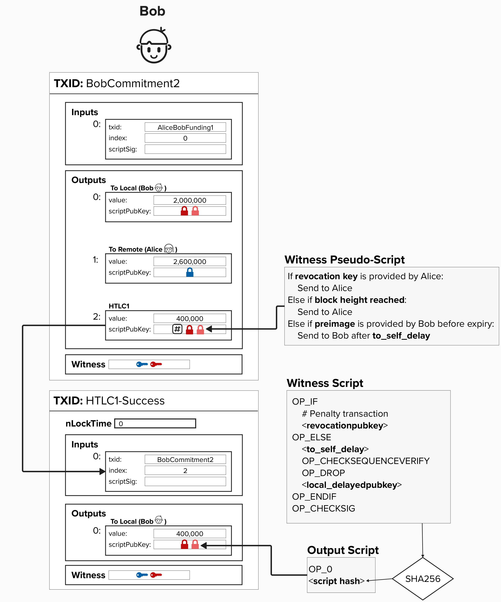
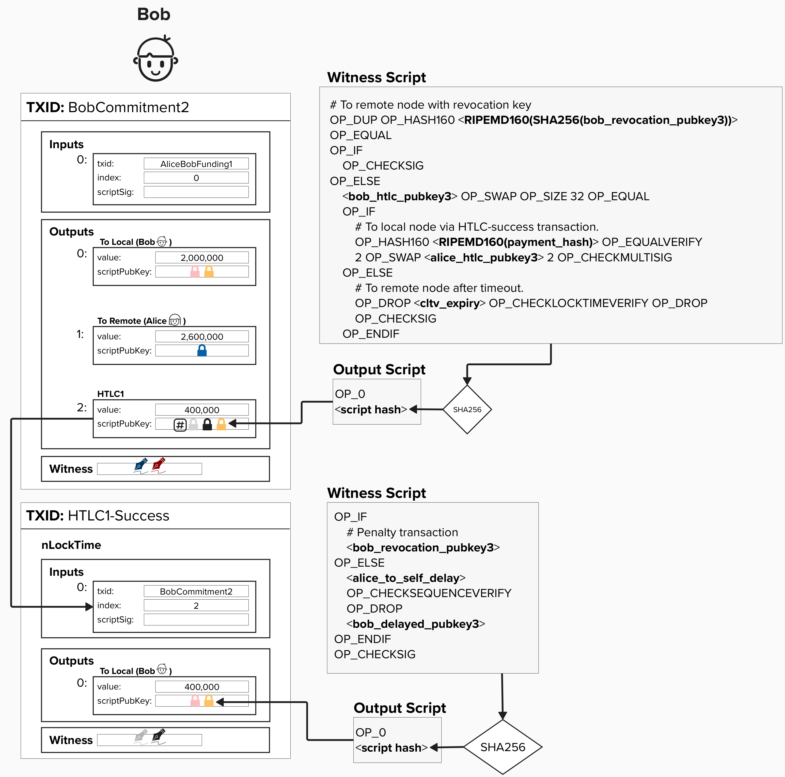

# HTLC Reciever
Now that we've reviewed the Alice's HTLC script, let's take a look at Bob's!

Bob, the ***HTLC reciever***, has to create an output where: 
- **Alice** can spend the output if she has the **revocation key**. This protects Alice in the future if Bob attempts to publish this commitment transaction after they had agreed to move to a new channel state.
- **Alice** can spend (effectively, reclaim) the output if the **HTLC expires**.
- **Bob** can spend the output if he can prove he has the **preimage** *before* the HTLC expires. Since Bob is sending an output to himself, it has to be timelocked by ```to_self_delay``` blocks.

<p align="center" style="width: 50%; max-width: 300px;">
  
</p>

However, similar to the HTLC Offerer transaction, there is a dilema here! Bob's spending path must be delayed by ```to_self_delay``` blocks to give the Alice time to sweep the funds if Bob attempts to cheat in the future. 

#### Question: Looking at the simplified transaction, can you spot why this commitment transaction structure would be a problem?
<details>
  <summary>
    Answer
</summary>

Bob can only claim the output ***before*** the invoice's absolute timelock expires, known as ```cltv_expiry``` in the protocol. However, since Bob also has to wait `to_self_delay` to spend the output from the preimage spending path, **there is a chance that the** `to_self_delay` **is longer than the absolute timelock**. If this happens, Alice could potentially spend the output along her expiry path when, in fact, Bob did obtain the preimage before expiry.  Do you know how we can fix this?

</details>

## Addressing The Dilema
To fix this timelock dilema, we'll add a second transaction for Bob, just like we did for Alice. However, this transaction will be called the **HTLC Success Transaction**. Just like the HTLC Timeout transaction, this will use the same script as our ```to_local``` output, however, it will feature the following key differences:
1) The input for this transaction is the HTLC output from Bob's commitment transaction.
2) The spending path will require signatures from both Alice and Bob to spend. Similar to the HTLC Timeout transaction, they will pre-sign the HTLC Success transaction ahead of time, effectively both agreeing to the "success" terms of the contract.

Together, these changes allow for Bob to claim the HTLC funds as long as he has the preimage before the ```cltv_expiry```. The funds will then move to the second stage success transaction, where they will sit until Bob's ```to_self_delay``` passes. At that point, he can spend this output.

<p align="center" style="width: 50%; max-width: 300px;">
  
</p>

<p align="center" style="width: 50%; max-width: 300px;">
  
</p>


## Putting It All Together

Putting it all together, the HTLC output has the following spending conditions:

1) **Revocation Path**: If Alice holds the revocation key (in case Bob cheats by broadcasting an old transaction), she can immediately spend the output.
2) **Timeout Path**: If the ```cltv_expiry``` passes, Alice can spend the output.
3) **Preimage Path**: If Bob provides the preimage, he can spend the output via the HTLC Success Transaction, **which is set up in advance with Alice's signature for the 2-of-2 multisig condition. This allows Bob claim the funds before the ```cltv_expiry``` and also enforce his ```to_self_delay```**.

For the HTLC Success Transaction:
- **Revocation Path**: Alice can spend the output immediately with the revocation key.
- **Delayed Path**: Bob can spend the output after the `to_self_delay`.

<p align="center" style="width: 50%; max-width: 300px;">
  
</p>