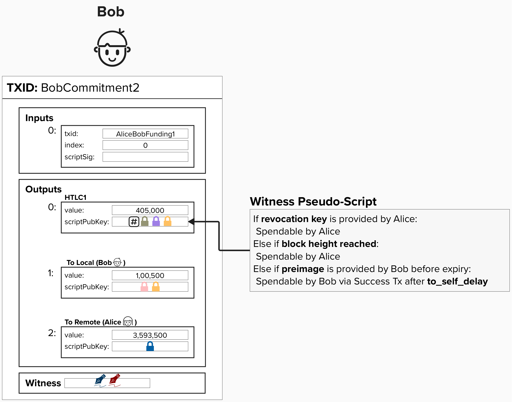
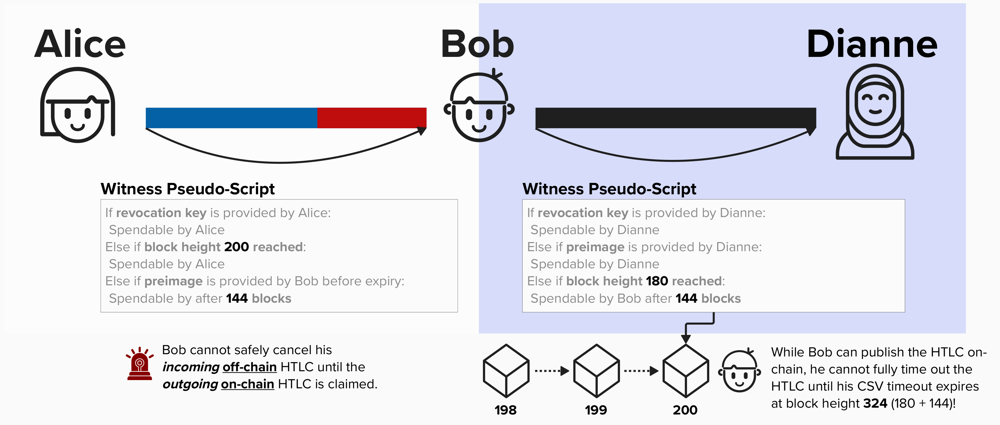
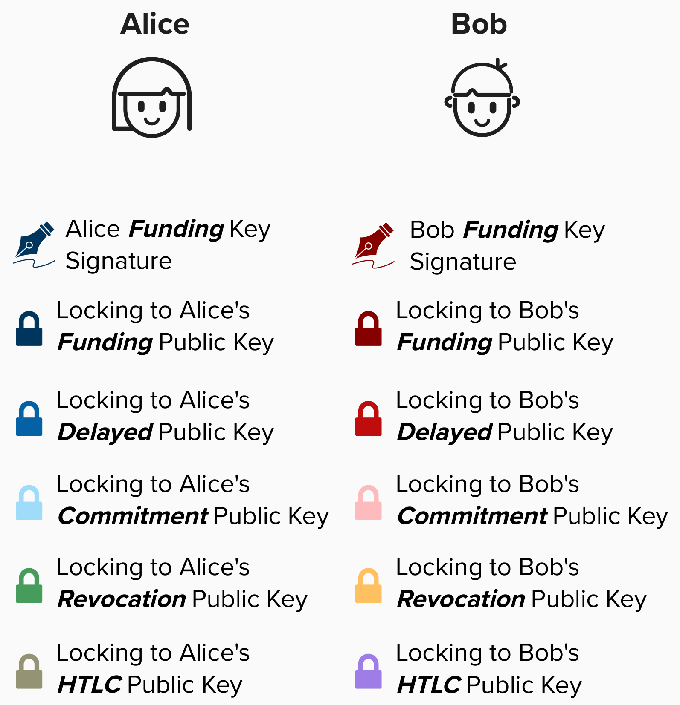
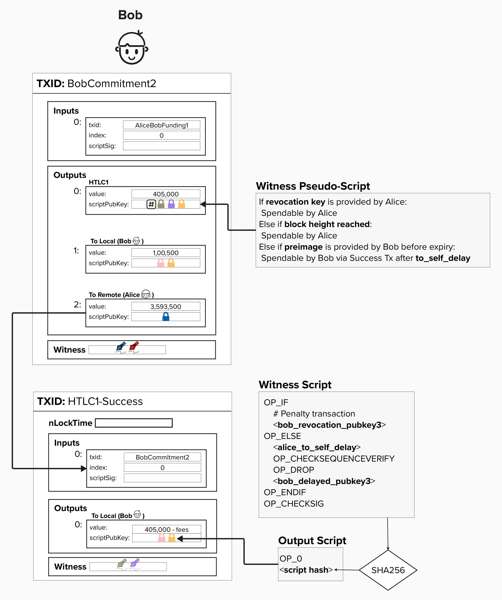
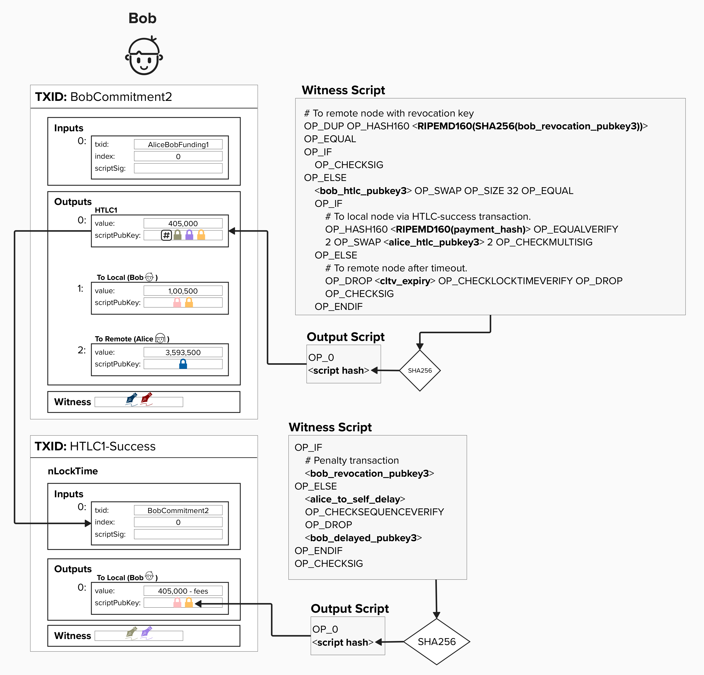

# HTLC Reciever
Now that we've reviewed the Alice's HTLC script, let's take a look at Bob's!

Bob, the ***HTLC reciever***, has to create an output where: 
- **Alice** can spend the output if she has the **revocation key**. This protects Alice in the future if Bob attempts to publish this commitment transaction after they have agreed to move to a new channel state.
- **Alice** can spend (effectively, reclaim) the output if the **HTLC expires**.
- **Bob** can spend the output if he can prove he has the **preimage** *before* the HTLC expires. Since Bob is sending an output to himself, it has to be timelocked by ```to_self_delay``` blocks.

<p align="center" style="width: 50%; max-width: 300px;">
  
</p>

However, similar to the HTLC Offerer transaction, there is a dilema here! Bob's spending path must be delayed by ```to_self_delay``` blocks to give the Alice time to sweep the funds if Bob attempts to cheat in the future. 

#### Question: Looking at the simplified transaction, can you spot why this commitment transaction structure would be a problem?
<details>
  <summary>
    Answer
</summary>


This is very similar to the prior dilema we ran into, in that the issue lies in the fact that we are using both **relative** and **absolute** timelocks. 

Let's make Bob's above commitment transaction a little more concrete. Imagine for a moment that the HTLC between Alice and Bob expires at **block height 200**. Now, let's say Bob obtains the preimage and publishes this commitment transaction to the bitcoin blockchain at **block height 150**. Unfortunately, since his spending path is timelocked for **144 blocks**, he cannot claim this HTLC output until **block height 294**, but this is **94** blocks AFTER the expiry! This means that Alice has plenty of time to swoop in and spend from the expiry path, effectively stealing bitcoin from Bob.

<p align="center" style="width: 50%; max-width: 300px;">
  
</p>

Let's fix this like we did with Alice's transaction. 

-----------
So this is very similar to the prior dilema we ran into, in that the issue lies in the fact that we are using both **relative** and **absolute** timelocks. However, now that we've introduced the fact that the HTLC script will change slightly depending on if you're offering or receiving the HTLC, we can actually dig in and see the big reason that 2nd stage HTLC transactions are needed.

Take a look at the example below. Imagine for a moment that Bob is forwarding the payment from Alice to Dianne. Therefore, in this case, Bob has an **Incoming HTLC Transaction** from Alice and an **Outgoing HTLC Transaction** to Dianne. Notice how the transactions have the following expiry times:
- Alice -> Bob: Expires at block height 200
- Bob -> Dianne: Expires at block height 160

<p align="center" style="width: 50%; max-width: 300px;">
  
</p>

Now, imagine that Dianne goes offline, so Bob is forced to close the channel once the HTLC times out by publishing the latest commitment, with the HTLC, on-chain at **block height 160**. However, since this output is also timelocked with a relative timelock of **144 blocks**, Bob cannot claim this output until **block height 304**.

Unfortunately, Bob is now unable to expire his HTLC with Alice (perhaps, by sending her an [`update_fail_htlc`](https://github.com/lightning/bolts/blob/master/02-peer-protocol.md#removing-an-htlc-update_fulfill_htlc-update_fail_htlc-and-update_fail_malformed_htlc) message), because, technically, Dianne could appear at any moment and claim the HTLC on-chain if she has the preimage.

Therefore, Bob will have to wait until the HTLC with Alice expires at **block height 200**. Furthermore, 

</details>

## Addressing The Dilema
To fix this timelock dilema, we'll add a second transaction for Bob, just like we did for Alice. However, this transaction will be called the **HTLC Success Transaction**. Just like the HTLC Timeout transaction, this will use the same script as our ```to_local``` output, however, it will feature the following key differences:
1) The input for this transaction is the HTLC output from Bob's commitment transaction.
2) The spending path will require signatures from both Alice and Bob to spend. Similar to the HTLC Timeout transaction, they will pre-sign the HTLC Success transaction ahead of time, effectively both agreeing to the "success" terms of the contract.

Together, these changes allow for Bob to claim the HTLC funds as long as he has the preimage before the ```cltv_expiry```. The funds will then move to the second stage success transaction, where they will sit until Bob's ```to_self_delay``` passes. At that point, he can spend this output.

<p align="center" style="width: 50%; max-width: 300px;">
  
</p>

<p align="center" style="width: 50%; max-width: 300px;">
  
</p>


## Putting It All Together

Putting it all together, the HTLC output has the following spending conditions:

1) **Revocation Path**: If Alice holds the revocation key (in case Bob cheats by broadcasting an old transaction), she can immediately spend the output.
2) **Timeout Path**: If the ```cltv_expiry``` passes, Alice can spend the output.
3) **Preimage Path**: If Bob provides the preimage, he can spend the output via the HTLC Success Transaction, **which is set up in advance with Alice's signature for the 2-of-2 multisig condition. This allows Bob claim the funds before the ```cltv_expiry``` and also enforce his ```to_self_delay```**.

For the HTLC Success Transaction:
- **Revocation Path**: Alice can spend the output immediately with the revocation key.
- **Delayed Path**: Bob can spend the output after the `to_self_delay`.

<p align="center" style="width: 50%; max-width: 300px;">
  
</p>