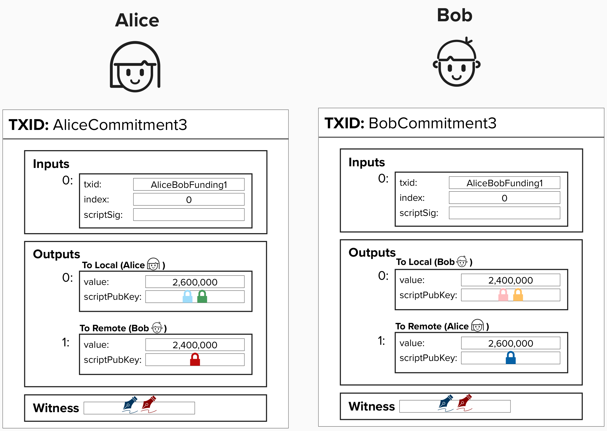

# Settling HTLCs

Wow! That got pretty intense, but, if you made it through, you now understand how transactions on the Lightning Network work! Interestingly, whether you're sending a payment to a direct channel partner (Alice -> Bob) or routing it through multiple hops (Alice -> Bob -> Charlie -> Dianne), you will always send payments via an HTLC. This simplifies protocol design and enhances privacy, as there is no discernable difference between recieving a payment from your channel partner or from someone else, routed through your channel partner.

So, you may now be wondering - "how do we settle HTLCs"? Regardless of if times out or succeeds, we'll need to  move those funds out of the HTLC. Of course, one option would be to publish the **HTLC Timeout** or **HTLC Success** transaction, but that would entail closing the entire payment channel. That doesn't seem optimal!

Instead, Bob will simply send Alice the **preimage**, proving that he can claim the funds via the **HTLC Success** spending path. When Alice sees this, she will initiate a process with Bob to create a new commitment transaction that has the HTLC funds reflected in his channel balance.

<p align="center" style="width: 50%; max-width: 300px;">
  
</p>

<p align="center" style="width: 50%; max-width: 300px;">
  
</p>

# Closing Lightning Channels

At some point, Alice and Bob will want to close their Lightning payment channel and move their funds out of this 2-of-2 multisig. 

When either party decides to do this, they have a few options for how they can get it done.

## Cooperative Closure
The best option, by far, is to initiate a **cooperative closure**. During a cooperative closure, Alice and Bob will work together to settle any pending HTLCs and then create a new transaction that locks their respective balances to a simple **Pay-To-Witness-Public-Key-Hash** script with no timelocks. This way, Alice and Bob can both spend their funds immediately.

Alice and Bob also have the ability to specify which address they'd like to lock their funds to, which is often a separate wallet that is not related to their Lightning wallet.

#### Question: When opening a Lightning channel, Alice and Bob also have the ability to specify an "up front shutdown script". This allows the to specify ahead of time where the funds should be sent to during a cooperative close. What are the benefits of doing this?

<details>
  <summary>Answer</summary>

Specifying an "up front shutdown script" can increase the security of Lightning channels. For example, if Bob is hacked and the hacker tries to initiatve a force close with Alice with a ***different*** address than Bob originally specified, then Alice will refuse to cooperate.the hacker isn't able to initiatve a cooperative close with a different address that the hacker controls.

</details>

## Force Closure
A valid, but sub-optimal, way of closing a channel is by initiative a force closure. During a force closure, either party will publish their version of the current commitment transactions with additional transactions that lock those funds to addresses that they unilaterally control.

Force closures can be initiated for a variety of reasons, such as:
- One party goes offline for an extended period of time.
- Two parties cannot agree on essential operations, such as which feerate to use on commitment transactions.
- One party attempts to cheat the other by publishing an old state.

#### Question: Why is a force closure worse than a cooperative closure?

<details>
  <summary>Answer</summary>

As we saw earlier, the more complex a transaction gets (ex: more outputs, longer scripts), the larger, in terms of data, the transaction will be. Since fees are proportional to the amount of data your transaction uses, force closures will often be much more expensive. Additionally, if you have any pending HTLCs, you will have to publish additional 2nd-stage (Timeout or Success) transactions for each HTLC.

Also, once you claim your funds, they will stil be timelocked by `to_self_delay` blocks, so you will have to wait until you are able to move them entirely out of the Lightning channel.

</details>

## ⚡️ Closing Our Lightning Channel

Ideally, we'd do everything in our power to initiatve a **cooperative close** for our Lightning channel. However, we already went through the trouble to create our **HTLC Timeout** transaction, so let's perform an ugly force close instead!

First, let's confirm that our funding transaction is still unspent. This will re-inforce that all of the transactions we just created during this workshop were all off-chain.

Enter this command within your **Shell**, ensuring to replace the `<funding_tx_id>` with your **Funding Tx ID**. The `0` after just indicates that the funding input was at index 0 of this transaction, which is guarenteed for this workshop but is not always true.

```
getutxo <funding_tx_id> 0
```

You should see something like the below. Notice, here is the amount of our channel, and the transaction has the 6 confirmations from when we opened the channel (unless you mined more since then!).

```
{
  "bestblock": "4538053a50040431e239cbbde64d1949e2079863872be806129b96c43c517d40",
  "confirmations": 6,
  "value": 0.04999800,
  ...
}
```

## ⚡️ Publish Our HTLC Transaction

For this exercise, we'll go through the super ugly channel closure of force closing our channel with HTLCs in it. To do this, let's start by broadcasting our **HTLC Tx Hex**. You can do this by entering the below command in your **Shell**. Make sure to replace `<htlc_tx_hex>` with your **HTLC Tx Hex**.

```
sendtx <htlc_tx_hex>
```

You should see a **Tx ID** pop up, indicating that it was successfully broadcasted.

## ⚡️ Publish Our HTLC Timeout Transaction

Now do the same with your **HTLC Timeout Tx Hex**!

```
sendtx <htlc_timeout_tx_hex>
```

Whoops! You should have gotten a `non-final` error. Take a moment to see if you can fix this yourself so that you can broadcast the transaction. If you need some help, click below.

<details>
  <summary>Help</summary>
  <br/>

Remember that our HTLC Timeout transaction is timelocked! This is because we gave our channel party a specific amount of time to fulfill the HTLC, so we can't close the channel and claim these funds until the timelock expires. This is one major reason why this closure type is considered very ugly.

The code behind the scenes in this Replit that created the HTLC timeout locked the transaction until block height 300. Try mining 150 blocks (`mine 150`) and see if you can broadcast the transaction now.

</details>