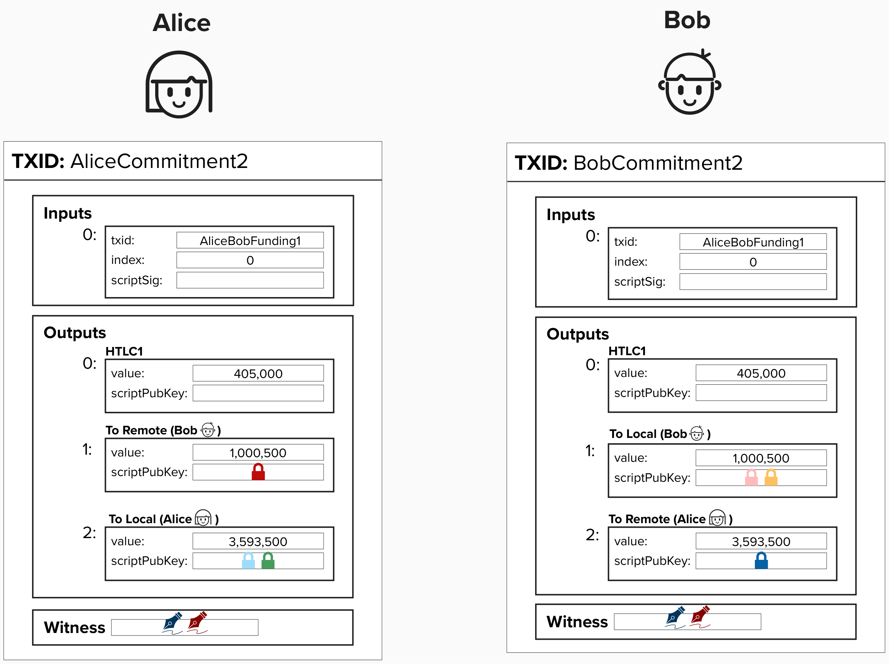

# HTLC Transactions in Lightning

Now that we've built our intuition around how HTLCs work, let's make things complicated again!

  

#### Question: Why would this output be insufficient for our Lightning payment channel?

  
Answer

There are a few issues.

**First, there is no revocation path!** Remember, each commitment transaction in our Lightning state machine is a *valid* transaction that could be published at any point in time.

If Alice decides to cheat and publish this commitment after her and Bob move to a new channel state, there is no protection for Bob, so Alice can sweep these funds immediately (assuming the block height expired)! Keep progressing through this course, and we'll fix this shortly!

# Building Lightning HTLCs

Before we can add back in the revocation path, we need to bring back our asymmetric commitment transactions. Below is a diagram of the same transactions we saw earlier, but a new HTLC output has been added for Alice and Bob.

The HTLC output is going to be a little gnarly. In fact, it won't be the same for Alice and Bob. Instead, it will change depending on if they are ***offering*** the HTLC or ***recieving*** the HTLC. Head on over to the next page to learn how full HTLCs are implemented in Lightning!

  

  

