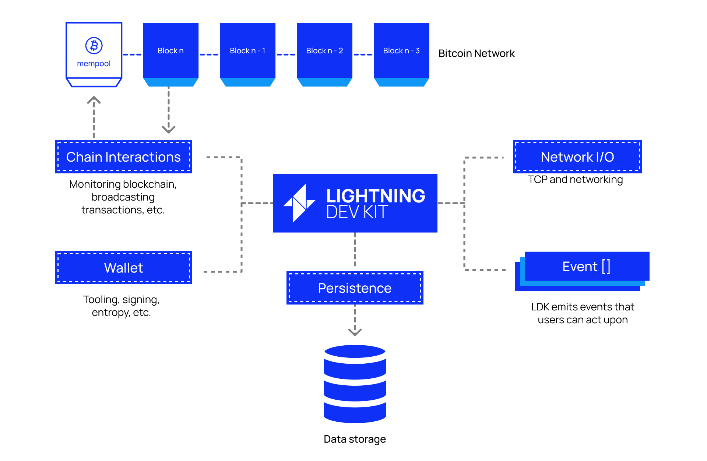

# Implementing Lightning

## Basis Of Lightning Technology (BOLT)
At it's core, Lightning is a fairness protocol that enables trustless exchanges of bitcoin without a third party. We got a taste of this fairness protocol during this workshop! While we reviewed a lot, we still left out many details!

All of the details explaining how Lightning works are described in the **Basis Of Lightning Technology** (**BOLT**) protocol specifications. Since Lightning is decentralized, there is no central authority dictating how Lightning must evolve or distributing the sole application client on which Lightning runs. This is in stark contrast to something like X (formerly, Twitter), where one company is in charge of then entire platform and decides who can build apps that integrate with the platform.

Lightning is different. It's an open protocol. Anyone is free to build a Lightning app and join the party, which is why we need very public and explicit documentation for how Lightning works.

## Lightning Development Kit
It would be a massive undertaking to attempt to implement the entire functionality specified in the BOLTs in order to operate a node on the Lightning network. There are a few of out-of-the-box implementations available to you if all you would like to do is operate a node, however, if you want to customize the behavior of how they work you either need to fork and then maintain the project or write plugins that would alter the default behavior. Regardless of the path you take they all are still delivered as a binary and need to be run and controlled over various RPC interfaces.

The **Lightning Development Kit** (**LDK**) takes a different approach. LDK is a library that implements the Lightning network protocol but gives you the ability to integrate it directly into your application in exactly the fashion that best suits your needs.

It exposes a broad but extremely powerful set of objects and events for you to utilize when customizing your users' Lightning experience.  

  

The next Programming Lightning workshop will dive deeper into building a Lightning node with LDK, exploring the various options developers have when building a node from scratch. Stay tuned!