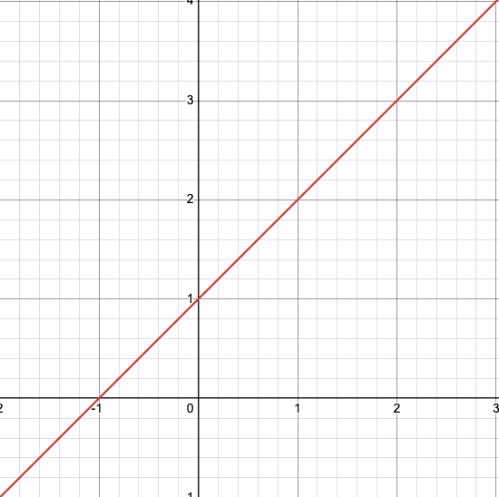
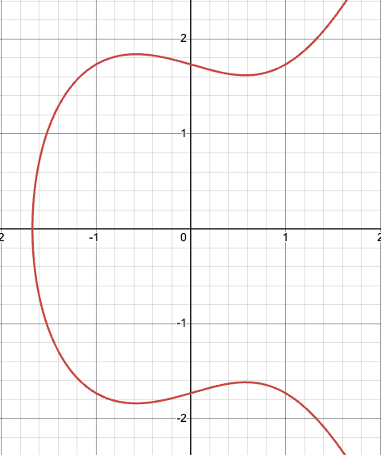
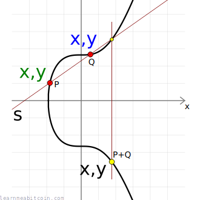
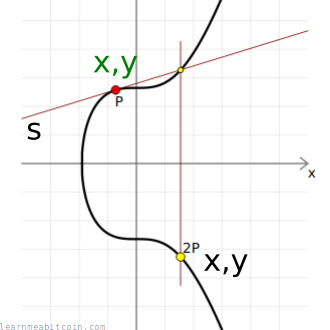
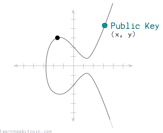
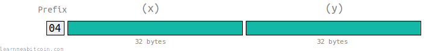

# Elliptic Curves Overview

Let's do a quick review of elliptic curves! This will help build our intuition for later in this course, as we'll need to utilize these skills to build robust payment channels! What follows below is a brief overview of the Elliptic Curve section on [LearnMeABitcoin](https://learnmeabitcoin.com/technical/cryptography/elliptic-curve/#multiply), a popular website to learn about various technical aspects of all things Bitcoin. I ***highly*** recommend checking them out.

Okay, let's get to it! An elliptic curve is just like any other curve in that it has parameters that define its shape. For example, we're probably all familiar with the linear curve ***y=mx+b***, where:
- ***m*** = slope
- ***b*** = y-intercept

For example, below is the graph for ***y=2.4x + 1***.

<p align="center" style="width: 50%; max-width: 300px;">
  
</p>

An elliptic curve is very similar, in that it can also be described, by an equation. While there are various types of elliptic curves, they generally take the form of: ***y² = x³ + ax + b***

In the example below:
- ***a*** = `-1`
- ***b*** = `3`

<p align="center" style="width: 50%; max-width: 300px;">
  
</p>

### Secp256k1 Curve

While we won't dive into the nuances of the **Secp256k1** curve, it's worth noting that this is the actual elliptic curve that Satoshi chose to use in Bitcoin. It's form is the following: ***y² = x³ + ax + b***
- ***a*** = `0`
- ***b*** = `7`

It also introduces a few new parameters, which have a very meaninful impact the resulting curve and outputs.
- ***p*** = `115792089237316195423570985008687907853269984665640564039457584007908834671663`
  - This is the **prime modulus**. We mod the resulting value of ***x³ + ax + b*** by ***p***, which has the impact of limiting the possible results of the equation to be whole numbers within a certain range.
- ***n*** = `115792089237316195423570985008687907852837564279074904382605163141518161494337`
  - This is the **order** of the curve. In other words, it's the number of possible points on the curve.
- ***G*** = This is the **generator point**. It's a publicl known point that is used for many cryptographic operations.
```
(
  x: 55066263022277343669578718895168534326250603453777594175500187360389116729240,
  y: 32670510020758816978083085130507043184471273380659243275938904335757337482424,
)
```

# Elliptic Curve Mathematics

Elliptic curve mathematics are not what we intuitively think of when we imagine adding and multiplying numbers. This is largely because of the **prime modulus**, which forces our function to only return numbers within a prime field. The specifics of this are outside the scope of this workshop, but we can still build our intuition of how Bitcoin and elliptic curves work by reviewing the visual representation of these mathematical operations.

# Add Two Points
Due to the **prime modulus** and non-linearity of the **Secp256k1** curve, adding two points isn't the same as adding two integer points. Instead, visually, it involves:
- Drawing a line between the two points.
- Finding the point on the curve that intersects the line.
- Finding the reflection of this point.

<p align="center" style="width: 50%; max-width: 300px;">
  
</p>

## Multiply A Point
Similarly, multiplication is also different than our general intuition.

Visually, multiplication involves the following:
- Drawing a tangent line to the curve at the given point.
- Finding the point on the curve that this line intersects.
- Finding the reflection of this point across the x-axis.


<p align="center" style="width: 50%; max-width: 300px;">
  
</p>


# Private Keys
A private key is simply a very very large random number.

More specifically, it's a 256-bit number. Below is a what a private key may look like in different formats:

#### Binary
```
1111010001000000011100111101100111000011101001001011100001111100110111010010010101011001010011011010101100110001110101110011011110100001100111111010110100011010110100111001100101001111011110001101011011011110001010100110010011100101010001001010110011001100
```
#### Decimal
```
110478212838204782069310877802907443569620392766918522241217806929829984251084
```

#### Hexadecimal
```
f44073d9c3a4b87cdd25594dab31d737a19fad1ad3994f78d6de2a64e544accc
```


# Public Keys
A Public key is calcualted by multiplying your private key by the scep256k1 **generator point**.

<p align="center" style="width: 50%; max-width: 300px;">
  
</p>


### Formats
Given that public keys are just points on a curve, they can be represented as an x,y corrdinate.

#### Decimal
```
x: 81591541406288143274758265124625798440200740391102527151086648448953253267255
y: 64573953342291915951744135406509773051817879333910826118626860448948679381492
```


#### Hexadecimal
```
x: b4632d08485ff1df2db55b9dafd23347d1c47a457072a1e87be26896549a8737
y: 8ec38ff91d43e8c2092ebda601780485263da089465619e0358a5c1be7ac91f4
```

#### Uncompressed
We can also store them in a more compact form by using the below methods:

**Uncompressed**: A `04` byte prefix followed by the full x and y coordinates (65 bytes) 

<p align="center" style="width: 50%; max-width: 300px;">
  
</p>

**Compressed**: A `02` or `02` byte prefix, depending on if the y coordinate is even or odd. followed by the  x coordinate (33 bytes).


Due to the structure of the elliptic curve, the y coordinate can only be two possible values (remember the equation: ***y² = x³ + ax + b***). So, it's sufficient to know if the coordinate is even or odd. You don't have to store the entire corrdinate itself.

<p align="center" style="width: 50%; max-width: 300px;">
  
</p>


#### Public Key Usage
Public keys are often used to **recieve** bitcoin.