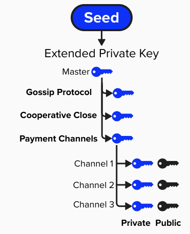
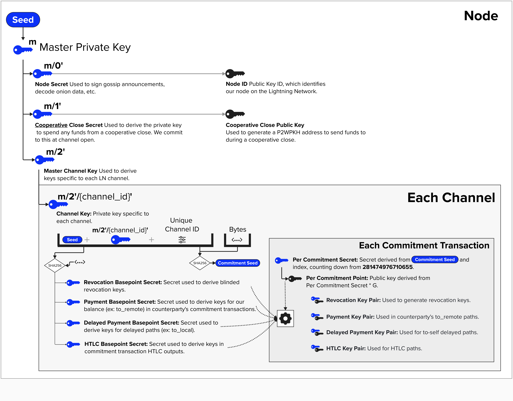

# Lightning Wallet Deep Dive 

If you're reading this, you've found yourself in one of the "deep dive" sections of this workbook. Good luck on this journey - you will need it! (Kidding?)

## Lightning Off-Chain Wallet Strucure
To properly understand how keys work within a Lightning, it's helpul to contextualize them within the context of a Lightning node's wallet. For this deep dive, we'll focus on the **off-chain** portion of a node's wallet. To accomplish this, let's briefly review **Bitcoin Improvement Proposal (BIP) 32**

BIP 32  describes a **hierarchical deterministic** (HD) wallet structure which introduces the following characteristics to key management:
- **Single Source**: All public and private keys can be derived from a single seed phrase. As long as you have access to the seed, you can re-derive the entire wallet.
- **Hierarchical**: All keys can be organized in a tree structure.
- **Deterministic**: All keys are generated the same exact way. Each time you restore you wallet from your seed, you'll get the exact same result.

### Derivation Paths
Another useful property of HD wallets is that you can create unique derivation paths that act as different "accounts" or "use cases" for your keys. For example, in the context of the Lightning Network, we can create new child private keys for the following tasks:
- **Gossip Protocol**: Sign gossip announcements, decode onion data, etc.
- **Channel Close**: Derive private and public keys which can be used to generate addresses that we can use when locking up funds on-chain during channel closure.
- **Payment Channel**: Help derive all of the public and private keys we need to operate a payment channel (ex: revocation key, htlc key, delayed payment key, and payment key). Furthermore, each channel will have its own child key from this derivation path.

<p align="center" style="width: 50%; max-width: 300px;">
  
</p>

### LDK Key Management
Okay, now that we've reviewed BIP 32 and seen how we can create an organized tree of public and private keys, let's see how we can put this theory into practice.

Below is a *mostly* accurate diagram of how LDK organizes **off-chain** Lightning keys for it's default [`KeysManger`](https://docs.rs/lightning/latest/lightning/sign/struct.KeysManager.html). Some details are abstracted away because the *exact implementation* isn't neccessary from a learning perspective. Also, in an attempt to focus our attention, a few keys are intentionally faded. With that said, the overall architecture is described below:

<p align="center" style="width: 50%; max-width: 300px;">
  
</p>

- **Seed**: We kick-start out Lightning wallet by providing a seed. This is just a 32-byte (very large) random number. This can be a stand-alone seed, or it can itself be a hardened derivation path from an higher-level HD wallet. 
- **Derivation Paths**: From our seed, we create multiple **hardened (extended) public/private key pairs** for various Lightning operations. It's important to create hardened devivation paths so that, if we leak private key information for one of the derivation paths, the rest of our Lightning keys are not at risk.
- **Channel Keys**: For each channel, we derive a series of **basepoints** (points on elliptic curve) and **basepoint secrets** (256-bit scalars). We call them "basepoints" because these cryptographic primitives are used to create the public/private keys that we place in our Bitcoin transactions, but we do *not* place these primitives themselves within the transaction.  For example, below is a list of the basepoints and basepoint secrets used in the Lightning Network:
  - **Revocation Basepoint + Secret**: Basepoint/Secret used to derive revocation keys.
  - **Payment Basepoint + Secret**: Basepoint/Secret used to derive keys for our balance (ex: to_remote) in counterparty's commitment transactions.
  - **Delayed Payment Basepoint + Secret**: Secret used to derive keys for delayed paths (ex: to_local).
  - **HTLC Basepoint + Secret**: Secret used to derive keys in commitment transaction HTLC outputs.
  - **Commitment Seed**: The commitment seed, while not a basepoint, is  a cryptographic primitive that is used in combination to create a new basepoint/secret key pair for each state.
- **Per-Commitment Keys**: For each commitment transaction, we use the **basepoints** and a **per-commitment** private/public key, derived from the **commitment seed**, to derive specific public and private keys for each output. Remember, we don't use the basepoints themselves in our outputs! By doing this, we can ensure the keys for each commitment state are deterministically derivable in an efficient way and unqiue for each commitment. For example, each commitment transaction will have a new delayed payment public key, which is used in our `to_local` output in the timelocked spending path that pays to ourselves. To accomplish this, the BOLT's provide instructions on how to utilize the above keys. Each formula relies on the creation of a new **per commitment point** - unique to each commitment state -, which is derived from the **Commitment Seed** for each channel state.

## ⚡️ Build a SimpleNodeKeys to Manager Our Node-Level Keys
For this exercise, we're going to implement the `new` method on our `SimpleNodeKeys`, which manages a few important keys that we're doing to need to operate a Lightning Node. If you were to map this to the above diagram, we're going implement the following keys:
- **Node Secret**:  Private Key, derived from hardened child at index `0`.
- **Node ID**:  Public Key, derived from Node Secret.
- **Channel Master Key**: Extended Private Key, , derived from hardened child at index `3`.

```rust
pub struct NodeKeysManager {
    pub secp_ctx: Secp256k1<secp256k1::All>,
    pub channel_master_key: Xpriv,
    pub node_secret: SecretKey,
    pub node_id: PublicKey,
    pub seed: [u8; 32],
}
```

```rust
impl NodeKeysManager {
pub(crate) fn new(seed: [u8; 32]) -> NodeKeysManager {
    // define Secp256k1 context for cryptographic operations

    // get master key from seed

    // derive node secret (private key) at hardened index 0

    // derive node id from node secret

    // derive channel master key (extended private key) at hardened index 3

    // NodeKeysManager {
        // secp_ctx: secp_ctx,
        // channel_master_key: channel_master_key,
        // node_secret: node_secret,
        // node_id: node_id,
        // seed: seed,
    // }
}
```

<details>
  <summary>Step 1: Initialize the Secp256k1 Context</summary>

Since we'll be performing cryptographic operations in this exercise, we'll need to start by defining a variable that can perform those cryptographic operations for us. To do that, we can use the `Secp256k1` crate.

```rust
let secp_ctx = Secp256k1::new();
```
</details>

<details>
  <summary>Step 2: Derive the Master Key from the Seed</summary>

Using the provided 32-byte `seed`, we can generate a BIP-32 extended private key (master key) from which all other keys will be derived.

To do this, we can leverage the `Xpriv` type, provided by the `bip32` crate in rust-bitcoin. Since the derivation path will depend on the network type, we'll need to define the `network` and pass it into the `new_master` function, available on the `Xpriv` type.

This function will return a `Result` type, so we'll need to unwrap it before we can use it. In a robust application, we may want to handle this error more precisely.

```rust
let network = Network::Regtest;
let master_key = Xpriv::new_master(network, &seed).unwrap();
```
</details>

<details>
  <summary>Step 3: Derive the Node Secret at Hardened Index</summary>

The node secret is a private key derived from the master key at the hardened child index `0`. Our node will use this private key to sign messages that are communicated over the gossip network, proving those messages came from us.

You can derive a private key using the below code.

```rust
let private_key = master_key
    .derive_priv(&secp_ctx, &ChildNumber::from_hardened_idx(0).unwrap())
    .expect("Your RNG is busted")
    .private_key;
```
</details>

<details>
  <summary>Step 4: Derive the Node ID from the Node Secret</summary>

Next, we'll need to derive the node ID. This is a public key, and it is used to identify our node on the Lightning Network. Other nodes may use this public key to create shared secrets with us, enabling them to encrypt messages (ex: routing payments via onion routing) such that only we can decrypt them.

You can derive a public key from a private key using the below code.

```rust
let node_id = PublicKey::from_secret_key(&secp_ctx, &node_secret);
```
</details>

<details>
  <summary>Step 5: Derive the Channel Master Key at Hardened Index 3</summary>

Now, to get the channel master key, we'll need to derive another hardened child key. In our case, we're going to derive this key at index `3`. One notable difference between this key and the `node_secret` is that this is an **extended private key**. Extended private keys can generate a tree of child keys (public and private) deterministically. This is quite useful for us, as we'd like to create a new public/private key pair *for each payment channel*. On the other hand, the `node_secret` is only needed to sign and decrypt messages related to our `node_id`, so this key does not need to be able to derive child keys.

If you'd like to learn more about extended keys, this is a great resource: https://learnmeabitcoin.com/technical/keys/hd-wallets/extended-keys/

You can derive an extended private key using the below code.

```rust
let hardened_extended_child = master_key
    .derive_priv(&secp_ctx, &ChildNumber::from_hardened_idx(3).unwrap())
    .expect("Your RNG is busted");
hardened_extended_child
```
</details>

<details>
  <summary>Step 6: Construct and Return the SimpleNodeKeys Struct</summary>

Finally, assemble all the derived keys and the original seed into the `SimpleNodeKeys` struct and return it!

```rust
NodeKeysManager {
    secp_ctx,
    channel_master_key,
    node_secret,
    node_id,
    seed,
}
```
</details>