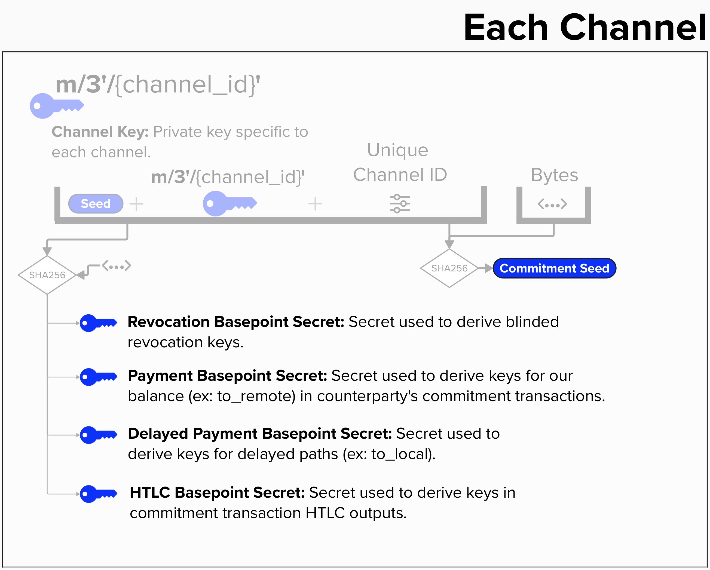
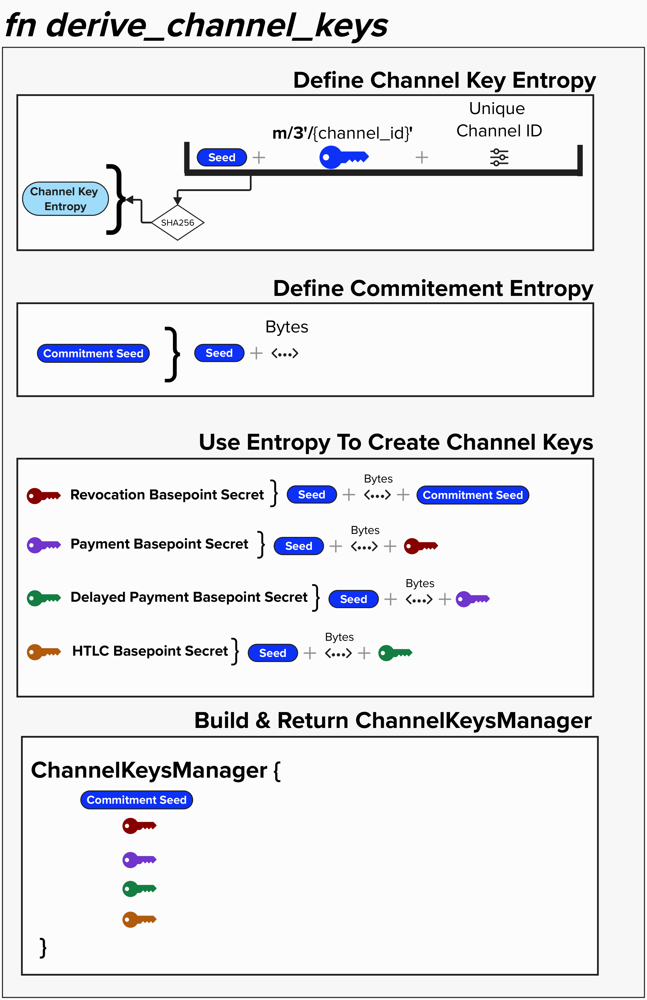

# Commitment Keys Deep Dive 

Now that we've implemented our `ChannelKeysManager`

As a reminder, they are the following:
  - **Revocation Basepoint + Secret**: Basepoint/Secret used to derive revocation keys.
  - **Payment Basepoint + Secret**: Basepoint/Secret used to derive keys for our balance (ex: to_remote) in counterparty's commitment transactions.
  - **Delayed Payment Basepoint + Secret**: Secret used to derive keys for delayed paths (ex: to_local).
  - **HTLC Basepoint + Secret**: Secret used to derive keys in commitment transaction HTLC outputs.
  - **Commitment Seed**: The commitment seed, while not a basepoint, is  a cryptographic primitive that is used in combination to create a new basepoint/secret key pair for each state.

As you look at the below diagram, keep in mind that it is not meant to be an *exacty* representation of how to derive the keys - that's what the coding exercises are for! Instead, it's meant to convey high-level concepts, such as the fact that we will be taking the SHA256 of certain pieces of information - like the serialized child derivation keys and unique channel id - and using that as **secure entropy** to create keys that are specific to this Lightning channel.

<p align="center" style="width: 50%; max-width: 300px;">
  
</p>

## ⚡️ Implement `derive_channel_keys` for our NodeKeysManager
For this exercise, we'll implement the `derive_channel_keys` for our `NodeKeysManager`. This function will take a unique 32-byte array as an input, which we can use as an ID for each set of channel keys that our `NodeKeysManager` produces.

It should return a `ChannelKeysManager` of the following structure. As you can see, this stores each of the **basepoint secrets** that we will need to create the keys for our Lightning channel. Remember, these secrets are also private keys themselves, but we call them "basepoint secrets" because they are not used as private keys but, instead, as cryptographic tools to create private/public keys. We'll see how in the next section.

```rust
pub struct ChannelKeysManager {
    pub commitment_seed: [u8; 32],
    pub revocation_base_key: SecretKey,
    pub payment_key: SecretKey,
    pub delayed_payment_base_key: SecretKey,
    pub htlc_base_key: SecretKey,
}
```

### Approach Via Entropy
A useful way to approach conceptualizing (and completing) this exercise is from the perspective of **entropy**.

Entropy, a measure of randomness or unpredictability, is at the heart of cryptographic systems. Why? Because entropy ensures that the keys we generate are both unique and secure. They are *our* keys, and attackers should not be able to guess or otherwise reconstruct the keys.

To complete this exercise, we'll need to accomplish the following steps:
1. Define a source of entropy that can be combined with other pieces of information, such as a unique byte stream, that we can use to generate **channel-level basepoints**. 
2. Define a source of entropy that we can use to generate **commitment-level public/private keys**.
3. Create each unique **channel-level basepoint**, using the entropy we defined above.
4. Build & Return `ChannelKeysManager`

Together, these steps will enable us to create unique and secure basepoints for every payment channel our Lightning node creates. Furthermore, these basepoints will be the building blocks that we can use to create unique and secure commitment-specific keys for each channel state in our payment channel.

<p align="center" style="width: 50%; max-width: 300px;">
  
</p>


```rust
impl NodeKeysManager {
    pub fn derive_channel_keys(&self, channel_id_params: &[u8; 32]) -> SimpleChannelKeys {

        // exctract 
        let chan_id = u64::from_be_bytes(channel_id_params[0..8].try_into().unwrap());
        
        let mut unique_start = Sha256::engine();
        unique_start.input(channel_id_params);
        unique_start.input(&self.seed);

        // We only seriously intend to rely on the channel_master_key for true secure
        // entropy, everything else just ensures uniqueness. We rely on the unique_start (ie
        // starting_time provided in the constructor) to be unique.
        let child_privkey = self
            .channel_master_key
            .derive_priv(
                &self.secp_ctx,
                &ChildNumber::from_hardened_idx((chan_id as u32) % (1 << 31))
                    .expect("key space exhausted"),
            )
            .expect("Your RNG is busted");
        unique_start.input(&child_privkey.private_key[..]);

        let seed = Sha256::from_engine(unique_start).to_byte_array();

        let commitment_seed = {
            let mut sha = Sha256::engine();
            sha.input(&self.seed);
            sha.input(&b"commitment seed"[..]);
            Sha256::from_engine(sha).to_byte_array()
        };

        let revocation_base_key = key_step_derivation(&seed, &b"revocation base key"[..], &commitment_seed[..]);
        let payment_key = key_step_derivation(&seed, &b"payment key"[..], &revocation_base_key[..]);
        let delayed_payment_base_key = key_step_derivation(&seed, &b"delayed payment key"[..], &payment_key[..]);
        let htlc_base_key = key_step_derivation(&seed, &b"HTLC base key"[..], &delayed_payment_base_key[..]);

        SimpleChannelKeys {
            commitment_seed,
            revocation_base_key,
            payment_key,
            delayed_payment_base_key,
            htlc_base_key,
        }
    }
}
```
