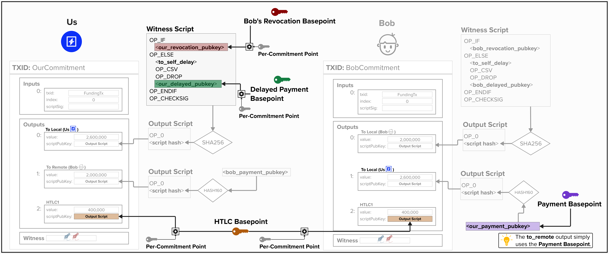

# Commitment Keys Deep Dive 

Now that we've built our `ChannelKeysManager`, we're ready to implement the logic to create commitment-specific keys. It's worth noting that the process of creating commitment keys, which we will review in this section, is specified in BOLT 3. Everything up until now represents decisions that *implementors* of Lightning network protocols are free to choose. For example, the BOLT does not specify how to create the basepoints themselves.

To start, let's put this process in the right context by reviewing our end goal: **create unique public/private keys that can be used for each spending path in our commitment transaction outputs**. 

In the below diagram, you can see each public key that Alice will provide for this arbitrary channel state between Alice and Bob. NOTE: for simplicity, the HTLC output is not pictured, but Alice will have an HTLC public key embedded within the HTLC output for both her commitment transaction and Bob's. 

<p align="center" style="width: 50%; max-width: 300px;">
  
</p>

So, the question is... how do we leverage our **basepoints** to create new public/private key pairs **for each commitment transaction**?

## Per Commitment Point
If you recall from the last exercise, we created a `commitment_seed` and stored it in our `ChannelKeysManager`. This will be an important cryptographic building block that we will use to create new keys for each commitment transaction.

Per [BOLT 3](https://github.com/lightning/bolts/blob/master/03-transactions.md#per-commitment-secret-requirements), for each commitment transaction, we must create a new **per-commitment secret**. This will be used to tweak the respective **basepoint** to calculate a new public or private key. For example, for the `localpubkey`, `local_htlcpubkey`, and `local_delayedpubkey`, we will use the below equations. It's worth noting that the `revocation_pubkey` is created using a different equation, which we will cover shortly.

### Public Keys
```
pubkey = basepoint + SHA256(per_commitment_point || basepoint) * G
```

### Private Keys
```
privkey = basepoint_secret + SHA256(per_commitment_point || basepoint)
```

As you can see, we've implemented the functionality for everything **except** the `per_commitment_point` so far. So, let's do that now!

To do create a `per_commitment_point`, we must first obtain the `per_commitment_secret`. Once we have this, we can multiply it by `G` (the secp256k1 "generator point") to obtain the `per_commitment_point`.

So, how do we get the **per-commitment secret** for a given commitment transaction? Well, the BOLT provides the following algorithm, which we *must* follow.

```
generate_from_seed(seed, I):
P = seed
for B in 47 down to 0:
    if B set in I:
        flip(B) in P
        P = SHA256(P)
return P
```

In the algorithm above, we have two inputs:
1) The `seed` is the `commitment_seed` we created earlier.
2) `I` is the index of the current commitment transaction.

This algorithm takes the `commitment_seed` and flips it bits based on the index `I`, applying the SHA256 iteratively. The resulting secret is then used to create the `per_commitment_point` for the specific commitment transaction. One interesting thing to note is that this algorithm gives us 48 bits to work with when generating the secret. Since the largest number that 48 bits can represent is  281,474,976,710,655, we can generate over 281 trillion channel states per channel!

This function has already been implemented for you on the `ChannelKeysManager`. You may be wondering why the BOLT specifies this process in the first place. Well, this algorithm provides efficient storage of per-commitment secrets by enabling the receiver to store only one secret per unique prefix (up to 49 entries), from which all subsequent secrets with matching prefixes and trailing zeros can be derived, significantly reducing the storage needed compared to saving every individual secret. 

```rust
/// Build the commitment secret from the seed and the commitment number
impl ChannelKeysManager {
    pub fn build_commitment_secret(&self, idx: u64) -> [u8; 32] {
        let mut res: [u8; 32] = self.commitment_seed.clone();
        for i in 0..48 {
            let bitpos = 47 - i;
            if idx & (1 << bitpos) == (1 << bitpos) {
                res[bitpos / 8] ^= 1 << (bitpos & 7);
                res = Sha256::hash(&res).to_byte_array();
            }
        }
        res
    }
}
```

## ⚡️ Implement derive_private_key for our ChannelKeysManager

For this exercise, we're going to get our hands dirty by building a function to derive any `payment`, `delayed_payment`, or `htlc` private key for a given commitment transaction.

Our function will take the following parameters:
- `basepoint_type`: This is a Rust **enum**, which can take the following values:
    - `Revocation`
    - `Payment`
    - `DelayedPayment`
    - `HTLC`
- `commitment_index`: This is the index of whichever channel state we'd like to generate a private key for.
- `secp_ctx`: This is a `Secp256k1` context for us to use for cryptographic operations.

```rust
pub fn derive_private_key(
    &self,
    basepoint_type: Basepoint,
    commitment_index: u64,
    secp_ctx: &Secp256k1<secp256k1::All>,
) -> SecretKey {

    // Step 1: Get Appropriate Basepoint Secret

    // Step 2: Convert Secret Key to Public Key

    // Step 3: Derive the Per-Commitment Point for a Commitment Transaction

    // Step 4: Create a Scalar Tweak for the Private Key

    // Step 5: Apply the Scalar Tweak to the Basepoint Secret

    }
}
```

To successfully complete this function, you must implement the following steps:

<details>
  <summary>Step 1: Get Appropriate Basepoint Secret</summary>

To fetch the right basepoint secret, we can use the `Basepoint` **enum** provided in the function signature. A useful way of declaring a variable based on an **enum** is by using a `match` statement.

For example, if we had the following `UserType` **enum**, we could fetch their permissions using something like the following:

```rust
enum UserType {
    Admin,
    Editor,
    Viewer,
    Guest,
}

let user_role = match user_type {
    UserType::Admin => &self.admin_permissions,
    UserType::Editor => &self.editor_permissions,
    UserType::Viewer => &self.viewer_permissions,
    UserType::Guest => &self.guest_permissions,
};
```
</details>

<details> <summary>Step 2: Convert Secret Key to Public Key</summary>
Next, we need to transform a secret key into its corresponding public key. This can be done using a method like `PublicKey::from_secret_key`, which takes a cryptographic context (e.g., `secp_ctx`) and a `secret_key` as inputs.

For example, if we were working with a `user_secret_key` and wanted to generate a public key for authentication, it might look something like this:

```rust
let user_public_key = PublicKey::from_secret_key(&secp_ctx, &user_secret_key);
```
Try adapting this pattern to convert the basepoint secret into a public key.

</details>

<details> <summary>Step 3: Derive the Per-Commitment Point for a Commitment Transaction</summary>
At this stage, we need to generate the `per_commitment_point` for a specific commitment transaction using the `commitment_index`. As discussed earlier in the **Per Commitment Point** section, we start with the `per_commitment_secret`, which is derived from the `commitment_seed` using the algorithm outlined in BOLT 3. This secret is then transformed into a private key and finally into a public key — the `per_commitment_point`.

For this portion of the exericse, most of the code has been provided below. You will need to make sure you retrieve the right secret for the commitment state.

```rust
let per_commitment_secret = // call self.build_commitment_secret with commitment index
let per_commitment_privkey = SecretKey::from_slice(&per_commitment_secret).unwrap();
let per_commitment_point = PublicKey::from_secret_key(secp_ctx, &per_commitment_privkey);
```
</details>

<details> <summary>Step 4: Create a Scalar Tweak for the Private Key</summary>
Now, we need to generate a scalar tweak to adjust our basepoint secret into a commitment-specific private key. As covered in the above sections, the private key formula is:
    
```
privkey = basepoint_secret + SHA256(per_commitment_point || basepoint)
```

This tweak is computed by hashing the `per_commitment_point` and `basepoint` together using SHA256, then converting the result into a scalar value.

For example, imagine we wanted to SHA256 the `per_commitment_point` by itself and create a scalar to tweak another key by. We could do that this way:

```rust
let mut sha = Sha256::engine();
sha.input(&per_commitment_point.serialize());
let res = Sha256::from_engine(sha).to_byte_array();
let scalar = Scalar::from_be_bytes(res).unwrap();
```
</details>

<details> <summary>Step 5: Apply the Scalar Tweak to the Basepoint Secret</summary>
Finally, we’ll combine the scalar tweak with our basepoint secret to produce the commitment-specific private key.
    
As a reminder, the fomula we're implementing is:

```
privkey = basepoint_secret + SHA256(per_commitment_point || basepoint)
```

After calculating the tweak as a scalar, we add it to the basepoint_secret to finalize the key.

You can tweak private key using the following notation.

```rust
let tweaked_key = secret.add_tweak(&tweak_scalar).expect("valid tweak");
```

Now, put it all together for our commitment transaction! Using the `basepoint_secret` and the scalar from Step 4, apply the tweak to create the final private key.

</details>