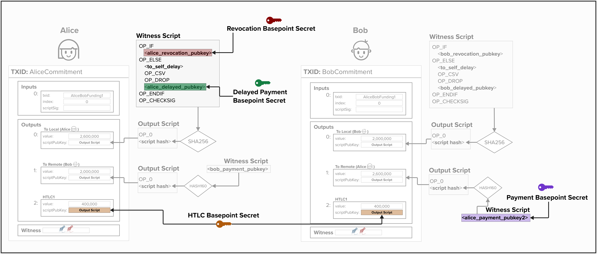

# Commitment Keys Deep Dive 

Now that we've implemented our `ChannelKeysManager`, we're ready to implement the logic to create commitment-specific keys. It's worth noting that the process of creating commitment keys, which we will review in this section, is specified in BOLT 3. Everything up until now represents decisions that *implementors* of Lightning network protocols are free to choose. For example, the BOLT does not specify how to create the basepoints themselves.

To start, let's put this process in the right context by reviewing our end goal: **create unique public/private keys that can be for each spending path in our commitment transaction outputs**. 

Imagine you're Alice. In the below diagram, you'll see each public key that Alice would provide for this arbitrary channel state between Alice and Bob. NOTE: for simplicity, the HTLC output is not pictured, but Alice would have an HTLC public key embedded within the HTLC output for both her commitment transaction and Bob's. 

<p align="center" style="width: 50%; max-width: 300px;">
  
</p>

So, the question is... how do we leverage our **basepoints** to create new public/private key pairs **for each commitment transactions**?

## Per Commitment Point
If you recall from the last exercise, we created a `commitment_seed` and stored it in our `ChannelKeysManager`. This will be an important cryptographic building block that we will use to create new keys for each commitment transaction.

Per [BOLT 3](https://github.com/lightning/bolts/blob/master/03-transactions.md#per-commitment-secret-requirements), for each commitment transaction, we must create a new **per-commitment secret**. This will be used to tweak the respective **basepoint** to calculate a new public or private key. For example, for the `localpubkey`, `local_htlcpubkey`, and `local_delayedpubkey` (not `revocation_pubkey`!), we will use the following equations:

### Public Keys
```
pubkey = basepoint + SHA256(per_commitment_point || basepoint) * G
```

### Private Keys
```
privkey = basepoint_secret + SHA256(per_commitment_point || basepoint)
```

As you can see, we've implemented the functionality for everything **except** the `per_commitment_point` so far. So, let's do that now!

To do create a `per_commitment_point`, we must first obtain the `per_commitment_secret`. Once we have this, we can multiply it by `G` (the secp256k1 "generator point") to obtain the `per_commitment_point`.

So, how do we get the **per-commitment secret** for a given commitment transaction? Well, the BOLT provides the following algorithm, which we *must* follow.

```
generate_from_seed(seed, I):
P = seed
for B in 47 down to 0:
    if B set in I:
        flip(B) in P
        P = SHA256(P)
return P
```

In the algorithm above, we have two inputs:
1) The `seed` is the `commitment_seed` we created earlier.
2) `I` is the index of the current commitment transaction.

This algorithm takes the `commitment_seed` and flips it bits based on the index `I`, applying the SHA256 iteratively. The resulting secret is then used to create the `per_commitment_point` for the specific commitment transaction`. One interesting thing to note is that this algorithm gives us 48 bits to work wih when generating the secret. Since the largest number that 48 bits can represent is  281,474,976,710,655, we can generate over 281 trillion channel states per channel!

This function has already been implemented for you on the `ChannelKeysManager`. You may be wondering why the BOLT specifies this process in the first place. Well, this algorithm provides efficient storage of per-commitment secrets by enabling the receiver to store only one secret per unique prefix (up to 49 entries), from which all subsequent secrets with matching prefixes and trailing zeros can be derived, significantly reducing the storage needed compared to saving every individual secret. 

```rust
/// Build the commitment secret from the seed and the commitment number
impl ChannelKeysManager {
    pub fn build_commitment_secret(&self, idx: u64) -> [u8; 32] {
        let mut res: [u8; 32] = self.commitment_seed.clone();
        for i in 0..48 {
            let bitpos = 47 - i;
            if idx & (1 << bitpos) == (1 << bitpos) {
                res[bitpos / 8] ^= 1 << (bitpos & 7);
                res = Sha256::hash(&res).to_byte_array();
            }
        }
        res
    }
}
```