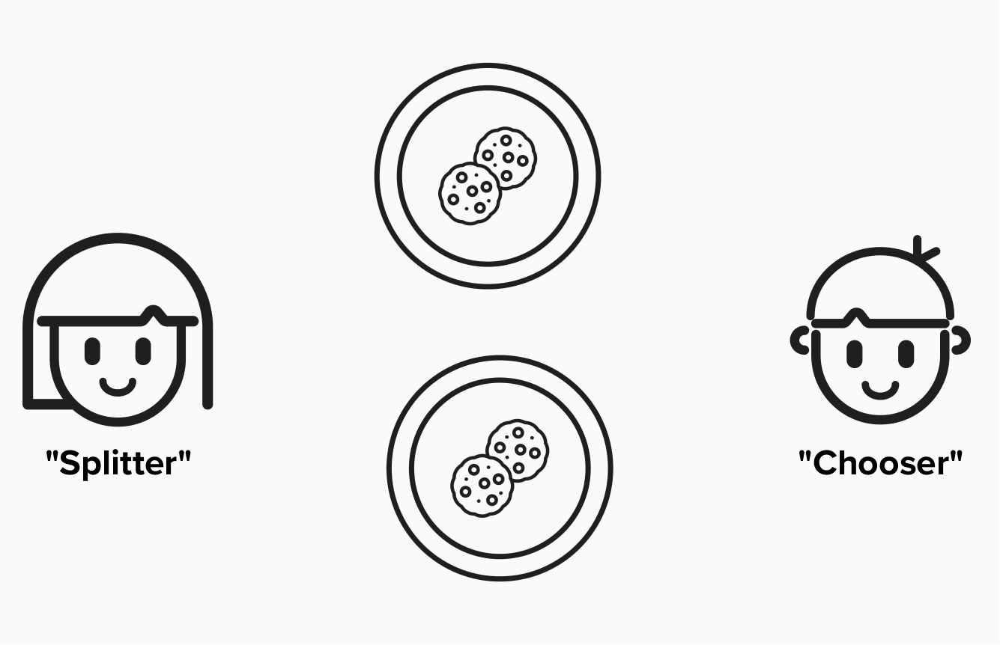

# Fairness Protocol

Before digging into Bitcoin and the Lightning protocol, it's important to review **fairness protocols**, as they are the underpinning of decentralized systems such as Bitcoin and Lightning.

To inch our way towards a definition of a "fairness protocol", let's start with a motivating question...

#### What is the goal of Bitcoin?

  
Answer!

First and foremost, there is no *right* answer.

A common answer may be **decentralized finance**. In other words, creating a financial system that does not rely on trusted third parties. While some may consider this an end-goal in itself, it's actually a means to a more desireable end. Put differently, they are mechanisms to achieving a broader goal.

The broader goal of Bitcoin is to achieve a **fair financial system**. One that does not have a small or privledged group of people that get to make decisions on behalf of everyone - often, decisions that benefit them at the expense of everyone else.

## Achieving Fairness
Over the last few thousand years, societies have developed a variety of ways to achieve fair outcomes. Some of these are more innate, while others are explicit innovations. Some examples are below:
1) **Trust**: Only interact with individuals or businesses that you personally trust. This works well at small scales (ex: families and communities), but it fails at larger scales.
2) **Law**: Establish rules for interactions that are enforced by institutions such as governments. This scales better, but it does not scale globally, as many countries have their own cultures and traditions that value outcomes differently. Also, institutions or governments can be corupted, leading to unfair laws and outcomes.
3) **Trusted Third Parties**: Enforce fairness by including a trusted third party in every interaction. This can help in situtuations where parties explicity do not trust each other but do trust the third party, however, it's only as good as the trusted third party, which could become corrupt.
4) **Trusted Protocols**: Establish rules and interactions that are enforced by incentives instead of third parties (institutions, governments, etc.). With the advent of the internet and cryptography, we have the tools to create internet-native protocols that enable interactions in a "trustless" environment, meaning that you don't have to trust your counterparties - you only need to trust that the software and incentives align.

## An Example
For a simple example of a fairness protocol, let's introduce Alice, Bob, and their mom.

Alice and Bob are hungry for cookies (who isn't), but they never play fair when the cookies come out. They both try to take as many cookies as they can, with little concern over how many cookies the other person gets.

  

#### How can we design a fairness protocol such that Alice and Bob do not have to trust eachother but still get fair outcomes?

  
Answer

One options is to have mom separate the cookies for each child. This would be a **trusted third party** solution. This could work fine, but mom could decide to play favorites (Alice got all A's at school but Bob got all B's).

Another option is for mom to enforce a game, called **"split and choose"**. In this game, one child plays the role of **"splitter"** and the other child plays the role of **"chooser"**.

The **"splitter"** will begin the game by splitting the cookies into two piles. The **"chooser"** will then select which pile of cookies they want. If the **"splitter"** decides to cheat by creating a bigger pile of cookies, the **"chooser"** can punish them by taking the bigger pile. As long as both participants play by the rules, a fair outcome is incentivized by the protocol.

  

## The Lightning Network
Throughout this workshop, keep the concept of a fairness protocol in mind. At it's heart, the Lightning Network is a payment system, enforced by a fairness protocol.