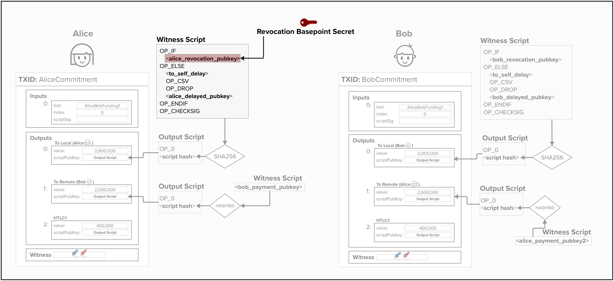
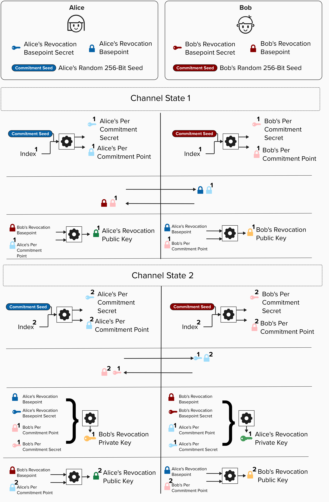
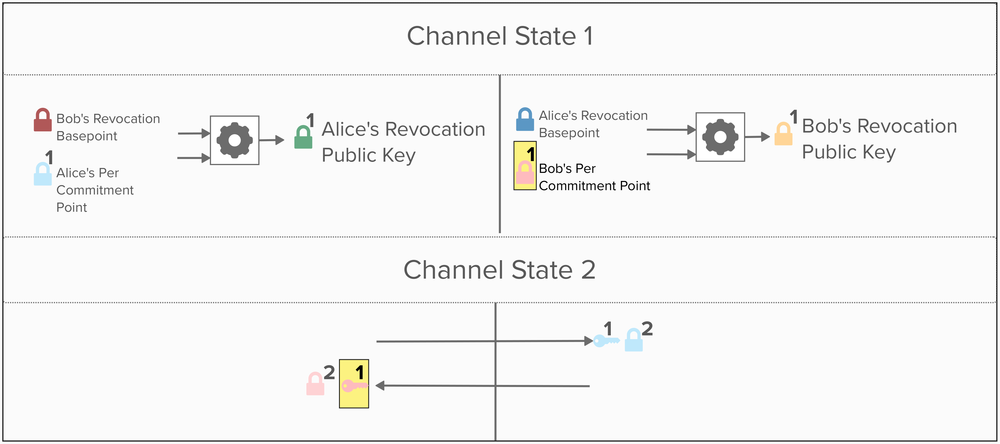

# Revocation Keys Deep Dive 

Let's bring this full circle by seeing how we can extend our **basepoints** and **per-commitment secret** to create revocation keys. If you've been following up until now, then you're in a great position to tackle this last piece!

Before diving in, take a moment to review the diagram below and remind yourself where the revocation public key is placed within a commitment transaction.

  

## Revocation Key Properties
Recall from earlier in this workbook that the revocation key is used to provide our *channel partner* with the ability to punish *us* if we decide to cheat by publishing an old commitment state.

For example, in the image above, Alice's revocation public key must satisfy the following requirements:

1) At the time of creation, neither Alice nor Bob know the private key to either **revocation public key**.
2) When advancing to a new channel state, Alice and Bob should be able to obtain (or, more specifically, calculate) the private key to their counterparty's **revocation public key**. 

## Deriving Revocation Keys
Just like the other keys we use in commitment transactions, the BOLTs specify exactly how revocation public keys and revocation private keys are calculated.

### Revoaction Public Key

  

  

### Revocation Private Key

  

  

As you can see, these equations are somewhat similar to how we calculate our other transaction keys, but there is one ***major*** difference. Can you spot it?

  
Answer

First, let's review how they are similar. Both revocation keys and our other channel keys (payment, delayed payment, and htlc) use the SHA256 of the concatenation of the `per_commitment_point` and some `basepoint`. This effectively creates a unique scalar that we can use to tweak the basepoint and create a distinct public/private key for the current commitment transaction.

Now, the big difference here is that the equation utilizes one key from each channel partner. This has the effect of **blinding** the key, meaning that neither party knows the private key to the public key, since it's created using both of their private keys.

If this is not entirely clear, take a look at the revocation public key formula below. It's the same as the above formula, but the generator point, `G`, has been factored out. From this perspective it may be clearer how the revocation key is in fact made up of the private keys from both channel parties!

  

Now, when Alice and Bob move to a new channel state, they just have to reveal (provide to their channel partner) the `per_commitment_point` that they used in the prior channel state, and the channel partner will be able to calculate *their counterparties* private key.

What's super neat is that, given the way the public keys are derived, you're still unable to calculate the private key to your own revocation public key.

## Visualizing Revocation In-Process
At this point, we've reviewed how basepoints are created, how you can derive commitment-specific keys, and how to create blinded revocation keys.

If you're a visual learner, you should be able to review the high-level visual below, displaying the revocation process, and intuitively understand each step in this process!

If you want to test your knowledge, go back to the revocation exercise in the workbook and try (re)-implementing the two coding exercises!

  

#### Question: Is it clear why Alice cannot derive the private key to her own revocation public key?

  
Answer

If it's not entirely clear why Alice cannot derive the private key to her own **revocation public key**, then take a look at the below diagram.

This diagram is a truncated visual of the above diagram, showing the process of moving from one commtment state to the next. We can see that Bob and Alice exchange the **per comitment secrets** they used for the prior channel state. Notice how *Bob's* revocation public key is created using the following two public keys:
- **Bob's per commitment point**
- **Alice's revocation basepoint**

The reason Alice is then able to spend from *Bob's* **revocation public key** is that Alice already know's her **revocation basepoint**, so she will have all the information she needs to calculate the prvate key to *Bob's* **revocation public key** .

**However**, Aiice's **revocation public key** is created with *Bob's* **revocation basepoint**. Since Bob *never* reveals *his* **revocation basepoint secret** to Alice, she should never be able to calculate the private key to her own revocation path!

  

