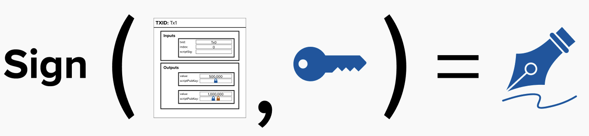
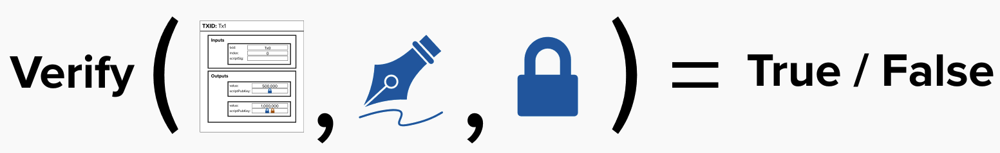
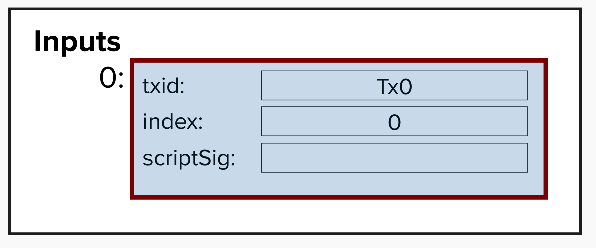
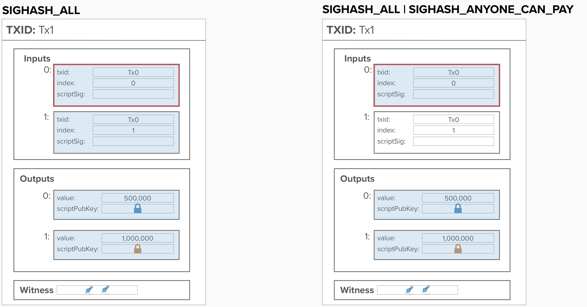
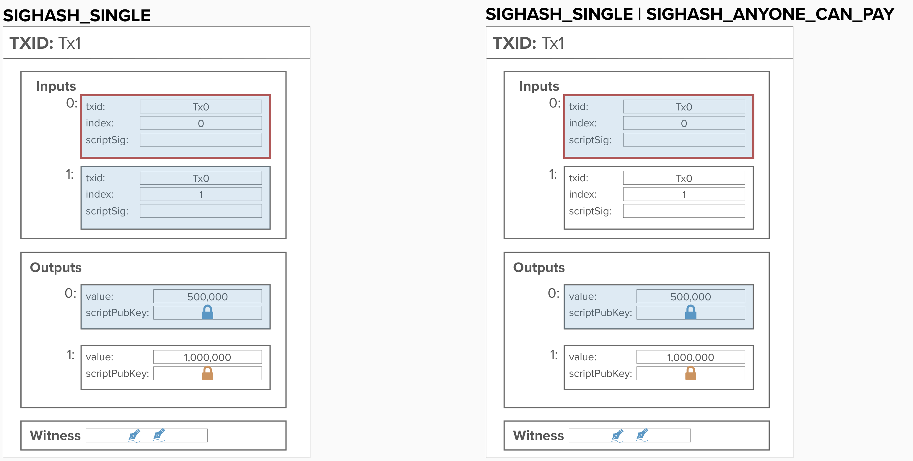

# Signatures

Up until this point, we've abstracted away most of the details behind bitcoin **signatures**. Before digging into Lightning, it's important to do a brief review of how signatures work, as they play an important role in creating a trustless off-chain payment system.

A **signature** accomplishes the following two goals:
1) It proves that you know the **secret key** to a corresponding **public key**.
2) It **binds itself** to specific information, such as a bitcoin transaction. This ensure that the signature is only valid for that particular piece of data, and it cannot be reused for another transaction.

## Creating a Signature
To create a signature, you need to *sign* a **message** using your private key. In Bitcoin, the message is the **transaction data**, but cryptographic signing can be leveraged for many things.

Recall, to unlock an input, we must provide a valid signature. Therefore, we must create a signature ***for each input*** that we'd like to spend.

<p align="center" style="width: 50%; max-width: 300px;">
  
</p>

## Verifying a Signature
To verify a signature, we must have the following pieces of information:
- The **message** that was used to produce the signature.
- The **signature** itself.
- The **public key** corresponding to the *private key* that was used to create this messsage.

Then, by leveraging elliptic curve mathematics, we can do some advanced calculations to verify the following:
1) The person who created the signature knows the private key corresponding to the given public key.
2) The message itself has not changed in any meaningful way.

<p align="center" style="width: 50%; max-width: 300px;">
  
</p>

## Signature Types
In Bitcoin, we can specify which parts of the transaction we're signing by adjusting the transaction data before passing it into the signing algorithm. This adds additional flexibility and capabilities, as participants can provide signatures to some parts of transactions, but not all.

To inform the Bitcoin protocol which parts of the transaction are being signed, we use a special **signature hash type** (also known as **sighash**) flag in our transaction. We do this by appending a **1-byte** sighash to the signature before including it in the transaction.

Below are the sighash options:

```
0x01 = SIGHASH_ALL
0x02 = SIGHASH_NONE
0x03 = SIGHASH_SINGLE
0x81 = SIGHASH_ALL | SIGHASH_ANYONECANPAY
0x82 = SIGHASH_NONE | SIGHASH_ANYONECANPAY
0x83 = SIGHASH_SINGLE | SIGHASH_ANYONECANPAY
```

We'll breifly discuss each of them below. When reviewing them, imagine we are spending the first input.

<p align="left" style="width: 50%; max-width: 300px;">
  
</p>


### SIGHASH_ALL & SIGHASH_ALL | SIGHASH_ANYONECANPAY
- The `SIGHASH_ALL` flag indicates that we signed **all of the inputs and outputs**. Therefore, for this signature to be valid, the inputs and ouputs cannot change.
- If `SIGHASH_ANYONECANPAY` is used in conjunction with the `SIGHASH_ALL` flag, then we are signaling that, for the given input we are seeking to spend, we only signed the input, but we still signed all of the outputs. 
<p align="center" style="width: 50%; max-width: 300px;">
  
</p>

### SIGHASH_NONE & SIGHASH_NONE | SIGHASH_ANYONECANPAY
- The `SIGHASH_NONE` flag indicates that we signed **all of the inputs and** ***none*** **of the outputs**. 
- If `SIGHASH_ANYONECANPAY` is used in conjunction with the `SIGHASH_NONE` flag, then we are signaling that, for the given input we are seeking to spend, we **only signed the input**. You pretty much never want to do this, as you are effectively providing a signature that allows for that input to be sent anywhere by anyone.
<p align="center" style="width: 50%; max-width: 300px;">
  
</p>

### SIGHASH_SINGLE & SIGHASH_SINGLE | SIGHASH_ANYONECANPAY
- The `SIGHASH_SINGLE` flag indicates that we signed **all of the inputs and** ***one*** **of the outputs**. The one output is the one that corresponds to the index of the input we're creating a signature for.
- If `SIGHASH_ANYONECANPAY` is used in conjunction with the `SIGHASH_SINGLE` flag, then we are signaling that, for the given input we are seeking to spend, we **only signed the input and the corresponding output**. This is useful if we want to allow *others* to replace by fee (RBF) our transaction with another one, as they would be able to attach their own inputs and outputs to the transaction in such a way that our signature is still valid.
<p align="center" style="width: 50%; max-width: 300px;">
  
</p>


## ⚡️ Generate A Signature

For this exercise, we'll complete the function `generate_multisig_signature`, which will create a signature for a p2wsh multisig transaction. It will return a `Signature` type, which is defined in **rust-bitcoin**. You can read more about it [here](https://docs.rs/secp256k1/latest/secp256k1/ecdsa/struct.Signature.html).

```rust 
pub fn generate_multisig_signature(
    transaction: Transaction,
    input_idx: usize,
    witness_script: &ScriptBuf,
    value: u64,
    private_key: secp256k1::SecretKey,
) -> Signature{
  // define secp curve for cryptographic operations
  let secp = Secp256k1::new();

  // declare sighash

  // generate message

  // generate and return signature

}
```

### To complete this functionality, we'll need to implement the following steps:

#### 1) Decide which sighash type we're going to use. For this exercise, our goal is to provide a signature that commits to all of the inputs and outputs such that our signature is only valid for the exact inputs and outputs we're signing.
<details>
  <summary>Step 1 Hint</summary>

Rust Bitcoin provides an "enum" `EcdsaSighashType`, which contains all of the sighash types we reviewed above. 

The various options are:
- `All`
- `None`
- `Single`
- `AllPlusAnyoneCanPay`
- `NonePlusAnyoneCanPay`
- `SinglePlusAnyoneCanPay`

You can define a sighash variable by using the following syntax:

- `let sighash_single = EcdsaSighashType::Single;`

</details>

#### 2) Create a message digest for our transaction data.

<details>
  <summary>Step 2 Hint</summary>

To aid in creating a message that can be signed with our private key, you can use the function `generate_p2wsh_message`.

```rust
 fn generate_p2wsh_message(
     transaction: Transaction,
     input_idx: usize,
     witness_script: &ScriptBuf,
     value: u64,
     sighash_type: EcdsaSighashType,
 ) -> Message
```

</details>

#### 3) Sign that message with our private keys.

<details>
  <summary>Step 3 Hint</summary>

To sign our message, we'll use the `secp256k1` library. An instance of the library has already been instantiated for you in the following line of code:
```rust
let secp = Secp256k1::new();
```

To sign a message, you can make use of the `secp.sign_ecdsa()` method, which takes two arguments: `&message`, which is the message to be signed (typically a hash of the transaction data), and `&private_key`, which is the private key used to create the signature.

The resulting signature can be used to prove ownership of the private key and authorize the transaction.

</details>