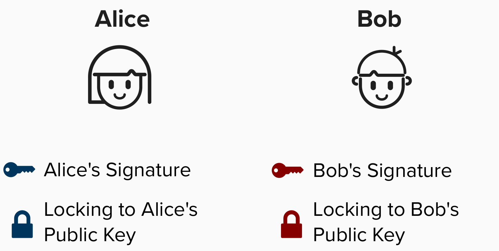
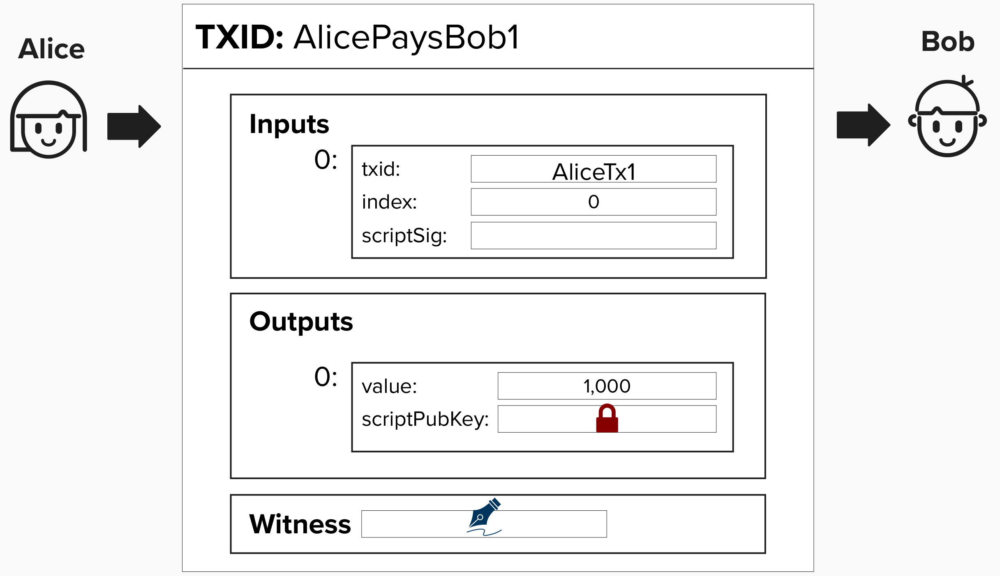
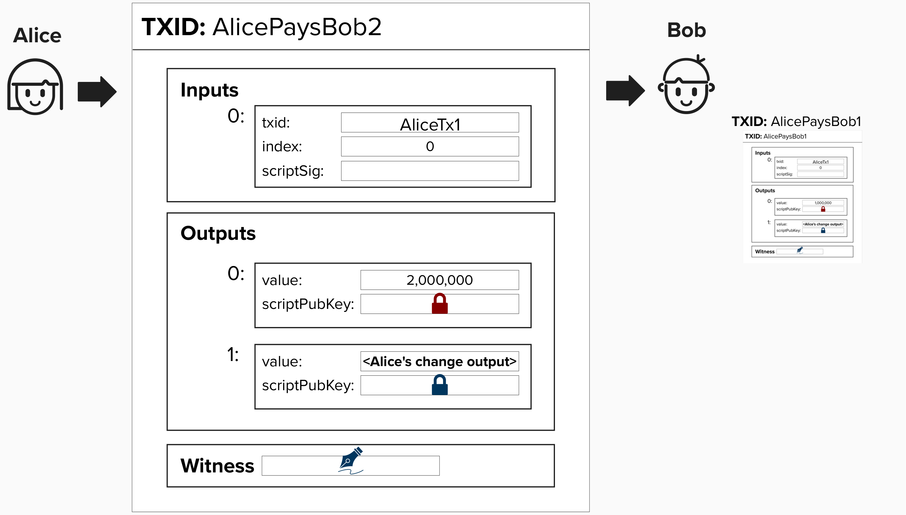

# Irresponsibly Naive Scaling

At the heart of Lightning and other scaling solutions is the concept of exchanging **"off-chain"** transactions. Off-chain transactions are transactions that are **valid**, in that they can be published and mined at any time, but the holders of these transactions choose not to do so. To make an off-chain payment, you can simply contruct a valid transaction and send it to someone - perhaps via email or text message. After all, under the hood, a transaction is just a sequence of bytes.

<details>
  <summary>Click to see an example transaction!</summary>

Unless you have the Bitcoin protocol programmed into your brain, you likely won't understand the byte sequence below, but it's actually a valid Bitcoin transaction. All the necessary details, such as inputs, outputs, and signatures, are encoded into this byte sequence.

```
020000000001018d54238793c4547bb913e369a27c74bc08fc20c33197f5690f41565c7cfad12e0000000000ffffffff01784a4c0000000000220020657760ca015175e42ff5b4470563b23adcf0d2973a0506a176a5569690d64437024730440220548d3aeae38390d1d4f79b8756b5758d131051ddce223aa4f395bb88be1ccaeb02201698654ab9c29d41822771cd3a75bffec87488322a46783f64cd53aefb1f5d960121024e77786b0c8bef20ef469345cf4c306b14dee25dd5bab152155bee1e2115e93100000000
```


</details>

## Alice and Bob Exchange Off-Chain Transactions

To help build our intuition, let's discuss what might be the most naive scaling solution possible. **PLEASE DON'T TRY THIS AT HOME!**.

Imagine Alice and Bob are all grown and now drink adult beverages. In fact, Bob started his own bar (good luck!). Since they both love Bitcoin, Alice decides to pay Bob in Bitcoin whenever she goes to his bar, but, to save on transaction fees, Alice and Bob agree to create an **off-chain** transaction, meaning that Alice will send Bob a valid Bitcoin transaction, and Bob can choose to publish that when fees are low in the future.

To bring this example to life, let's equip Alice and Bob with private and public keys. As we work through this workshop, we'll represent their **signatures** with a **signature** logo, and we'll represent their locking to their **public keys** with a **lock** logo.

<p align="center" style="width: 50%; max-width: 300px;">
  
</p>

Now, if Alice wants to pay Bob, she can simply send him a valid transaction off-chain. For example, imagine that Alice buys a glass of wine for 1,000 sats. She will just create a transaction locking 1,000 sats to Bob's public key.


<p align="center" style="width: 50%; max-width: 300px;">
  
</p>

If Alice decides to purchase another glass of wine, she can just create a new transaction that pays Bob 2,000 sats. Notice, in the below image, the transaction is spending from the same UTXO as above, but that doesn't need to be the case. In this off-chain scaling solution, Alice is simply providing Bob new transactions with increasingly larger amounts of Bitcoin. 

<p align="center" style="width: 50%; max-width: 300px;">
  
</p>

## Payment Channels
At the end of the night, Bob can publish the **most recent** transaction to the Bitcoin blockchain, claiming his balance from tonight. In this way, Alice and Bob have created a **payment channel**. **In it's simplest form, a payment channel is a way for multiple parties to exchange Bitcoin transactions off-chain.**

By not broadcasting each transaction to the chain, the parties do not need to:
1) Wait for confirmations.
2) Pay miner fees.
3) Force resource costs onto the entire network.

## Removing All Trust Assumptions 

You likely read the above channel construction and thought, "OMG, this is bad!". You'd be right.

In the above payment channel, there are many opportunities for both channel parties to steal from eachother - whether that be Bitcoin or the goods and services obtained from the Bitcoin payments. Let's address these one by one, working our way towards payment channels that work without trust assumptions!

We'll start with the double-spending issue. In the above channel construction, Alice could double-spend the Bitcoin in the transaction that pays Bob by secretly creating another transaction and moving her bitcoin to a different UTXO!

#### Question: How can we make sure that the Bitcoin allocated to this payment channel stays in this payment channel? In other words, how can we stop it from being double-spent?
<details>
  <summary>Answer</summary>

As we just learned, the core idea of a payment channel is to enable multiple parties to send each other off-chain transactions, resulting in instant and nearly-free payments. However, since these transactions are exchanged off-chain, we need a way to make sure they are not spent on-chain in such a way that renders the off-chain transaction no longer valid (or spendable).

To alleviate this concern, we can require both parties to lock funds in a **2-of-2 multisig** output - one public key for each channel member. Therefore, to spend from this output, we'll need one signature from Alice and one signature from Bob. This will assure both Alice and Bob that neither of them can double-spend the funds they are using in the payment channel.

</details>