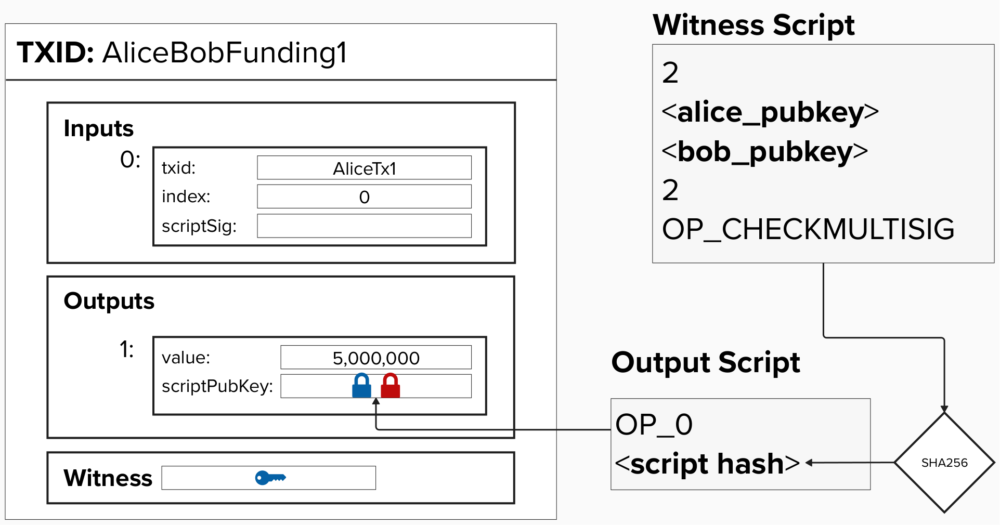

# Payment Channels

You can conceptually think of a payment channel as a way to perform batching of your payments over a potentially unlimited length of time. In fact, with a simple payment channel, two parties can make thousands of payments between each other while only ever making two on-chain bitcoin transactions. This reduces both the costs of sending transactions and the cost of storing transaction data, alleviating the three problems we identified earlier. 

## Core concept

So how is this possible? What conceptually is going on when payments are made in a payment channel?

The idea is that the two parties will still construct bitcoin transactions for each payment being made but they agree not to broadcast them to the chain. By not broadcasting each transaction to the chain, the parties do not need to wait for confirmations, do not need to pay miner fees, and do not need to force resource costs onto the entire network.

Like all good computer science textbooks, to help explain this concept, let's introduce our two old friends - Alice and Bob. Note that Alice and Bob each have their own private keys. Alice's private key is represented by a blue key, while Bob's private key is represented by a red key.

<p align="center" style="width: 50%; max-width: 300px;">
  
</p>

## Creating a Payment Channel

To create a payment channel, Alice and Bob start by agreeing to fund a 2-of-2 multisig output with a specific amount. This amount is crucial, as it represents the total channel capacity, meaning Alice and Bob will only be able to transfer up to this amount between themselves.

To fund this channel, Alice and Bob create a **Pay-to-Witness-Script-Hash (P2WSH)** transaction that locks their channel balance into an output controlled by both of them. Specifically, this output requires both Alice and Bob to control one of the keys necessary to spend the funds. This transaction differs from earlier P2SH transactions for the following reasons:

- It is a 2-of-2 multisig, meaning that both private keys are required to spend the bitcoin locked to this output.
- It is a SegWit transaction, so to unlock and spend the bitcoin, the signatures must be presented in the **witness** field rather than the **scriptSig** field.
- In P2WSH, the witness script is hashed using the **SHA-256** hash function instead of the **HASH160** function used in P2SH. Since SHA-256 produces a longer hash output (256 bits as opposed to 160 bits), it offers greater resistance to potential collision attacks and security vulnerabilities.
- Instead of placing ```OP_HASH160 <script hash> OP_EQUAL``` in the output script, we place ```OP_0 <script hash>```. For SegWit transactions, the first byte in the **scriptPubKey** indicates the **witness version** and dictates how to interpret the **scriptPubKey**. For example, **P2WSH** and **Pay-to-Witness-Public-Key-Hash (P2WPKH)** are version 0 while **Pay-To-Taproot** (**P2TP**) is version 1. Since this is a **P2WSH** transaction, we will preface the script hash with ```OP_0```.


<p align="center" style="width: 50%; max-width: 300px;">
  
</p>


#### ⚡️ Write Function To Generate Our Funding Transaction's Pay-To-Witness-Script-Hash Witness Script

Can you write the implementation for a function that takes in three Bitcoin PublicKeys and generates a 2-of-3 multisig witness script? 
```rust
fn two_of_two_multisig(alice_pubkey: &PublicKey, bob_pubkey: &PublicKey) -> Script {
    // TODO: build 2-of-2 multisig Script using alice_pubkey and bob_pubkey
}
```

#### ⚡️ Write Function To Generate Our Funding Transaction's Pay-To-Witness-Script-Hash Output Script

Great, now that we've generated the witness script, we need to hash it and use the hash to create our output script. Remember, our Pay-to-Witness-Script-Hash **script** has the following form: 

```
OP_0 <witness script hash>
```

Can you write the implementation for a function that takes the hash of a witness script and generates a P2WSH output script? 
```rust
fn p2wsh(witness_script: &Script) -> Script {}
```

When you think you have the solution click the big green `Run` button at the top of the screen to make sure the unit tests are still passing.


## Problem: Potential Loss of Funds

There is a big security issue with this construction! Let's see if we can tease it out and come up with a solution.

### Question

How can Alice lose all of her funds in this setup?

<br/>
<details>
  <summary>Answer</summary>
  <br/>

  If Bob stops responding or refuses to cooperate, then there's no way for Alice to retrieve her funds from this payment channel. This is because, to spend from a 2-of-2 multisig, you need signatures from *both* parties.
</details>